# 🚀 Enhanced 10-Phase Migration Plan with Advanced Specialist Orchestration

## Executive Summary

Complete migration from legacy CLI/Gradio to OpenAI GPT-5 React system with comprehensive specialist orchestration, parallel execution optimization, and multi-layer quality validation.

## 📊 Enhanced Specialist Matrix

### Primary & Secondary Role Assignments

| Specialist | Primary Phases | Secondary Phases | Backup For |
|------------|---------------|------------------|------------|
| @code-archaeologist | 1, 9 | 3, 4 | @backend-developer |
| @documentation-specialist | 2, 8 | 1, 10 | All specialists |
| @backend-developer | 3, 5 | 7, 9 | @api-architect |
| @code-reviewer | 4, 10 | All phases | Quality gates |
| @api-architect | 5, 7 | 3, 6 | @backend-developer |
| @react-component-architect | 6 | 5, 9 | Frontend issues |
| @performance-optimizer | - | 5, 7, 10 | Performance validation |

## 🔄 Coordination Protocols

### Communication Framework

```yaml
handoff_protocol:
  format: "JSON status report"
  channels:
    primary: "git commit messages"
    secondary: "status files in /docs/migration-status/"
    emergency: "rollback triggers"
  
validation_protocol:
  pre_handoff:
    - unit_tests: "PASSING"
    - integration_tests: "PASSING" 
    - documentation: "UPDATED"
    - review_status: "APPROVED"
  
  post_handoff:
    - acknowledge_receipt: true
    - validate_inputs: true
    - report_issues: "immediate"
```

### Handoff Procedures

**Standard Handoff Template:**
```json
{
  "phase": "PHASE_NUMBER",
  "from_specialist": "@specialist-name",
  "to_specialist": "@specialist-name",
  "timestamp": "ISO8601",
  "deliverables": {
    "files_modified": [],
    "tests_passed": [],
    "documentation_updated": [],
    "known_issues": []
  },
  "validation_status": "PASSED/FAILED",
  "git_branch_state": "migration-experimental",
  "main_branch_preserved": true,
  "next_actions": []
}
```

## ✅ Quality Gates & Validation Checkpoints

### Multi-Specialist Validation Requirements

| Phase | Primary Validator | Secondary Validator | Validation Criteria |
|-------|------------------|---------------------|---------------------|
| 1 | @code-reviewer | @documentation-specialist | Experimental branch created, main branch preserved |
| 2 | @documentation-specialist | @code-reviewer | Documentation mapping complete |
| 3 | @code-reviewer | @backend-developer | No import errors, clean git status |
| 4 | @backend-developer | @code-reviewer | Test environment clean |
| 5 | @api-architect | @code-reviewer | All services functional |
| 6 | @react-component-architect | @api-architect | Frontend builds, API connected |
| 7 | @code-reviewer | @performance-optimizer | Dependencies resolved |
| 8 | @code-reviewer | @documentation-specialist | Docs accurate, no broken links |
| 9 | @code-reviewer | @backend-developer | Tests migrated and passing |
| 10 | @code-reviewer | @performance-optimizer | System fully operational |

## 🚀 Parallel Execution Opportunities

### Parallelization Matrix

```mermaid
gantt
    title Migration Phase Parallelization
    dateFormat HH:mm
    section Phase 1-2
    Pre-Migration Validation    :p1, 00:00, 2h
    Documentation Prep          :p2, after p1, 3h
    
    section Phase 3-4 (PARALLEL)
    Remove Legacy Python        :p3, after p2, 4h
    Remove Legacy Tests         :p4, after p2, 3h
    
    section Phase 5-6-7 (PARTIAL PARALLEL)
    Migrate to Root            :p5, after p3 p4, 5h
    Migrate Frontend           :p6, after p5, 2h
    Update Config              :p7, after p5, 2h
    
    section Phase 8-9 (PARALLEL)
    Documentation Consolidation :p8, after p6 p7, 5h
    Testing Migration          :p9, after p6 p7, 4h
    
    section Phase 10
    Final Validation           :p10, after p8 p9, 3h
```



### Parallel Execution Rules

**Maximum 2 Specialists Active:**
- Phases 3 & 4: Can run in parallel (different codebases)
- Phases 6 & 7: Can run in parallel after Phase 5 
- Phases 8 & 9: Can run in parallel (independent tasks)

**Sequential Requirements:**
- Phase 1 → Phase 2 (validation before documentation)
- Phase 5 requires Phases 3 & 4 complete
- Phase 10 requires all phases complete

## 🛡️ Risk Mitigation Strategies

### Backup Specialist Protocols

**Primary Failure Response:**
```yaml
specialist_unavailable:
  detection: "No response in 30 minutes"
  escalation:
    level_1: "Notify secondary specialist"
    level_2: "Activate backup specialist"
    level_3: "Tech lead intervention"
  
backup_activation:
  handoff_time: "15 minutes"
  knowledge_transfer: "Via git branch state and status files"
  validation: "Code reviewer approval"
  
branch_management:
  experimental_branch: "migration-experimental"
  safety_fallback: "main (untouched)"
  emergency_recovery: "git checkout main"
```

### Branch Switching Procedures

**Phase-Specific Recovery Points:**

| Phase | Recovery Trigger | Recovery Command | Recovery Time |
|-------|------------------|------------------|---------------|
| 1 | Branch setup failure | `git checkout main` | 2 min |
| 2 | Doc corruption | `git checkout main` | 2 min |
| 3 | Import errors | `git checkout main` | 2 min |
| 4 | Test failures | `git checkout main` | 2 min |
| 5 | Service down | `git checkout main` | 2 min |
| 6 | Build failures | `git checkout main` | 2 min |
| 7 | Dependency conflicts | `git checkout main && git branch -D migration-experimental` | 3 min |
| 8 | Doc broken links | `git checkout main` | 2 min |
| 9 | Test migration fails | `git checkout main` | 2 min |
| 10 | Final validation fails | `git checkout main` | 2 min |

---

## 📋 PHASE 1: Pre-Migration Validation & Branch Setup

### Enhanced Orchestration

**Primary Specialist:** @code-archaeologist  
**Secondary Specialist:** @documentation-specialist  
**Backup Specialist:** @backend-developer  

### Coordination Protocol

```yaml
phase_1_coordination:
  startup:
    - code-archaeologist: "Initialize experimental branch"
    - documentation-specialist: "Prepare validation checklist"
  
  sequential_tasks:
    task_1a: 
      owner: "code-archaeologist"
      action: "Create experimental branch and validate main branch state"
      mcp_tools: ["mcp__filesystem__*", "Bash"]
    
    task_1b:
      owner: "documentation-specialist"  
      action: "Document current state and branch strategy"
      mcp_tools: ["mcp__filesystem__read_multiple_files"]
  
  handoff:
    from: "code-archaeologist"
    to: "documentation-specialist"
    deliverable: "branch_setup_verification.json"
```

### Quality Gate 1

**Multi-Specialist Validation:**
- [ ] @code-archaeologist: Experimental branch created and validated
- [ ] @documentation-specialist: Current state documented
- [ ] @code-reviewer: Branch strategy approved

### Detailed Tasks with MCP Tools

1. **Experimental Branch Setup (code-archaeologist)**
   ```bash
   # Using Bash tool
   git status --porcelain  # Ensure clean working directory
   git branch migration-experimental
   git checkout migration-experimental
   echo "Migration work branch created from main branch state"
   ```

2. **System State Validation (documentation-specialist)**
   ```python
   # Using mcp__filesystem tools
   validation_checklist = {
       "main_branch_clean": check_git_status(),
       "cli_operational": test_cli(),
       "react_ui_builds": test_frontend_build(),
       "api_responsive": test_api_health(),
       "tests_passing": run_test_suite()
   }
   ```

3. **Branch Strategy Documentation (both specialists)**
   - Document main branch as safety fallback
   - Create experimental branch workflow guide
   - Define emergency branch switching procedures

---

## 📋 PHASE 2: Documentation Migration Preparation

### Enhanced Orchestration

**Primary Specialist:** @documentation-specialist  
**Secondary Specialist:** @code-reviewer  
**Backup Specialist:** @code-archaeologist  

### Coordination Protocol

```yaml
phase_2_coordination:
  startup:
    receive_from_phase_1: "backup_verification.json"
    validate_prerequisites: true
  
  sequential_tasks:
    - audit_documentation
    - create_mapping_table
    - backup_critical_docs
    - prepare_new_structure
  
  handoff:
    to: ["backend-developer", "code-reviewer"]
    deliverable: "doc_migration_plan.json"
```

### Quality Gate 2

**Multi-Specialist Validation:**
- [ ] @documentation-specialist: Mapping complete
- [ ] @code-reviewer: No critical docs missing
- [ ] @backend-developer: Technical docs verified

### Detailed Tasks

1. **Documentation Audit Matrix**
   ```markdown
   | Document | Keep | Migrate | Remove | New Location |
   |----------|------|---------|--------|--------------|
   | README.md | ✓ | ✓ | | /README.md |
   | CLAUDE.md | ✓ | ✓ | | /CLAUDE.md |
   | old_gradio_docs.md | | | ✓ | - |
   ```

2. **Critical Documentation State Recording**
   ```bash
   # Record current documentation state on main branch
   git checkout main
   find docs/ -name "*.md" -exec ls -la {} \; > /tmp/docs_state_main.log
   find . -maxdepth 1 -name "*.md" -exec ls -la {} \; >> /tmp/docs_state_main.log
   git checkout migration-experimental
   ```

---

## 📋 PHASE 3: Remove Legacy Python Core Code

### Enhanced Orchestration  

**Primary Specialist:** @backend-developer  
**Secondary Specialist:** @api-architect  
**Backup Specialist:** @code-archaeologist  

**⚡ PARALLEL WITH PHASE 4**

### Coordination Protocol

```yaml
phase_3_coordination:
  parallel_execution:
    with_phase: 4
    max_duration: "4 hours"
    
  critical_checks:
    - verify_no_active_dependencies
    - confirm_backup_exists
    - validate_new_system_ready
  
  removal_sequence:
    1: "Entry points (chat_ui.py, market_parser_demo.py)"
    2: "Source directories (/src/, /stock_data_fsm/)"
    3: "Legacy tests at root"
    4: "Python cache cleanup"
```

### Quality Gate 3

**Multi-Specialist Validation:**
- [ ] @backend-developer: No import errors
- [ ] @api-architect: API endpoints intact
- [ ] @code-reviewer: Git status clean

### Risk Mitigation

**Branch Safety Check Script:**
```python
# Pre-removal validation on experimental branch
import subprocess
import os

def verify_main_branch_safety():
    """Ensure main branch remains untouched"""
    result = subprocess.run(['git', 'status', '--porcelain'], 
                          capture_output=True, text=True)
    if result.stdout.strip():
        print("Warning: Uncommitted changes detected")
    
    # Verify we're on experimental branch
    branch_result = subprocess.run(['git', 'branch', '--show-current'],
                                 capture_output=True, text=True)
    if branch_result.stdout.strip() != 'migration-experimental':
        raise Exception("Must be on migration-experimental branch")
```

---

## 📋 PHASE 4: Remove Legacy Testing Infrastructure

### Enhanced Orchestration

**Primary Specialist:** @code-reviewer  
**Secondary Specialist:** @backend-developer  
**Backup Specialist:** @code-archaeologist  

**⚡ PARALLEL WITH PHASE 3**

### Coordination Protocol

```yaml
phase_4_coordination:
  parallel_execution:
    with_phase: 3
    coordination: "via git branches"
    
  archive_before_removal:
    - test_results: "/archive/test_results/"
    - coverage_reports: "/archive/coverage/"
    - performance_logs: "/archive/performance/"
  
  removal_validation:
    - no_broken_references
    - pytest_config_updated
    - ci_cd_updated
```

### Quality Gate 4

**Multi-Specialist Validation:**
- [ ] @code-reviewer: Test environment clean
- [ ] @backend-developer: No test dependencies broken
- [ ] @documentation-specialist: Test docs archived

---

## 📋 PHASE 5: Migrate New System to Root Level

### Enhanced Orchestration

**Primary Specialist:** @backend-developer  
**Secondary Specialist:** @api-architect  
**Backup Specialist:** @code-reviewer  

**⚠️ CRITICAL PHASE - NO PARALLEL EXECUTION**

### Coordination Protocol

```yaml
phase_5_coordination:
  prerequisites:
    phase_3: "COMPLETED"
    phase_4: "COMPLETED"
    
  migration_sequence:
    1: "Move core modules to root"
    2: "Update all import paths"
    3: "Move configuration files"
    4: "Update pyproject.toml"
    5: "Merge uv.lock files"
    
  validation_checkpoints:
    after_each_step: true
    rollback_on_failure: true
```

### Quality Gate 5

**Triple Validation Required:**
- [ ] @backend-developer: CLI functional
- [ ] @api-architect: FastAPI operational
- [ ] @code-reviewer: All imports resolved

### Import Path Update Script

```python
# Automated import path updater
import re
import os

def update_imports(file_path):
    """Update import paths from nested to root"""
    with open(file_path, 'r') as f:
        content = f.read()
    
    # Update import patterns
    content = re.sub(
        r'from gpt5-openai-agents-sdk-polygon-mcp\.src',
        'from src',
        content
    )
    
    with open(file_path, 'w') as f:
        f.write(content)
```

---

## 📋 PHASE 6: Migrate & Update Frontend Infrastructure

### Enhanced Orchestration

**Primary Specialist:** @react-component-architect  
**Secondary Specialist:** @api-architect  
**Backup Specialist:** @backend-developer  

**⚡ PARALLEL WITH PHASE 7 AFTER PHASE 5**

### Coordination Protocol

```yaml
phase_6_coordination:
  parallel_execution:
    with_phase: 7
    shared_resources: "none"
    
  frontend_migration:
    1: "Move frontend to /frontend/"
    2: "Update package.json paths"
    3: "Update API endpoints"
    4: "Move Playwright config"
    5: "Resolve Node dependencies"
    
  api_coordination:
    with: "@api-architect"
    validate: "CORS and endpoints"
```

### Quality Gate 6

**Multi-Specialist Validation:**
- [ ] @react-component-architect: Frontend builds
- [ ] @api-architect: API connection verified
- [ ] @performance-optimizer: Build size optimal

---

## 📋 PHASE 7: Update Configuration & Dependencies

### Enhanced Orchestration

**Primary Specialist:** @api-architect  
**Secondary Specialist:** @backend-developer  
**Backup Specialist:** @code-reviewer  

**⚡ PARALLEL WITH PHASE 6 AFTER PHASE 5**

### Coordination Protocol

```yaml
phase_7_coordination:
  parallel_execution:
    with_phase: 6
    dependency_conflicts: "resolve immediately"
    
  configuration_updates:
    1: "Clean pyproject.toml"
    2: "Update package.json"
    3: "Update .gitignore"
    4: "Update linting configs"
    5: "Update CI/CD workflows"
```

### Quality Gate 7

**Multi-Specialist Validation:**
- [ ] @api-architect: Dependencies resolved
- [ ] @backend-developer: Python env clean
- [ ] @code-reviewer: Linting passes

---

## 📋 PHASE 8: Documentation Consolidation & Updates

### Enhanced Orchestration

**Primary Specialist:** @documentation-specialist  
**Secondary Specialist:** @code-reviewer  
**Backup Specialist:** @backend-developer  

**⚡ PARALLEL WITH PHASE 9**

### Coordination Protocol

```yaml
phase_8_coordination:
  parallel_execution:
    with_phase: 9
    
  documentation_tasks:
    1: "Update README.md"
    2: "Update CLAUDE.md"
    3: "Consolidate /docs/"
    4: "Update path references"
    5: "Create MIGRATION_COMPLETE.md"
    
  validation_tools:
    - link_checker
    - markdown_linter
    - example_validator
```

### Quality Gate 8

**Multi-Specialist Validation:**
- [ ] @documentation-specialist: All docs updated
- [ ] @code-reviewer: No broken references
- [ ] @backend-developer: Technical docs accurate

---

## 📋 PHASE 9: Testing Infrastructure Migration

### Enhanced Orchestration

**Primary Specialist:** @code-reviewer  
**Secondary Specialist:** @code-archaeologist  
**Backup Specialist:** @backend-developer  

**⚡ PARALLEL WITH PHASE 8**

### Coordination Protocol

```yaml
phase_9_coordination:
  parallel_execution:
    with_phase: 8
    
  test_migration:
    1: "Migrate Playwright tests"
    2: "Create new test structure"
    3: "Update test configurations"
    4: "Validate all tests pass"
    
  test_categories:
    unit_tests: "/tests/unit/"
    integration_tests: "/tests/integration/"
    e2e_tests: "/tests/e2e/"
    playwright_tests: "/tests/playwright/"
```

### Quality Gate 9

**Multi-Specialist Validation:**
- [ ] @code-reviewer: All tests migrated
- [ ] @backend-developer: Tests passing
- [ ] @performance-optimizer: Test performance acceptable

---

## 📋 PHASE 10: Final Cleanup & Validation

### Enhanced Orchestration

**Primary Specialist:** @code-reviewer  
**Secondary Specialist:** @performance-optimizer  
**Backup Specialist:** @documentation-specialist  

**⚠️ FINAL PHASE - FULL VALIDATION REQUIRED**

### Coordination Protocol

```yaml
phase_10_coordination:
  prerequisites:
    all_phases: "COMPLETED"
    
  final_validation:
    1: "Remove temporary files"
    2: "Clean git history"
    3: "Optimize dependencies"
    4: "Performance testing"
    5: "Security audit"
    6: "Create final report"
    
  sign_off_required:
    - code-reviewer: "Code quality"
    - performance-optimizer: "Performance metrics"
    - documentation-specialist: "Documentation complete"
    - backend-developer: "System functional"
    - api-architect: "API operational"
```

### Quality Gate 10 - FINAL

**Full Team Validation Required:**
- [ ] @code-reviewer: Code quality APPROVED
- [ ] @performance-optimizer: Performance ACCEPTABLE
- [ ] @documentation-specialist: Docs COMPLETE
- [ ] @backend-developer: Backend OPERATIONAL
- [ ] @api-architect: APIs FUNCTIONAL
- [ ] @react-component-architect: Frontend WORKING

### Final Validation Checklist

```yaml
system_health:
  cli_test: "uv run src/main.py"
  api_test: "curl http://localhost:8000/health"
  frontend_test: "npm run build && npm run dev"
  test_suite: "pytest tests/"
  
performance_metrics:
  api_response_time: "< 100ms"
  frontend_build_time: "< 30s"
  test_execution_time: "< 5 minutes"
  
documentation:
  readme_updated: true
  api_docs_generated: true
  migration_guide_complete: true
```

---

## 🔄 Continuous Monitoring Protocol

### Real-Time Status Dashboard

```yaml
monitoring_dashboard:
  location: "/docs/migration-status/dashboard.md"
  update_frequency: "Every 30 minutes"
  
  metrics:
    - phase_progress: "percentage"
    - active_specialists: "list"
    - blocked_tasks: "list"
    - quality_gates_passed: "count"
    - rollback_triggers: "count"
    
  alerts:
    specialist_inactive: "> 30 minutes"
    quality_gate_failed: "immediate"
    dependency_conflict: "immediate"
    test_failure: "after 3 attempts"
```

### Emergency Response Team

**Escalation Levels:**
1. **Level 1**: Secondary specialist activation (5 min)
2. **Level 2**: Backup specialist engagement (15 min)
3. **Level 3**: Tech lead intervention (30 min)
4. **Level 4**: Full rollback initiation (45 min)

---

## 📊 Success Metrics

### Migration Success Criteria

| Metric | Target | Acceptable | Critical |
|--------|--------|------------|----------|
| Total Duration | 24 hours | 32 hours | 48 hours |
| Quality Gates Passed | 10/10 | 9/10 | 8/10 |
| Test Coverage | 85% | 75% | 60% |
| Performance Regression | 0% | 5% | 10% |
| Documentation Coverage | 100% | 95% | 90% |
| Rollback Events | 0 | 2 | 5 |

### Post-Migration Validation

**Week 1 Monitoring:**
- Daily performance reports
- User feedback collection
- Bug tracking and resolution
- Documentation updates

**Week 2 Optimization:**
- Performance tuning based on metrics
- Documentation refinement
- Test coverage improvement
- Team retrospective

---

## 🚨 Critical Success Factors

1. **No Single Point of Failure**: Every specialist has a backup
2. **Parallel Execution**: Maximum 2 active specialists per protocol
3. **Quality Over Speed**: All gates must pass before progression
4. **Documentation First**: Every change documented immediately
5. **Rollback Ready**: Every phase has tested rollback procedure

---

## 📝 Appendix A: Specialist Communication Templates

### Status Report Template

```json
{
  "specialist": "@specialist-name",
  "phase": 1,
  "status": "IN_PROGRESS",
  "progress": 75,
  "blockers": [],
  "next_milestone": "Backup verification",
  "eta": "30 minutes",
  "requires_assistance": false
}
```

### Handoff Checklist

- [ ] All tasks in phase completed
- [ ] Documentation updated
- [ ] Tests passing
- [ ] Known issues documented
- [ ] Next specialist notified
- [ ] Handoff acknowledged

### Emergency Branch Recovery Command

```bash
#!/bin/bash
# Emergency Branch Recovery Script
PHASE=$1
echo "Initiating recovery for Phase $PHASE"
git stash  # Save any uncommitted work
git checkout main  # Return to safe main branch
echo "Switched to main branch (original state preserved)"
./validate_system.sh
echo "Recovery complete. System status: $(./health_check.sh)"
# Optional: Delete experimental branch
# git branch -D migration-experimental
```

---

## 📝 Appendix B: MCP Tool Requirements by Phase

| Phase | Required MCP Tools | Optional Tools |
|-------|-------------------|----------------|
| 1 | mcp__filesystem__*, Bash | mcp__sequential-thinking |
| 2 | mcp__filesystem__read_multiple_files | mcp__context7__* |
| 3 | mcp__filesystem__*, Bash | Grep, Glob |
| 4 | mcp__filesystem__*, Bash | TodoWrite |
| 5 | mcp__filesystem__*, MultiEdit | mcp__sequential-thinking |
| 6 | mcp__filesystem__*, Bash | WebFetch |
| 7 | mcp__filesystem__edit_file | mcp__context7__* |
| 8 | mcp__filesystem__write_file | Grep |
| 9 | mcp__filesystem__*, Bash | mcp__playwright__* |
| 10 | All validation tools | All tools |

---

**Document Version:** 1.0.0  
**Last Updated:** 2025-09-11  
**Status:** READY FOR IMPLEMENTATION  
**Approval Required From:** Tech Lead