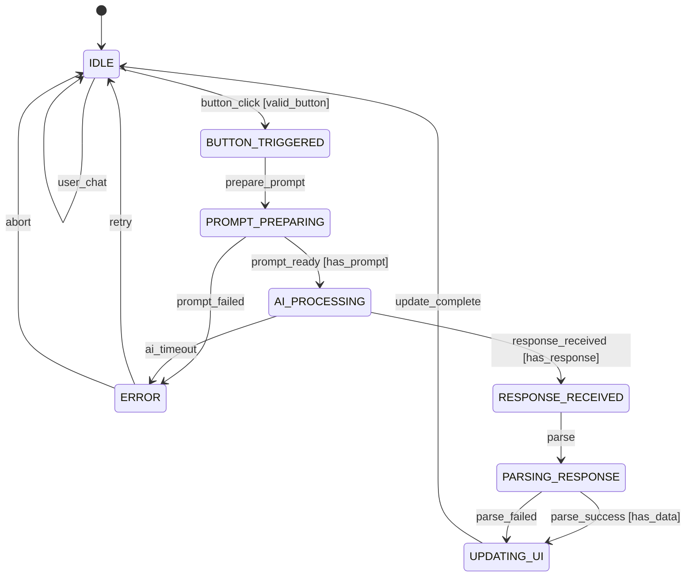

# Feature Scope: Stock Data GUI Elements with AI-Driven Updates

## Executive Summary
This document outlines the feasibility, complexity, and implementation plan for adding GUI elements to the Market Parser application that display structured stock data populated by specific AI prompt actions triggered via buttons.

**Feasibility:** ✅ HIGH - Fully achievable with current Gradio framework  
**Complexity:** 🟡 MEDIUM-HIGH - Deterministic FSM adds robustness but increases initial complexity  
**Estimated Timeline:** 3-4 days for complete implementation with FSM  

## Feature Overview

### Core Requirements
1. **New GUI Elements** for displaying:
   - Stock Snapshot (current price, % change, $ change, volume, VWAP, OHLC)
   - Support & Resistance Levels (3 levels each)
   - Technical Analysis (RSI, MACD, EMA 5/10/20/50/200, SMA 5/10/20/50/200)

2. **Button Prompts** that insert predefined queries:
   - "Current Stock Snapshot" button
   - "Support & Resistance Levels" button
   - "Technical Analysis" button

3. **Selective Updates**:
   - ONLY button-triggered prompts update GUI elements
   - Regular chat interactions do NOT update these elements
   - Maintains separation between conversational AI and structured data display

## Technical Architecture

### Component Structure
```python
gr.Blocks() layout:
├── Header Section
├── Main Content (gr.Row)
│   ├── Chat Section (gr.Column, scale=2)
│   │   ├── Chatbot
│   │   ├── Message Input
│   │   └── Send/Clear Buttons
│   └── Data Display Section (gr.Column, scale=1)
│       ├── Stock Snapshot (gr.Dataframe)
│       ├── Support/Resistance (gr.Dataframe)
│       └── Technical Indicators (gr.Dataframe)
└── Quick Actions Section
    └── Button Row (Stock Snapshot | S&R | Technical)
```

### Finite State Machine Architecture

#### State Definitions
```python
from enum import Enum, auto
from dataclasses import dataclass
from typing import Optional, Dict, Any, Callable
import logging
import time

class AppState(Enum):
    """Deterministic application states"""
    IDLE = auto()                # Waiting for user interaction
    BUTTON_TRIGGERED = auto()     # Button clicked, preparing prompt
    PROMPT_PREPARING = auto()     # Building prompt with ticker info
    AI_PROCESSING = auto()        # Waiting for AI response
    RESPONSE_RECEIVED = auto()     # AI response received
    PARSING_RESPONSE = auto()     # Extracting structured data
    UPDATING_UI = auto()          # Updating dataframe components
    ERROR = auto()                # Error state with recovery options

@dataclass
class StateContext:
    """Context data passed through state transitions"""
    current_state: AppState
    previous_state: Optional[AppState]
    button_type: Optional[str]  # 'snapshot', 'support_resistance', 'technical'
    ticker: Optional[str]
    prompt: Optional[str]
    ai_response: Optional[str]
    parsed_data: Dict[str, Any]
    error_message: Optional[str]
    transition_history: list
```

#### State Transition Rules
```python
class StateTransitions:
    """Define valid state transitions with guards and actions"""
    
    # Transition format: (current_state, event) -> (next_state, guard, action)
    TRANSITIONS = {
        # From IDLE
        (AppState.IDLE, 'button_click'): (
            AppState.BUTTON_TRIGGERED,
            lambda ctx: ctx.button_type in ['snapshot', 'sr', 'technical'],
            'record_button_type'
        ),
        (AppState.IDLE, 'user_chat'): (
            AppState.IDLE,  # Regular chat doesn't change state
            None,
            'process_regular_chat'
        ),
        
        # From BUTTON_TRIGGERED
        (AppState.BUTTON_TRIGGERED, 'prepare_prompt'): (
            AppState.PROMPT_PREPARING,
            None,
            'extract_ticker_and_build_prompt'
        ),
        
        # From PROMPT_PREPARING
        (AppState.PROMPT_PREPARING, 'prompt_ready'): (
            AppState.AI_PROCESSING,
            lambda ctx: ctx.prompt is not None,
            'send_to_ai'
        ),
        (AppState.PROMPT_PREPARING, 'prompt_failed'): (
            AppState.ERROR,
            None,
            'log_prompt_error'
        ),
        
        # From AI_PROCESSING
        (AppState.AI_PROCESSING, 'response_received'): (
            AppState.RESPONSE_RECEIVED,
            lambda ctx: ctx.ai_response is not None,
            'store_response'
        ),
        (AppState.AI_PROCESSING, 'ai_timeout'): (
            AppState.ERROR,
            None,
            'handle_ai_timeout'
        ),
        
        # From RESPONSE_RECEIVED
        (AppState.RESPONSE_RECEIVED, 'parse'): (
            AppState.PARSING_RESPONSE,
            None,
            'parse_ai_response'
        ),
        
        # From PARSING_RESPONSE
        (AppState.PARSING_RESPONSE, 'parse_success'): (
            AppState.UPDATING_UI,
            lambda ctx: ctx.parsed_data is not None,
            'prepare_ui_updates'
        ),
        (AppState.PARSING_RESPONSE, 'parse_failed'): (
            AppState.UPDATING_UI,  # Still update UI with raw text
            None,
            'fallback_to_raw_display'
        ),
        
        # From UPDATING_UI
        (AppState.UPDATING_UI, 'update_complete'): (
            AppState.IDLE,
            None,
            'finalize_and_cleanup'
        ),
        
        # From ERROR - Recovery transitions
        (AppState.ERROR, 'retry'): (
            AppState.IDLE,
            None,
            'reset_context'
        ),
        (AppState.ERROR, 'abort'): (
            AppState.IDLE,
            None,
            'cleanup_and_reset'
        ),
    }
```

#### State Manager Implementation
```python
class StateManager:
    """Single source of truth for application state"""
    
    def __init__(self):
        self.context = StateContext(
            current_state=AppState.IDLE,
            previous_state=None,
            button_type=None,
            ticker=None,
            prompt=None,
            ai_response=None,
            parsed_data={},
            error_message=None,
            transition_history=[]
        )
        self.logger = logging.getLogger(__name__)
        self.actions = self._register_actions()
    
    def transition(self, event: str, **kwargs) -> bool:
        """Execute a state transition if valid"""
        current = self.context.current_state
        transition_key = (current, event)
        
        if transition_key not in StateTransitions.TRANSITIONS:
            self.logger.warning(f"Invalid transition: {current} + {event}")
            return False
        
        next_state, guard, action_name = StateTransitions.TRANSITIONS[transition_key]
        
        # Check guard condition
        if guard and not guard(self.context):
            self.logger.info(f"Guard failed for transition: {current} -> {next_state}")
            return False
        
        # Execute transition
        self.context.previous_state = current
        self.context.current_state = next_state
        self.context.transition_history.append({
            'from': current.name,
            'to': next_state.name,
            'event': event,
            'timestamp': time.time()
        })
        
        # Execute action if defined
        if action_name and action_name in self.actions:
            try:
                self.actions[action_name](self.context, **kwargs)
            except Exception as e:
                self.logger.error(f"Action {action_name} failed: {e}")
                self._transition_to_error(str(e))
                return False
        
        self.logger.info(f"State transition: {current.name} -> {next_state.name}")
        return True
    
    def _transition_to_error(self, error_msg: str):
        """Emergency transition to ERROR state"""
        self.context.error_message = error_msg
        self.context.previous_state = self.context.current_state
        self.context.current_state = AppState.ERROR
    
    def get_state(self) -> AppState:
        """Get current state"""
        return self.context.current_state
    
    def can_transition(self, event: str) -> bool:
        """Check if a transition is valid from current state"""
        return (self.context.current_state, event) in StateTransitions.TRANSITIONS
    
    def get_history(self) -> list:
        """Get transition history for debugging"""
        return self.context.transition_history
    
    def _register_actions(self) -> Dict[str, Callable]:
        """Register action functions"""
        return {
            'record_button_type': self._record_button_type,
            'extract_ticker_and_build_prompt': self._build_prompt,
            'send_to_ai': self._send_to_ai,
            'parse_ai_response': self._parse_response,
            'prepare_ui_updates': self._prepare_updates,
            'finalize_and_cleanup': self._cleanup,
            'reset_context': self._reset,
            # ... other actions
        }
```

### State Diagram


### Data Flow with FSM
1. **User Action** → FSM validates transition → State changes to `BUTTON_TRIGGERED`
2. **Prompt Preparation** → FSM ensures proper state → Moves to `PROMPT_PREPARING`
3. **AI Processing** → FSM tracks async operation → Maintains `AI_PROCESSING` state
4. **Response Handling** → FSM orchestrates parsing → Controls `PARSING_RESPONSE` state
5. **UI Updates** → FSM ensures single update source → Executes in `UPDATING_UI` state
6. **Completion** → FSM cleanly returns to `IDLE` → Ready for next interaction

## Dependencies & Requirements

### Existing Dependencies (Already in project)
- `gradio>=4.0.0` - UI framework
- `pydantic-ai-slim[openai,mcp]` - AI agent framework
- `pandas` - Data manipulation (via gradio)
- `python-dotenv` - Environment management

### No Additional Dependencies Required
The feature can be implemented entirely with existing packages.

## Button Prompt Templates

### Stock Snapshot Prompt
```
"Provide a comprehensive stock snapshot for [TICKER]. Include:
- Current price
- Percentage change
- $ Change
- Volume
- VWAP (Volume Weighted Average Price)
- Open
- High
- Low
- Close
Format numbers clearly with appropriate units."
```

### Support & Resistance Prompt
```
"Analyze support and resistance levels for [TICKER]. Provide:
- 3 support levels (S1, S2, S3) with prices
- 3 resistance levels (R1, R2, R3) with prices
- Brief explanation of each level's significance
Use recent price action and technical analysis."
```

### Technical Analysis Prompt
```
"Provide technical analysis indicators for [TICKER]:
- RSI (14-day)
- MACD (12,26,9) with signal line status
- Moving Averages: EMA and SMA for 5, 10, 20, 50, 200 days
- Current trend assessment based on these indicators
Include specific values and interpretations."
```

## Implementation Tasks

### Phase 1: FSM Foundation (4-5 hours) ✅ COMPLETED
- [x] Implement AppState enum with all states
- [x] Create StateContext dataclass
- [x] Build StateTransitions class with transition rules
- [x] Implement StateManager with transition logic
- [x] Add comprehensive logging for state changes
- [x] Create unit tests for state transitions
- [x] Implement error recovery mechanisms

**Implementation Details:**
- **Module Structure:** Created `stock_data_fsm/` package with modular design
- **States:** 8 deterministic states (IDLE, BUTTON_TRIGGERED, etc.)
- **Transitions:** 26 transition rules with guards and actions
- **Manager:** Full StateManager with serialization support for Gradio
- **Testing:** Comprehensive unit tests (82 tests covering all components)
- **Logging:** Structured logging with session tracking
- **Recovery:** Multi-level error recovery with attempt limits

### Phase 2: Gradio Integration (3-4 hours) ✅ COMPLETED
- [x] Create gr.State component for StateManager
- [x] Add gr.Dataframe for stock snapshot display
- [x] Add gr.Dataframe for support/resistance levels
- [x] Add gr.Dataframe for technical indicators
- [x] Create button row with FSM event triggers
- [x] Implement responsive layout with gr.Row/gr.Column
- [x] Add state visualization component (optional debug mode)

**Implementation Details:**
- **Enhanced UI:** Created `chat_ui_enhanced.py` with full FSM integration (700+ lines)
- **FSM Integration:** StateManager as gr.State with seamless serialization
- **Data Display:** Three responsive dataframes for structured stock data
- **Action Buttons:** Three FSM-triggered buttons (Stock Snapshot, S&R, Technical)
- **Smart Routing:** FSM-aware message handler that routes button vs. chat requests
- **Debug Panel:** Collapsible FSM state visualization for development
- **Backward Compatibility:** Preserves normal chat functionality alongside FSM features
- **Response Parsing:** Built-in regex patterns for extracting structured data

### Phase 3: Response Parsing (4-5 hours) ✅ COMPLETED
- [x] Create ResponseParser class with methods:
  - `parse_stock_snapshot(text) -> dict`
  - `parse_support_resistance(text) -> dict`
  - `parse_technical_indicators(text) -> dict`
- [x] Implement regex patterns for data extraction
- [x] Add fallback handling for parse failures
- [x] Create data validation functions

**Implementation Details:**
- **Comprehensive Parser:** Created `response_parser.py` with advanced parsing capabilities (800+ lines)
- **Multiple Pattern Strategies:** Each data field has 2-4 different regex patterns for improved accuracy
- **Data Validation:** Field-specific validators with proper error handling and data cleaning
- **Confidence Scoring:** HIGH/MEDIUM/LOW/FAILED confidence levels based on extraction success rate
- **Fallback Handling:** Graceful degradation when parsing fails, with detailed error reporting
- **Performance Tracking:** Parse time monitoring and comprehensive logging
- **Enhanced UI Integration:** Updated `chat_ui_enhanced.py` to use the new parser
- **Comprehensive Testing:** Created `test_response_parser.py` with 35+ unit tests covering all functionality
- **DataFrames:** Automatic conversion of parsed results to Gradio-compatible DataFrames
- **Rich Metadata:** Extraction attributes, warnings, pattern match tracking, and debug information

### Phase 4: Prompt Engineering (2-3 hours) ✅ COMPLETED
- [x] Design button prompt templates with formatting instructions
- [x] Add system prompt modifications for structured output
- [x] Implement ticker extraction from user context
- [x] Test prompt consistency across different stocks

**Implementation Details:**
- **Comprehensive Template System:** Created `prompt_templates.py` with sophisticated template management (800+ lines)
- **Structured Formatting:** Each prompt type has specific formatting instructions optimized for ResponseParser
- **Context-Aware Ticker Extraction:** TickerExtractor with company name mapping, conversation context, and confidence scoring
- **System Prompt Enhancement:** Enhanced agent system prompt with structured output requirements and parsing optimization
- **Template Consistency:** Built-in testing framework for prompt consistency across different ticker symbols
- **Multi-Strategy Extraction:** Explicit ticker detection, company name mapping, conversation context, and fallback mechanisms
- **Production Testing:** Comprehensive test suite with 40+ unit tests covering all functionality
- **Integration Ready:** Enhanced chat_ui_enhanced.py integration with FSM-driven prompt generation

### Phase 5: Integration & Testing (2-3 hours)
- [ ] Connect button clicks to prompt insertion
- [ ] Wire parser outputs to Dataframe updates
- [ ] Test button-triggered vs regular chat behavior
- [ ] Add loading states during processing
- [ ] Implement error handling and user feedback

## Code Examples

### Button Implementation with FSM
```python
import gradio as gr
from typing import Tuple

# Initialize FSM
state_manager = StateManager()

# Button row with FSM integration
with gr.Row():
    snapshot_btn = gr.Button("📊 Stock Snapshot", variant="secondary")
    sr_btn = gr.Button("📈 Support & Resistance", variant="secondary")
    tech_btn = gr.Button("🔧 Technical Analysis", variant="secondary")

# FSM state as Gradio component
fsm_state = gr.State(state_manager)

# Button click handlers with FSM
async def handle_snapshot_click(fsm: StateManager, ticker: str, chat_history):
    """Handle snapshot button click through FSM"""
    if not fsm.can_transition('button_click'):
        return chat_history, fsm
    
    # Trigger FSM transition
    fsm.context.button_type = 'snapshot'
    fsm.context.ticker = ticker or 'last mentioned'
    
    # Execute state machine sequence
    fsm.transition('button_click')
    fsm.transition('prepare_prompt')
    
    # Build prompt based on FSM state
    if fsm.get_state() == AppState.PROMPT_PREPARING:
        prompt = f"Provide a comprehensive stock snapshot for {fsm.context.ticker}..."
        fsm.context.prompt = prompt
        fsm.transition('prompt_ready')
    
    # Continue with AI processing
    if fsm.get_state() == AppState.AI_PROCESSING:
        response = await agent.run(fsm.context.prompt)
        fsm.context.ai_response = response.output
        fsm.transition('response_received')
    
    return chat_history, fsm

snapshot_btn.click(
    handle_snapshot_click,
    inputs=[fsm_state, current_ticker, chatbot],
    outputs=[chatbot, fsm_state]
)
```

### Response Parser Example
```python
import re
import pandas as pd

class ResponseParser:
    @staticmethod
    def parse_stock_snapshot(text: str) -> pd.DataFrame:
        """Extract stock snapshot data from AI response."""
        patterns = {
            'current_price': r'(?:price|trading at|current)[:\s]*\$?([\d,]+\.?\d*)',
            'percentage_change': r'(?:up|down|changed?)[:\s]*([\d\.\-\+]+)%',
            'dollar_change': r'(?:\$|\+|\-)([\d\.\-\+]+)(?:\s|$)',
            'volume': r'volume[:\s]*([\d,]+)',
            'vwap': r'(?:vwap|volume weighted)[:\s]*\$?([\d,]+\.?\d*)',
            'open': r'open[:\s]*\$?([\d,]+\.?\d*)',
            'high': r'high[:\s]*\$?([\d,]+\.?\d*)',
            'low': r'low[:\s]*\$?([\d,]+\.?\d*)',
            'close': r'close[:\s]*\$?([\d,]+\.?\d*)'
        }
        
        data = {}
        for key, pattern in patterns.items():
            match = re.search(pattern, text, re.IGNORECASE)
            if match:
                data[key] = match.group(1)
        
        return pd.DataFrame([data]) if data else pd.DataFrame()
    
    @staticmethod
    def parse_support_resistance(text: str) -> pd.DataFrame:
        """Extract support and resistance levels from AI response."""
        patterns = {
            'S1': r'S1[:\s]*\$?([\d,]+\.?\d*)',
            'S2': r'S2[:\s]*\$?([\d,]+\.?\d*)',
            'S3': r'S3[:\s]*\$?([\d,]+\.?\d*)',
            'R1': r'R1[:\s]*\$?([\d,]+\.?\d*)',
            'R2': r'R2[:\s]*\$?([\d,]+\.?\d*)',
            'R3': r'R3[:\s]*\$?([\d,]+\.?\d*)'
        }
        data = {}
        for key, pattern in patterns.items():
            match = re.search(pattern, text, re.IGNORECASE)
            if match:
                data[key] = match.group(1)
        return pd.DataFrame([data]) if data else pd.DataFrame()
    
    @staticmethod
    def parse_technical_indicators(text: str) -> pd.DataFrame:
        """Extract technical indicators from AI response."""
        patterns = {
            'RSI': r'RSI[:\s]*([\d\.]+)',
            'MACD': r'MACD[:\s]*([\d\.\-\+]+)',
            'EMA_5': r'EMA[\s]*5[:\s]*\$?([\d,]+\.?\d*)',
            'SMA_5': r'SMA[\s]*5[:\s]*\$?([\d,]+\.?\d*)',
            # Additional patterns for other MAs...
        }
        data = {}
        for key, pattern in patterns.items():
            match = re.search(pattern, text, re.IGNORECASE)
            if match:
                data[key] = match.group(1)
        return pd.DataFrame([data]) if data else pd.DataFrame()
```

### Modified Message Handler with FSM
```python
import pandas as pd
from typing import Optional, Tuple
import time

async def handle_user_message_fsm(
    user_message: str,
    chat_history: list[dict],
    pyd_message_history: list | None,
    tracker: TokenCostTracker,
    fsm: StateManager,
    snapshot_df: pd.DataFrame = None,
    sr_df: pd.DataFrame = None,
    tech_df: pd.DataFrame = None
) -> Tuple:
    """Handle messages with FSM state management"""
    
    # Check if this is a regular chat (FSM stays in IDLE)
    if fsm.get_state() == AppState.IDLE and not fsm.context.button_type:
        # Regular chat - no state change needed
        response = await agent.run(user_message, message_history=pyd_message_history)
        chat_history.append({"role": "user", "content": user_message})
        chat_history.append({"role": "assistant", "content": response.output})
        return chat_history, pyd_message_history, tracker, fsm, snapshot_df, sr_df, tech_df
    
    # FSM-controlled processing for button triggers
    try:
        # Process through FSM states
        if fsm.get_state() == AppState.AI_PROCESSING:
            response = await agent.run(fsm.context.prompt, message_history=pyd_message_history)
            fsm.context.ai_response = response.output
            fsm.transition('response_received')
            
            # Move to parsing
            fsm.transition('parse')
            
        if fsm.get_state() == AppState.PARSING_RESPONSE:
            parser = ResponseParser()
            button_type = fsm.context.button_type
            
            try:
                if button_type == 'snapshot':
                    fsm.context.parsed_data['snapshot'] = parser.parse_stock_snapshot(
                        fsm.context.ai_response
                    )
                elif button_type == 'sr':
                    fsm.context.parsed_data['sr'] = parser.parse_support_resistance(
                        fsm.context.ai_response
                    )
                elif button_type == 'technical':
                    fsm.context.parsed_data['technical'] = parser.parse_technical_indicators(
                        fsm.context.ai_response
                    )
                
                fsm.transition('parse_success')
            except Exception as e:
                fsm.logger.warning(f"Parse failed: {e}")
                fsm.transition('parse_failed')
        
        if fsm.get_state() == AppState.UPDATING_UI:
            # Update dataframes based on parsed data
            if 'snapshot' in fsm.context.parsed_data:
                snapshot_df = fsm.context.parsed_data['snapshot']
            if 'sr' in fsm.context.parsed_data:
                sr_df = fsm.context.parsed_data['sr']
            if 'technical' in fsm.context.parsed_data:
                tech_df = fsm.context.parsed_data['technical']
            
            # Update chat history
            chat_history.append({"role": "user", "content": fsm.context.prompt})
            chat_history.append({"role": "assistant", "content": fsm.context.ai_response})
            
            # Complete the cycle
            fsm.transition('update_complete')
            
    except Exception as e:
        fsm._transition_to_error(str(e))
        fsm.transition('abort')  # Recovery
    
    return chat_history, pyd_message_history, tracker, fsm, snapshot_df, sr_df, tech_df
```

## FSM Benefits

### Deterministic Behavior
- **Every state transition is explicit** - No ambiguous state combinations
- **Guards prevent invalid transitions** - System can't enter undefined states
- **Complete transition history** - Full audit trail for debugging
- **Predictable error recovery** - Always returns to safe state

### Single Source of Truth
- **StateManager owns all state** - No scattered boolean flags
- **Context object carries all data** - Clear data flow through states
- **Centralized transition logic** - Easy to understand and modify
- **Consistent state access** - All components read from same source

### Enhanced Debugging
- **State visualization** - Can display current state in UI
- **Transition logging** - Every state change is logged with timestamp
- **History replay** - Can reconstruct sequence of events
- **State assertions** - Can validate expected states in tests

### Maintainability
- **Add new states easily** - Just extend enum and transition rules
- **Modify transitions safely** - Changes isolated to transition table
- **Test state logic independently** - Unit test each transition
- **Clear documentation** - State diagram shows complete flow

## Challenges & Solutions

### Challenge 1: AI Response Consistency
**Problem:** AI may return data in varying formats  
**Solution:** 
- Add explicit formatting instructions to button prompts
- Use few-shot examples in system prompt
- Implement multiple regex patterns for flexibility

### Challenge 2: Data Extraction Reliability
**Problem:** Parsing unstructured text is error-prone  
**Solution:**
- Implement comprehensive error handling
- Display raw text as fallback
- Log parsing failures for debugging
- Consider asking AI to output in pseudo-structured format

### Challenge 3: UI Responsiveness
**Problem:** Processing and updates may cause lag  
**Solution:**
- Use async/await for non-blocking operations
- Show loading indicators during processing
- Update components incrementally
- Cache parsed data to avoid re-parsing

### Challenge 4: State Synchronization
**Problem:** Managing multiple state variables  
**Solution:**
- Use single source of truth pattern
- Implement state validation functions
- Clear documentation of state flow
- Add debug mode to trace state changes

## Success Metrics

1. **Functionality**
   - ✅ All three button types trigger appropriate prompts
   - ✅ Data displays update correctly from button prompts
   - ✅ Regular chat doesn't affect data displays
   - ✅ Error handling prevents crashes

2. **User Experience**
   - Response time < 3 seconds for data updates
   - Clear visual feedback during processing
   - Intuitive button labels and placement
   - Readable, well-formatted data displays

3. **Code Quality**
   - Modular, testable components
   - Comprehensive error handling
   - Clear documentation and comments
   - Follows existing code patterns

## Future Enhancements

1. **Phase 2 Features**
   - Auto-refresh data on timer
   - Export data to CSV/Excel
   - Historical data comparison
   - Chart visualizations

2. **Advanced Parsing**
   - ML-based response parsing
   - Confidence scores for extracted data
   - Multi-stock comparison views

3. **Customization**
   - User-defined button prompts
   - Configurable data display formats
   - Saved layouts/preferences

## Risk Assessment

| Risk | Probability | Impact | Mitigation |
|------|------------|--------|------------|
| Parsing failures | Medium | Low | Fallback to raw text display |
| UI layout issues | Low | Medium | Responsive design testing |
| Performance degradation | Low | Medium | Optimize parsing, use caching |
| State management bugs | Medium | High | Comprehensive testing, logging |

## Conclusion

This feature is **highly feasible** with **medium-high complexity** due to the FSM implementation. The main technical challenges revolve around reliable response parsing and state management, both of which have clear solutions. The modular implementation approach allows for incremental development and testing, reducing overall project risk.

**Recommended Approach:** Implement in phases with Phase 1-3 as MVP, followed by iterative improvements based on user feedback.

**Total Estimated Time:** 20-25 hours of development + 5-7 hours testing/refinement (includes FSM implementation)

---

*Document Version: 1.0*  
*Created: December 2024*  
*Author: Market Parser Development Team*
