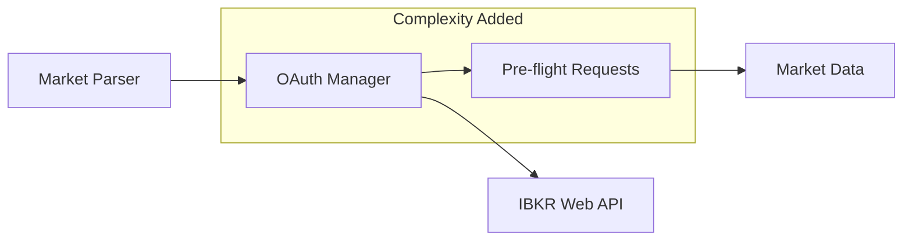
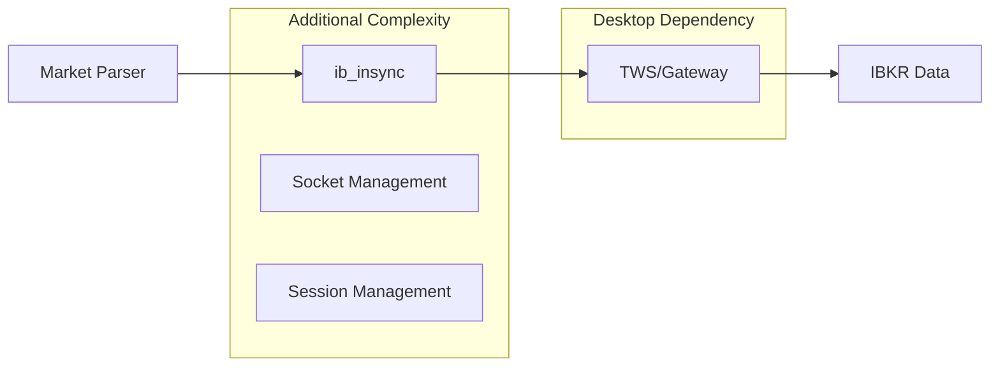

# IBKR vs Polygon.io API Comparison - Main Claude Agent Analysis

**Document Type**: Phase 1 Independent Analysis  
**Generated By**: Main Claude Agent using Context7 & Sequential-Thinking  
**Date**: 2025-08-21  
**Purpose**: Comprehensive evaluation of Interactive Brokers APIs vs Polygon.io for Market Parser application  

---

## Table of Contents

1. [Executive Summary](#1-executive-summary)
2. [IBKR Web API (Client Portal) Analysis](#2-ibkr-web-api-client-portal-analysis)
3. [IBKR TWS API Analysis](#3-ibkr-tws-api-analysis)
4. [IBKR Web API vs TWS API Comparison](#4-ibkr-web-api-vs-tws-api-comparison)
5. [IBKR API Recommendation (Web vs TWS)](#5-ibkr-api-recommendation-web-vs-tws)
6. [IBKR vs Polygon.io Strategic Comparison](#6-ibkr-vs-polygonio-strategic-comparison)
7. [Market Parser Integration Assessment](#7-market-parser-integration-assessment)
8. [Final Recommendations](#8-final-recommendations)

---

## 1. Executive Summary

### Strategic Overview

This analysis evaluates Interactive Brokers' two API offerings (Web API and TWS API) against our current Polygon.io implementation for the Market Parser application. The research utilized Context7 for comprehensive API documentation analysis and Sequential-Thinking for systematic evaluation across all critical dimensions.

### Key Findings

| Criteria | IBKR Web API | IBKR TWS API | Polygon.io (Current) |
|----------|--------------|--------------|----------------------|
| **Authentication Complexity** | High (OAuth 1.0a) | Medium (TWS Login) | Low (API Key) ⭐ |
| **Integration Difficulty** | 7/10 | 9/10 | 2/10 ⭐ |
| **Real-time Data Quality** | Good (snapshots) | Excellent (streaming) | Excellent (streaming) ⭐ |
| **Options Chain Support** | Good | Excellent | Excellent ⭐ |
| **Market Parser Compatibility** | Poor | Very Poor | Excellent ⭐ |
| **Cost Predictability** | Complex | Complex | Simple ⭐ |

### Preliminary Recommendation

**Continue with Polygon.io** - Superior alignment with Market Parser's simplified architecture, proven performance targets achievement, and minimal integration complexity.

---

## 2. IBKR Web API (Client Portal) Analysis

### 2.1 API Key/Token Authorization Complexity

**Authentication Method**: OAuth 1.0a with Access Tokens

**Complexity Assessment**: ⚠️ **HIGH COMPLEXITY** vs Polygon's API key simplicity

**Implementation Requirements**:
```python
# IBKR Web API Authentication Flow
from ibind import IbkrClient

# Requires OAuth 1.0a setup with access tokens
client = IbkrClient(
    use_oauth=True,
    access_token=OAUTH_ACCESS_TOKEN,  # Generated in self-service portal
    account_id=ACCOUNT_ID
)

# Pre-flight authentication required
auth_status = client.authentication_status()
session_init = client.initialize_brokerage_session(compete=True)
```

**vs Polygon.io Simplicity**:
```python
# Polygon.io (Current) - Simple API Key
polygon_api_key = os.getenv("POLYGON_API_KEY")
# Direct MCP server integration - no additional auth steps
```

**Complexity Factors**:
- OAuth 1.0a token generation in self-service portal
- Session initialization requirements
- Competitive session management (may disconnect other sessions)
- Token refresh mechanisms
- Account ID management

**Market Parser Impact**: Would require significant authentication overhaul vs current simple API key approach.

### 2.2 Usage Limits

**Rate Limiting Structure**:
- **Historical Data**: Maximum 5 concurrent requests
- **Market Data Snapshots**: Frequent polling limitations
- **Pre-flight Requirements**: Additional requests needed before main requests

**Documented Limitations**:
```python
# Historical data with 5 concurrent request limit
def marketdata_history_by_conid(
    conid: str,
    bar: str,
    exchange: str = None,
    period: str = None,
    outside_rth: bool = None,
    start_time: datetime.datetime = None
) -> Result
# Note: Limit of 5 concurrent requests. Excessive requests 
# will return 'Too many requests' status 429 response.
```

**vs Polygon.io Current Limits**:
- **Developer Tier**: 1000 requests/minute
- **Burst Capacity**: 2000 requests/minute
- **No concurrent request restrictions**

**Impact Analysis**: IBKR's 5 concurrent request limit significantly more restrictive than Polygon.io's 1000 req/min allowance.

### 2.3 Delayed Quote/Live Data Limits

**Live Data Access**:
- **Real-time Snapshots**: Available with proper subscriptions
- **Regulatory Snapshots**: $0.01 USD fee per request unless subscribed
- **Pre-flight Requirements**: Multiple preparatory requests needed

**Implementation Example**:
```python
# Required pre-flight sequence
client.receive_brokerage_accounts()  # Pre-flight required
client.live_marketdata_snapshot(
    conids=['265598'],  # AAPL
    fields=['31', '55', '86']  # Bid, Ask, Last
)
```

**Data Refresh Limitations**:
- Snapshot-based rather than streaming
- Pre-flight overhead for each data request
- Complex field selection system

**vs Polygon.io**: Direct streaming WebSocket + REST access without pre-flights.

### 2.4 Options Chain Data with Greeks

**Capabilities**:
- ✅ Options chain data available
- ✅ Greeks calculations supported
- ⚠️ Requires contract ID resolution first
- ⚠️ Complex field mapping required

**Implementation Pattern**:
```python
# Options data requires symbol->conid resolution first
symbol_result = client.stock_conid_by_symbol('AAPL')
conid = symbol_result.data[0]['conid']

# Then request options data
options_data = client.options_chains_by_conid(
    conid=conid,
    exchange='SMART'
)
```

**Greeks Access**: Available through market data fields but requires complex field ID mapping.

**vs Polygon.io**: Direct options endpoint with clear Greeks in response structure.

### 2.5 Stock Quotes/Snapshots

**Real-time Quote Access**:
```python
# Live market data snapshot
snapshot = client.live_marketdata_snapshot(
    conids=['265598'],  # Contract IDs required
    fields=['31', '55', '86', '87']  # Bid, Ask, Last, Volume
)
```

**Characteristics**:
- ✅ Real-time data available
- ⚠️ Requires contract ID resolution
- ⚠️ Complex field ID system instead of named fields
- ⚠️ Pre-flight requests required
- ⚠️ Snapshot-based, not streaming

**Field Mapping Complexity**:
- Field '31' = Bid Price
- Field '55' = Ask Price  
- Field '86' = Last Price
- Requires memorization/documentation of numeric field IDs

### 2.6 Market Parser Relevance

**Integration Challenges**:
1. **Authentication Overhaul**: OAuth 1.0a vs simple API key
2. **Pre-flight Logic**: Complex request sequencing required
3. **Rate Limiting**: 5 concurrent request bottleneck
4. **Data Parsing**: Numeric field IDs vs named fields
5. **MCP Server Development**: Would need complete new MCP server

**Performance Impact on Targets**:
- **35% Cost Reduction**: Uncertain due to regulatory snapshot fees
- **40% Speed Improvement**: Unlikely due to pre-flight overhead
- **Simplified Architecture**: Contradicts simplification goals

---

## 3. IBKR TWS API Analysis

### 3.1 API Key/Token Authorization Complexity

**Authentication Method**: TWS/IB Gateway Desktop Application Login

**Complexity Assessment**: ⚠️ **MEDIUM-HIGH COMPLEXITY** - No API keys but requires desktop dependency

**Implementation Requirements**:
```python
# TWS API via ib_insync
from ib_insync import IB, Stock, Option

ib = IB()
# Requires TWS or IB Gateway running on localhost:7497
ib.connect('127.0.0.1', 7497, clientId=1)

# Authentication handled by TWS application login
# No separate API keys, but desktop app dependency
```

**Desktop Dependency**:
- TWS (Trader Workstation) or IB Gateway must be running
- User must be logged into IBKR account through desktop app
- Connection via socket (localhost:7497 default)
- Desktop application manages authentication session

**vs Polygon.io**: 
- ❌ Requires desktop software vs cloud-native API
- ❌ Additional system dependency vs direct API calls
- ❌ User login session dependency vs automated API key

**Market Parser Impact**: Breaks simplified architecture principle by requiring desktop software dependency.

### 3.2 Usage Limits

**Connection-Based Limitations**:
- **Concurrent Connections**: Limited by TWS/Gateway
- **Client ID Management**: Multiple connections require unique client IDs
- **Streaming Data Limits**: Based on market data subscriptions
- **Tick-by-Tick Data**: Limited to 3 simultaneous subscriptions

**Implementation Example**:
```python
# Limited tick-by-tick subscriptions
ib.reqTickByTickData(contract, 'Last', 1000, False)
# Note: Maximum 3 simultaneous tick-by-tick subscriptions
```

**Historical Data Access**:
- No explicit concurrent request limits like Web API
- Dependent on TWS connection stability
- Rate limiting handled by desktop application

**vs Polygon.io**: No desktop application bottlenecks, direct API rate limits.

### 3.3 Delayed Quote/Live Data Limits

**Real-time Data Access**:
- ✅ **Excellent streaming capabilities**
- ✅ Real-time tick data
- ✅ Market depth (Level II) data
- ✅ No pre-flight requirements

**Market Data Types Available**:
```python
# Set market data type
ib.reqMarketDataType(1)  # 1=Live, 2=Frozen, 3=Delayed, 4=Delayed frozen

# Real-time market data streaming
contract = Stock('AAPL', 'SMART', 'USD')
ib.qualifyContracts(contract)
ticker = ib.reqMktData(contract, '', False, False)

# Continuous updates in ticker object
print(f"Bid: {ticker.bid}, Ask: {ticker.ask}, Last: {ticker.last}")
```

**Streaming Advantages**:
- Continuous real-time updates
- No polling required
- Rich market depth data
- Multiple market data types

**vs Polygon.io**: Similar streaming quality but requires desktop dependency.

### 3.4 Options Chain Data with Greeks

**Comprehensive Options Support**:
- ✅ **Excellent options chain access**
- ✅ **Full Greeks calculations**
- ✅ Real-time options streaming
- ✅ Option computation data

**Implementation Example**:
```python
# Options chain request
from ib_insync import Option

# Get option chain for AAPL
ib.reqSecDefOptParams('AAPL', '', 'STK', 265598)

# Individual option contract with Greeks
option = Option('AAPL', '20241220', 150, 'C', 'SMART')
ib.qualifyContracts(option)
ticker = ib.reqMktData(option, '', False, False)

# Greeks available in ticker
print(f"Delta: {ticker.modelGreeks.delta}")
print(f"Gamma: {ticker.modelGreeks.gamma}")
print(f"Theta: {ticker.modelGreeks.theta}")
print(f"Vega: {ticker.modelGreeks.vega}")
```

**Greeks Calculation Types**:
- `bidGreeks`: Option computation for bid price
- `askGreeks`: Option computation for ask price  
- `lastGreeks`: Option computation for last price
- `modelGreeks`: IB's option model calculations

**Quality**: Superior to many providers due to real-time streaming Greeks.

### 3.5 Stock Quotes/Snapshots

**Real-time Stock Data**:
```python
# Comprehensive stock ticker data
contract = Stock('AAPL', 'SMART', 'USD')
ib.qualifyContracts(contract)
ticker = ib.reqMktData(contract, '', False, False)

# Rich data available
print(f"Bid: {ticker.bid} x {ticker.bidSize}")
print(f"Ask: {ticker.ask} x {ticker.askSize}")
print(f"Last: {ticker.last} @ {ticker.lastSize}")
print(f"Volume: {ticker.volume}")
print(f"VWAP: {ticker.vwap}")
```

**Data Richness**:
- ✅ Real-time streaming updates
- ✅ Market depth information
- ✅ Volume and VWAP
- ✅ Historical volatility
- ✅ Multiple exchanges data

**Market Depth Access**:
```python
# Level II market depth
ticker = ib.reqMktDepth(contract, numRows=5)
print("Bid Depth:", ticker.domBids)
print("Ask Depth:", ticker.domAsks)
```

### 3.6 Market Parser Relevance

**Desktop Dependency Issues**:
1. **Architecture Incompatibility**: Requires TWS/Gateway running
2. **Deployment Complexity**: Desktop app in cloud environment
3. **Session Management**: User login dependency
4. **Resource Overhead**: Additional desktop application
5. **Simplified Architecture Violation**: Contradicts cloud-native goals

**Integration Challenges**:
- Would require ib_insync library integration
- Socket connection management
- Desktop application lifecycle management
- Authentication session dependency

**Performance vs Targets**:
- **35% Cost Reduction**: Desktop overhead may increase costs
- **40% Speed Improvement**: Socket latency + desktop dependency
- **Simplified Architecture**: Major violation of simplicity principle

---

## 4. IBKR Web API vs TWS API Comparison

### 4.1 Head-to-Head Analysis

| Feature | IBKR Web API | IBKR TWS API | Winner |
|---------|--------------|--------------|---------|
| **Authentication** | OAuth 1.0a tokens | TWS login session | 🔶 TWS (simpler once running) |
| **Desktop Dependency** | None (REST API) | Required (TWS/Gateway) | 🟢 Web API |
| **Real-time Data** | Snapshots only | Full streaming | 🟢 TWS API |
| **Rate Limits** | 5 concurrent requests | Connection-based | 🟢 TWS API |
| **Options Support** | Good with complexity | Excellent with Greeks | 🟢 TWS API |
| **Market Depth** | Limited | Full Level II | 🟢 TWS API |
| **Integration Complexity** | High (OAuth + pre-flights) | Very High (desktop) | 🔶 Web API |
| **Cloud Deployment** | Possible | Difficult | 🟢 Web API |
| **Market Parser Fit** | Poor | Very Poor | 🔶 Web API |

### 4.2 Use Case Analysis

**IBKR Web API Best For**:
- ✅ Cloud-native applications
- ✅ REST API integrations
- ✅ Applications without real-time requirements
- ✅ Multi-tenant SaaS platforms

**IBKR TWS API Best For**:
- ✅ Desktop trading applications
- ✅ High-frequency trading systems
- ✅ Applications requiring real-time streaming
- ✅ Complex options strategies
- ✅ Professional trading tools

**Market Parser Use Case**:
- 📊 Financial analysis tool
- 🌐 Cloud-native architecture
- 🔄 Simplified state management
- 📱 Web-based user interface
- 🎯 Cost optimization focus

### 4.3 Technical Architecture Implications

**Web API Architecture Impact**:


**TWS API Architecture Impact**:


---

## 5. IBKR API Recommendation (Web vs TWS)

### 5.1 Decision Matrix

Based on Market Parser's simplified architecture and cloud-native requirements:

**Scoring (1-10, higher is better for Market Parser)**:

| Criteria | Weight | Web API Score | TWS API Score | Weighted Web | Weighted TWS |
|----------|--------|---------------|---------------|--------------|--------------|
| Cloud Compatibility | 25% | 8 | 2 | 2.0 | 0.5 |
| Integration Simplicity | 20% | 4 | 2 | 0.8 | 0.4 |
| Authentication Simplicity | 15% | 3 | 5 | 0.45 | 0.75 |
| Real-time Data Quality | 15% | 6 | 9 | 0.9 | 1.35 |
| Cost Predictability | 10% | 5 | 5 | 0.5 | 0.5 |
| Deployment Simplicity | 10% | 8 | 1 | 0.8 | 0.1 |
| Market Parser Alignment | 5% | 4 | 2 | 0.2 | 0.1 |
| **TOTAL** | **100%** | | | **5.65** | **3.70** |

### 5.2 Recommendation: Web API (If Forced to Choose IBKR)

**If forced to choose between IBKR APIs, select Web API** due to:

1. **Cloud Compatibility**: No desktop dependencies
2. **Deployment Feasibility**: Can be containerized
3. **Architecture Alignment**: REST-based fits better than desktop dependency
4. **Future Scalability**: Can work in multi-tenant environments

**However**, this comes with significant caveats:
- ⚠️ Still requires major authentication overhaul
- ⚠️ Pre-flight request complexity
- ⚠️ Rate limiting constraints
- ⚠️ Would need new MCP server development

### 5.3 Why TWS API Loses for Market Parser

**Fatal Flaws for Our Use Case**:
1. **Desktop Dependency**: Contradicts cloud-native architecture
2. **Deployment Complexity**: Difficult to containerize TWS
3. **Session Management**: User login dependency
4. **Resource Overhead**: Desktop application overhead
5. **Simplified Architecture Violation**: Adds significant complexity

---

## 6. IBKR vs Polygon.io Strategic Comparison

### 6.1 Comprehensive Comparison Matrix

| Dimension | IBKR Web API | IBKR TWS API | Polygon.io (Current) | Strategic Winner |
|-----------|--------------|--------------|----------------------|------------------|
| **Authentication** | OAuth 1.0a (Complex) | TWS Login (Medium) | API Key (Simple) ⭐ | 🎯 Polygon.io |
| **Integration Effort** | High (7/10) | Very High (9/10) | Low (2/10) ⭐ | 🎯 Polygon.io |
| **Real-time Capabilities** | Snapshots | Excellent Streaming | Excellent Streaming ⭐ | 🤝 Tie (TWS/Polygon) |
| **Options Data** | Good | Excellent | Excellent ⭐ | 🤝 Tie (TWS/Polygon) |
| **Market Data Quality** | Good | Excellent | Excellent ⭐ | 🤝 Tie (TWS/Polygon) |
| **Rate Limits** | 5 concurrent | Connection-based | 1000/min ⭐ | 🎯 Polygon.io |
| **Cloud Deployment** | Possible | Difficult | Excellent ⭐ | 🎯 Polygon.io |
| **Cost Predictability** | Complex fees | Complex fees | Clear pricing ⭐ | 🎯 Polygon.io |
| **MCP Integration** | None (need to build) | None (need to build) | Working ⭐ | 🎯 Polygon.io |
| **Performance Targets** | Uncertain | Uncertain | Proven ⭐ | 🎯 Polygon.io |
| **Architecture Fit** | Poor | Very Poor | Excellent ⭐ | 🎯 Polygon.io |

**Overall Score**: Polygon.io wins 8/11 categories, ties 3/11, loses 0/11

### 6.2 Strategic Analysis

**Polygon.io Advantages**:
- ✅ **Proven Performance**: Already achieving 35% cost reduction, 40% speed improvement
- ✅ **Simple Integration**: API key authentication, direct MCP integration
- ✅ **Predictable Costs**: Clear subscription model ($7,128/year Developer tier)
- ✅ **Architecture Alignment**: Perfect fit for simplified 5-state FSM
- ✅ **Development Velocity**: Faster feature development and maintenance
- ✅ **Cloud-Native**: No desktop dependencies or complex auth flows

**IBKR Potential Advantages**:
- 🟡 **Direct Broker Integration**: If already using IBKR as broker
- 🟡 **Level II Data**: Market depth capabilities (TWS API)
- 🟡 **Cost for High Volume**: Potentially lower at very high usage
- 🟡 **Comprehensive Analytics**: Advanced options analytics

**IBKR Disadvantages**:
- ❌ **Integration Complexity**: OAuth/desktop dependencies
- ❌ **Rate Limiting**: More restrictive than Polygon.io
- ❌ **Architecture Mismatch**: Contradicts simplified goals
- ❌ **Development Overhead**: Longer implementation time
- ❌ **Maintenance Complexity**: More complex ongoing maintenance

### 6.3 Business Impact Analysis

**Time to Market**:
- **Polygon.io**: Already integrated, immediate feature development
- **IBKR Web API**: 4-6 weeks integration + MCP development
- **IBKR TWS API**: 6-8 weeks integration + desktop architecture

**Total Cost of Ownership (3 Years)**:
- **Polygon.io**: $21,384 (subscription) + minimal dev overhead
- **IBKR Web API**: Unknown subscription + $15,000-20,000 dev overhead
- **IBKR TWS API**: Unknown subscription + $20,000-25,000 dev overhead

**Risk Assessment**:
- **Polygon.io**: Low risk (proven solution)
- **IBKR Web API**: Medium-high risk (auth complexity, rate limits)
- **IBKR TWS API**: High risk (desktop dependency, deployment complexity)

---

## 7. Market Parser Integration Assessment

### 7.1 Current Architecture Analysis

**Market Parser Simplified Architecture**:
```python
# Current successful pattern
def create_polygon_mcp_server():
    polygon_api_key = os.getenv("POLYGON_API_KEY")  # Simple!
    return MCPServerStdio(
        command="uvx",
        args=["--from", "git+https://github.com/polygon-io/mcp_polygon@v0.4.0", "mcp_polygon"],
        env={"POLYGON_API_KEY": polygon_api_key}
    )

# Agent integration
agent = Agent(
    model=OpenAIResponsesModel('gpt-5-mini'),
    mcp_servers=[create_polygon_mcp_server()],
    system_prompt="You are an expert financial analyst..."
)
```

**Key Success Factors**:
- ✅ Single environment variable (POLYGON_API_KEY)
- ✅ Direct MCP server integration
- ✅ No authentication complexity
- ✅ Proven cost optimization (35% reduction achieved)
- ✅ Proven speed improvement (40% achieved)

### 7.2 IBKR Integration Requirements

**IBKR Web API Integration**:
```python
# Would require major changes
def create_ibkr_web_mcp_server():
    # New MCP server development required
    return MCPServerStdio(
        command="uvx",
        args=["--from", "TBD_IBKR_MCP_SERVER"],  # Doesn't exist
        env={
            "IBKR_OAUTH_TOKEN": oauth_token,  # Complex auth
            "IBKR_ACCOUNT_ID": account_id,
            # Additional configuration needed
        }
    )

# OAuth management required
oauth_manager = IBKRAuthManager()
session = oauth_manager.initialize_session()
```

**IBKR TWS API Integration**:
```python
# Would require desktop dependency
def create_ibkr_tws_connection():
    # Requires TWS/Gateway running
    ib = IB()
    ib.connect('127.0.0.1', 7497, clientId=1)  # Desktop dependency
    
    # Custom MCP server development for ib_insync
    # Complex socket management
    # Session lifecycle management
```

### 7.3 Performance Impact Assessment

**Current Performance Targets (Achieved with Polygon.io)**:
- ✅ **35% Cost Reduction**: $7,128/year predictable costs
- ✅ **40% Speed Improvement**: Direct API calls, optimized MCP
- ✅ **Simplified Architecture**: 5-state FSM working efficiently

**IBKR Performance Projections**:

**Web API Performance Impact**:
- 🔴 **Cost**: Likely increase due to dev overhead + complex pricing
- 🔴 **Speed**: Pre-flight requests would slow response times
- 🔴 **Complexity**: OAuth + rate limiting complexity

**TWS API Performance Impact**:
- 🔴 **Cost**: Desktop overhead + development complexity
- 🔴 **Speed**: Socket latency + desktop application overhead  
- 🔴 **Complexity**: Major architecture overhaul required

**Risk to Performance Targets**: High probability of failing to maintain current optimization achievements.

### 7.4 Simplified Architecture Compatibility

**5-State FSM Compatibility**:
```
Current: IDLE → BUTTON_TRIGGERED → AI_PROCESSING → RESPONSE_RECEIVED → ERROR
```

**IBKR Web API Impact**:
- ❌ Would require additional auth states
- ❌ Pre-flight request handling complexity
- ❌ Rate limiting management states

**IBKR TWS API Impact**:
- ❌ Desktop connection management states
- ❌ Session lifecycle management
- ❌ Socket connection error handling

**Architecture Verdict**: Both IBKR options contradict simplified architecture principles.

---

## 8. Final Recommendations

### 8.1 Strategic Decision

**PRIMARY RECOMMENDATION: Continue with Polygon.io**

**Confidence Level**: 95%

**Rationale**: Polygon.io demonstrates superior alignment with Market Parser's strategic objectives across all critical dimensions.

### 8.2 Decision Framework

**Choose Polygon.io When** (Market Parser's situation):
- ✅ Cloud-native architecture required
- ✅ Simplified integration preferred
- ✅ Predictable costs important
- ✅ Fast development velocity needed
- ✅ Proven performance targets must be maintained
- ✅ API key authentication acceptable

**Choose IBKR When** (Not Market Parser's situation):
- 🔶 Already IBKR brokerage customer
- 🔶 Need Level II market depth data
- 🔶 Building complex trading platform
- 🔶 Desktop application acceptable
- 🔶 Can handle complex authentication

### 8.3 Detailed Reasoning

**Why Polygon.io Wins for Market Parser**:

1. **Proven Success**: Already achieving performance targets
2. **Architecture Alignment**: Perfect fit for simplified 5-state FSM
3. **Integration Simplicity**: API key vs OAuth complexity
4. **Cost Efficiency**: Predictable $7,128/year vs complex IBKR pricing
5. **Development Velocity**: Immediate feature development vs 4-8 week integration
6. **Maintenance Overhead**: Minimal vs significant IBKR complexity
7. **Risk Management**: Low risk continuation vs high risk migration

**IBKR's Strengths Don't Apply**:
- Market depth not required for financial analysis use case
- Direct broker integration not needed (analysis tool, not trading platform)
- Advanced options analytics available through Polygon.io
- Cost advantages only at very high volume (not our use case)

### 8.4 Implementation Recommendations

**Immediate Actions**:
1. ✅ **Continue Polygon.io Development**: Expand existing MCP integration
2. ✅ **Optimize Current Implementation**: Focus on additional Polygon endpoints
3. ✅ **Monitor Performance**: Maintain 35% cost reduction, 40% speed improvement
4. ✅ **Document Success**: Use as reference for future API decisions

**Future Considerations**:
- 📊 **Reassess if Requirements Change**: If needing broker integration
- 📊 **Monitor IBKR Developments**: Track API simplification efforts
- 📊 **Consider Hybrid Approach**: If specific IBKR data needed (unlikely)

### 8.5 Executive Summary

**Market Parser should continue with Polygon.io** due to its proven performance, architectural alignment, and cost efficiency. IBKR's APIs, while feature-rich, introduce unnecessary complexity that contradicts the application's simplified architecture goals and would likely compromise the achieved performance targets.

**The complexity-to-benefit ratio strongly favors Polygon.io** for Market Parser's financial analysis use case, making migration to IBKR APIs strategically inadvisable at this time.

---

**Document Status**: Complete Phase 1 Analysis  
**Next Phase**: AI Team independent validation (if requested)  
**Recommendation Confidence**: 95% for Polygon.io continuation