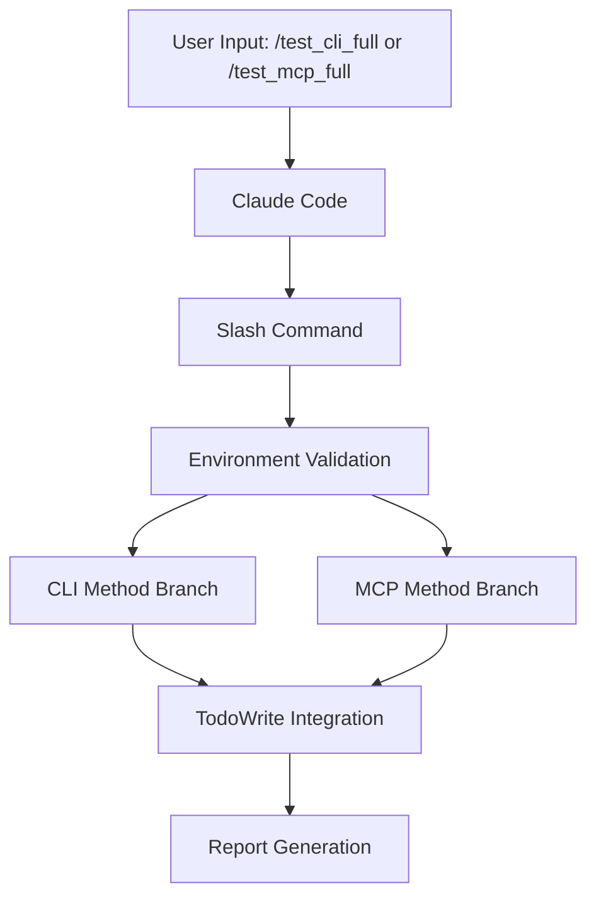
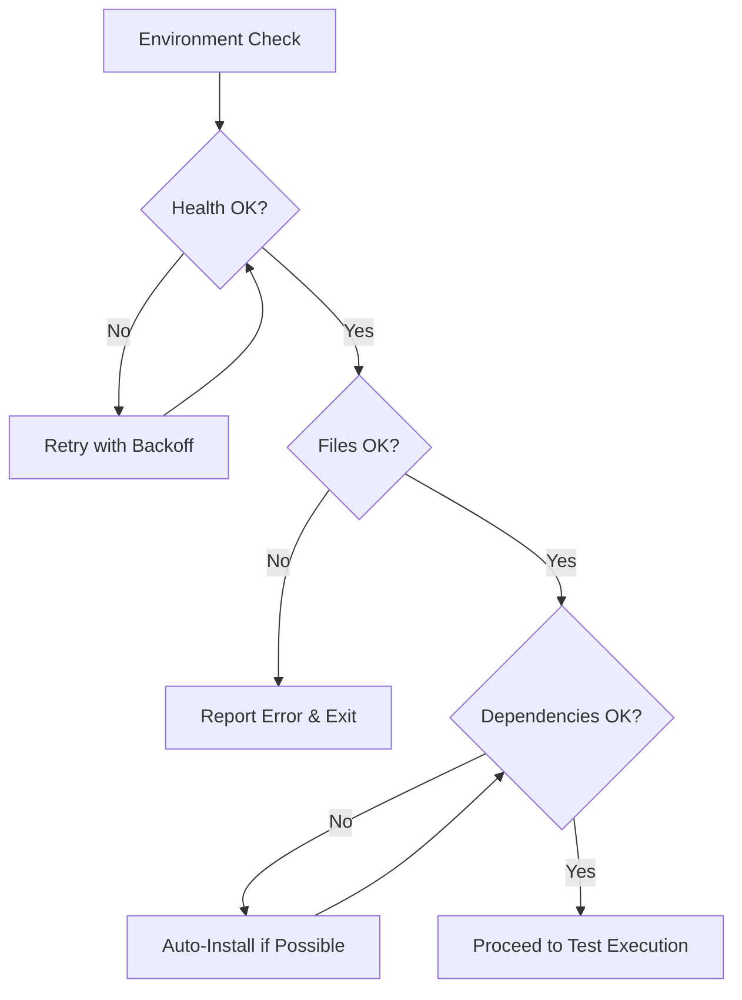
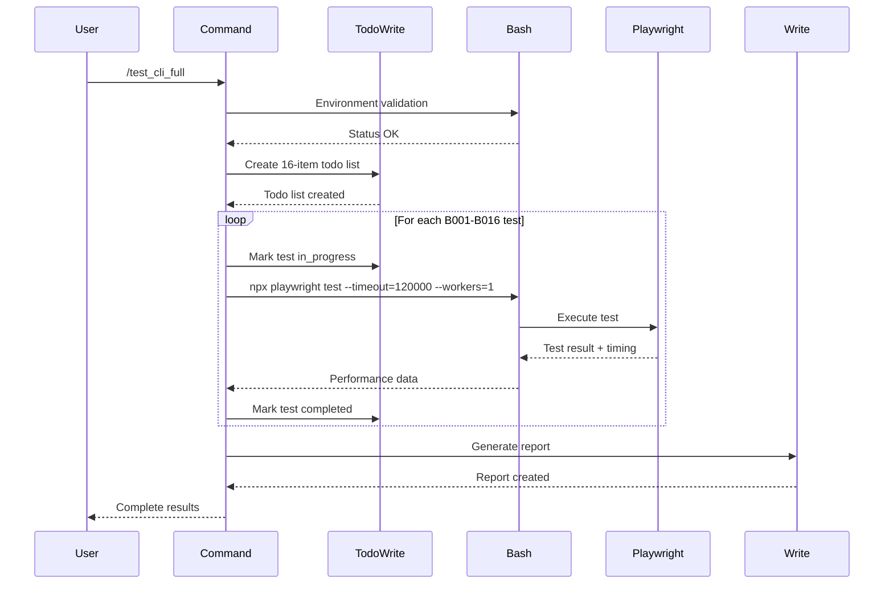
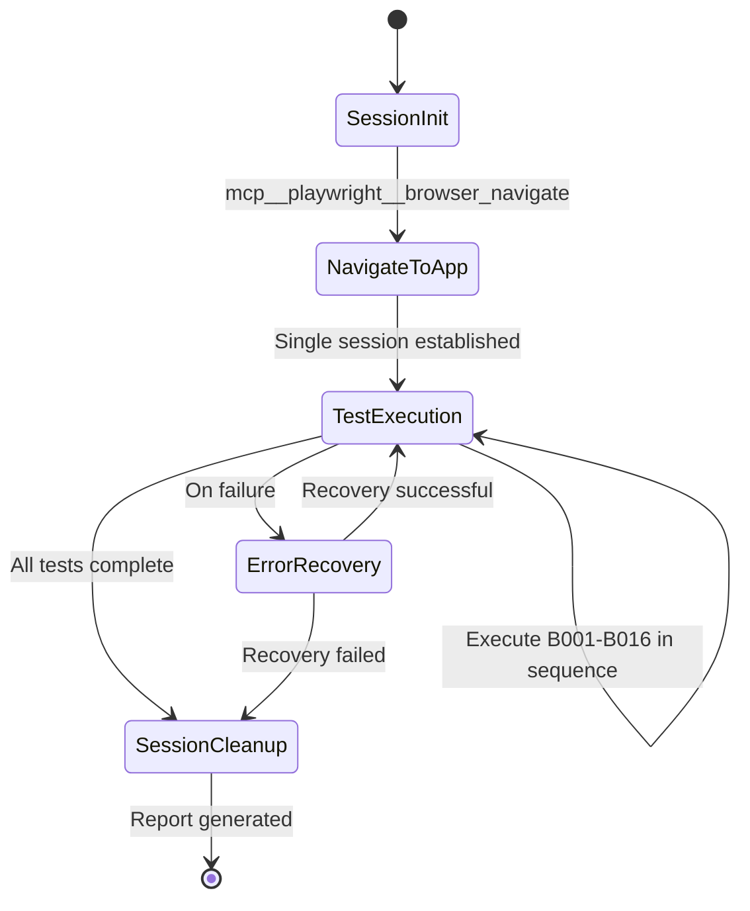
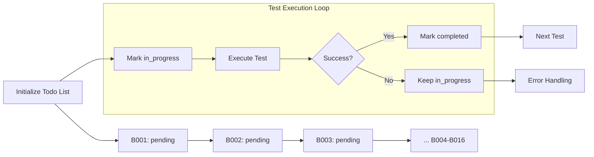
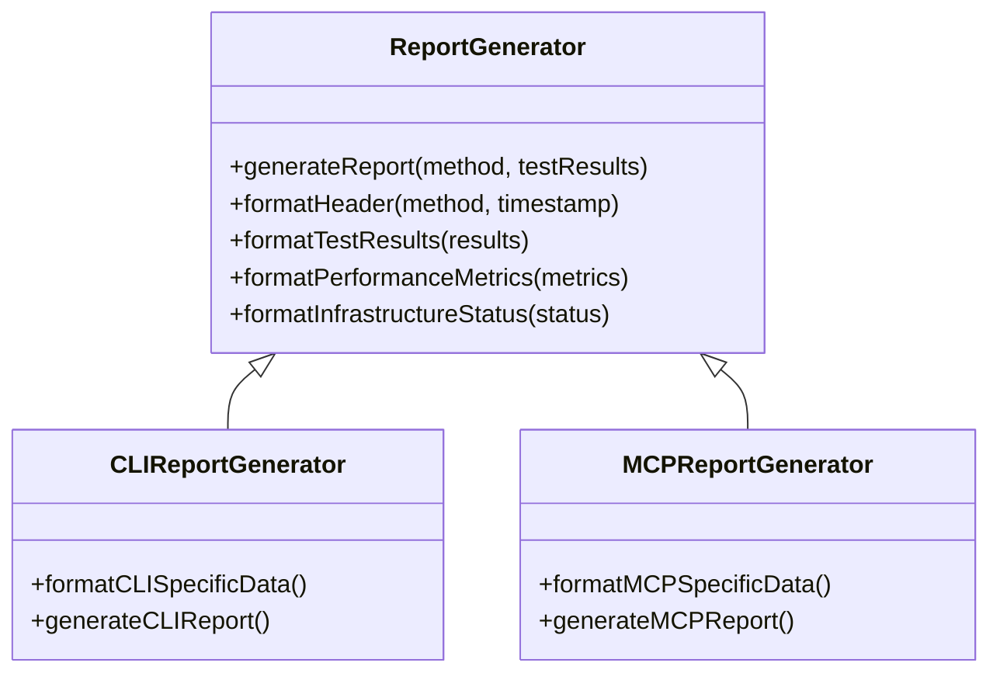
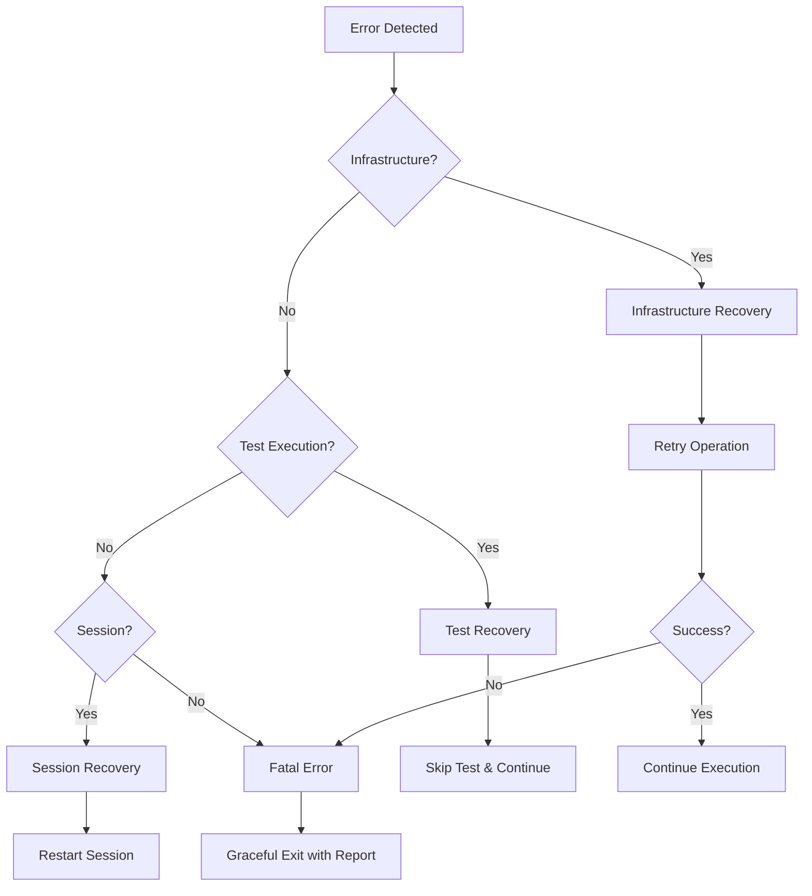
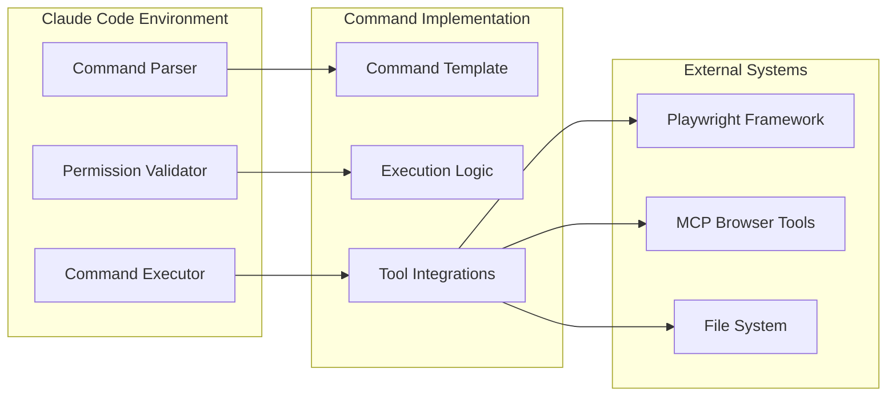
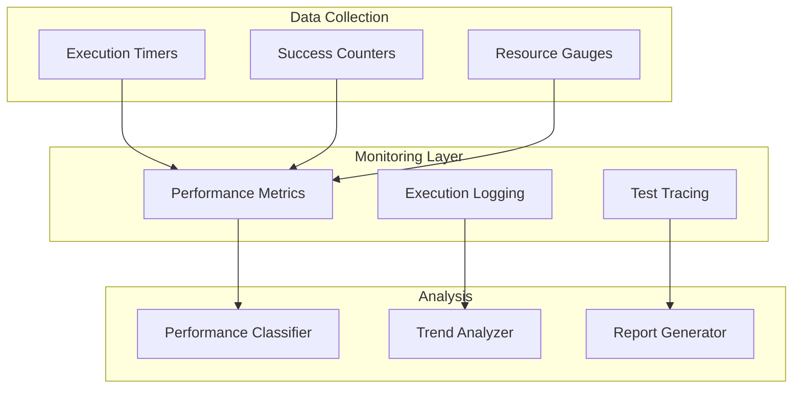

# Playwright Slash Commands Technical Architecture

**Detailed Technical Architecture for `/test_cli_full` and `/test_mcp_full` Command Implementation**

---

## Architecture Overview

This document defines the technical architecture for implementing two comprehensive Playwright testing slash commands. The architecture follows established patterns from Claude Code best practices while integrating with the Market Parser application's specific testing infrastructure.

### System Context



---

## 1. Command Architecture Specifications

### File Structure and Organization

```
.claude/
└── commands/
    ├── testing/
    │   ├── test-cli-full.md
    │   └── test-mcp-full.md
    └── README.md (documentation)
```

### Command File Architecture Pattern

**Standard Template Structure:**
```markdown
---
[YAML Frontmatter Configuration]
---

## Environment Status Check
[Dynamic Environment Validation]

## Task: [Command Purpose]
[Detailed Instructions and Requirements]
```

---

## 2. Environment Validation Architecture

### Multi-Layer Validation System

#### Layer 1: Infrastructure Health Checks
```bash
# Backend server validation
curl -f http://localhost:8000/health || echo "❌ Backend not ready"

# Frontend server auto-detection with port fallback
curl -f http://localhost:3000/ || \
curl -f http://localhost:3001/ || \
curl -f http://localhost:3002/ || \
echo "❌ Frontend not ready"
```

#### Layer 2: Test Environment Validation
```bash
# Verify test directory and files
cd /home/1000211866/Github/market-parser-polygon-mcp/gpt5-openai-agents-sdk-polygon-mcp/tests/playwright
ls test-b*.spec.ts | wc -l  # Should return 16
```

#### Layer 3: Dependency Verification
```bash
# Verify Playwright installation
npx playwright --version

# Verify browser installation
npx playwright install --dry-run chromium
```

### Error Recovery Architecture



---

## 3. CLI Method Technical Architecture

### Execution Flow Architecture



### Performance Measurement Integration

```javascript
// Performance classification logic
function classifyPerformance(duration) {
    if (duration <= 30) return "😊"; // Good
    if (duration <= 60) return "😐"; // OK
    if (duration <= 119) return "😴"; // Slow
    return "❌"; // Timeout (≥120s)
}
```

### CLI Command Pattern

```bash
# Enhanced CLI execution pattern
execute_test() {
    local test_file=$1
    local start_time=$(date +%s)
    
    npx playwright test \
        --timeout=120000 \
        --workers=1 \
        --reporter=line \
        "${test_file}"
    
    local end_time=$(date +%s)
    local duration=$((end_time - start_time))
    
    echo "Test: ${test_file}, Duration: ${duration}s"
    return $?
}
```

---

## 4. MCP Method Technical Architecture

### Browser Session Management



### MCP Tool Integration Pattern

```json
{
  "test_execution_workflow": {
    "initialization": {
      "tool": "mcp__playwright__browser_navigate",
      "parameters": {"url": "http://localhost:3000"},
      "purpose": "Establish single browser session"
    },
    "baseline_capture": {
      "tool": "mcp__playwright__browser_snapshot",
      "parameters": {},
      "purpose": "Capture initial application state"
    },
    "test_interaction": {
      "input_tool": "mcp__playwright__browser_type",
      "click_tool": "mcp__playwright__browser_click",
      "key_tool": "mcp__playwright__browser_press_key",
      "purpose": "Execute test interactions"
    },
    "response_detection": {
      "tool": "mcp__playwright__browser_wait_for",
      "parameters": {"time": 10},
      "pattern": "Poll every 10 seconds until response or timeout"
    },
    "validation": {
      "tool": "mcp__playwright__browser_evaluate",
      "purpose": "Validate test results and extract data"
    }
  }
}
```

### Polling Architecture

```javascript
// MCP polling implementation pattern
async function waitForResponse(expectedText, maxWaitTime = 120) {
    const pollInterval = 10; // 10-second intervals (required)
    const maxAttempts = Math.floor(maxWaitTime / pollInterval);
    
    for (let attempt = 1; attempt <= maxAttempts; attempt++) {
        try {
            await mcpBrowserWaitFor({
                text: expectedText,
                time: pollInterval
            });
            return { success: true, duration: attempt * pollInterval };
        } catch (timeout) {
            if (attempt === maxAttempts) {
                return { success: false, duration: maxWaitTime };
            }
            // Continue polling
        }
    }
}
```

---

## 5. TodoWrite Integration Architecture

### Progress Tracking System



### Todo List Structure

```json
{
  "todo_structure": [
    {
      "content": "Execute B001: Market Status Check",
      "status": "pending",
      "activeForm": "Executing B001: Market Status Check"
    },
    {
      "content": "Execute B002: NVDA Ticker Analysis", 
      "status": "pending",
      "activeForm": "Executing B002: NVDA Ticker Analysis"
    }
    // ... Continue for all B001-B016 tests
  ]
}
```

### Testing Integrity Architecture

```javascript
// Integrity validation pattern
class TestingIntegrityValidator {
    validateCompletionClaim(todoList, reportData) {
        // Verify all tests marked as completed
        const completedTests = todoList.filter(todo => todo.status === 'completed');
        const reportedTests = reportData.completedTests.length;
        
        if (completedTests.length !== reportedTests) {
            throw new IntegrityViolation('Completion mismatch detected');
        }
        
        // Verify no false reporting
        return this.verifyActualExecution(completedTests);
    }
}
```

---

## 6. Report Generation Architecture

### Report Factory Pattern



### Report Template Architecture

```markdown
# Report Template Structure

## Header Section
- Report metadata (date, method, coverage)
- Executive summary with key metrics

## Performance Analysis
- Performance distribution (😊😐😴 counts)
- Average execution times
- Method-specific observations

## Detailed Results
- Individual test results with timing
- Validation status for each test
- Error conditions and recovery

## Infrastructure Assessment
- System component status
- Performance metrics
- Stability analysis

## Quality Metrics
- Completion rates
- Error analysis
- Recommendations
```

### Performance Metrics Collection

```javascript
// Metrics collection architecture
class PerformanceCollector {
    constructor() {
        this.metrics = {
            testResults: [],
            performanceDistribution: { good: 0, ok: 0, slow: 0, timeout: 0 },
            infrastructureStatus: {},
            overallStats: {}
        };
    }
    
    recordTestResult(testId, duration, status, details) {
        const classification = this.classifyPerformance(duration);
        
        this.metrics.testResults.push({
            testId,
            duration,
            status,
            classification,
            details
        });
        
        this.updateDistribution(classification);
    }
    
    generateReport() {
        return {
            executiveSummary: this.generateExecutiveSummary(),
            detailedResults: this.metrics.testResults,
            performanceAnalysis: this.generatePerformanceAnalysis(),
            recommendations: this.generateRecommendations()
        };
    }
}
```

---

## 7. Error Handling and Recovery Architecture

### Multi-Level Error Handling



### Error Classification System

```javascript
class ErrorHandler {
    static ERROR_TYPES = {
        INFRASTRUCTURE: 'infrastructure',
        TEST_EXECUTION: 'test_execution',
        SESSION_MANAGEMENT: 'session_management',
        TIMEOUT: 'timeout',
        VALIDATION: 'validation'
    };
    
    handleError(error, context) {
        const errorType = this.classifyError(error);
        
        switch (errorType) {
            case this.ERROR_TYPES.INFRASTRUCTURE:
                return this.handleInfrastructureError(error, context);
            case this.ERROR_TYPES.TEST_EXECUTION:
                return this.handleTestExecutionError(error, context);
            case this.ERROR_TYPES.SESSION_MANAGEMENT:
                return this.handleSessionError(error, context);
            default:
                return this.handleUnknownError(error, context);
        }
    }
}
```

---

## 8. Security and Permissions Architecture

### Tool Permission Matrix

| Tool Category | `/test_cli_full` | `/test_mcp_full` | Purpose |
|---------------|------------------|------------------|---------|
| **File System** | `Bash(cd:*)`, `Bash(ls:*)` | None | Directory navigation and validation |
| **Process Execution** | `Bash(npx:*)` | None | Playwright CLI execution |
| **Network** | `Bash(curl:*)` | None | Health check validation |
| **Browser Automation** | None | `mcp__playwright__browser_*` | Browser interaction |
| **Progress Tracking** | `TodoWrite` | `TodoWrite` | Test progress management |
| **Report Generation** | `Write` | `Write` | Report file creation |

### Security Constraints

```yaml
security_constraints:
  tool_restrictions:
    - "No arbitrary bash command execution"
    - "Restricted to specific playwright operations"
    - "Read-only access to test files"
    - "Write access only to report directory"
  
  data_protection:
    - "No sensitive data in reports"
    - "Sanitized error messages"
    - "Temporary file cleanup"
  
  execution_limits:
    - "Maximum execution time: 30 minutes"
    - "Single process per command"
    - "Resource usage monitoring"
```

---

## 9. Integration Patterns

### Claude Code Integration



### Tool Integration Patterns

```javascript
// Tool integration abstraction
class ToolIntegrator {
    constructor(toolSet) {
        this.availableTools = toolSet;
    }
    
    async executeBashCommand(command, description) {
        if (!this.hasPermission('Bash', command)) {
            throw new PermissionError(`No permission for: ${command}`);
        }
        
        return await this.invokeTool('Bash', {
            command: command,
            description: description
        });
    }
    
    async executeMCPBrowserAction(action, parameters) {
        const toolName = `mcp__playwright__browser_${action}`;
        
        if (!this.hasPermission(toolName)) {
            throw new PermissionError(`No permission for: ${toolName}`);
        }
        
        return await this.invokeTool(toolName, parameters);
    }
}
```

---

## 10. Performance Optimization Architecture

### CLI Method Optimizations

```javascript
// CLI-specific optimizations
class CLIOptimizer {
    static OPTIMIZATION_STRATEGIES = {
        PARALLEL_WORKERS: false, // Single worker required for session continuity
        TIMEOUT_TUNING: 120000,  // 120-second timeout
        REPORTER_OPTIMIZATION: 'line', // Fast line reporter
        BROWSER_REUSE: true      // Reuse browser instance
    };
    
    optimizeTestExecution(testConfig) {
        return {
            ...testConfig,
            workers: 1, // Required for single session
            timeout: this.OPTIMIZATION_STRATEGIES.TIMEOUT_TUNING,
            reporter: this.OPTIMIZATION_STRATEGIES.REPORTER_OPTIMIZATION
        };
    }
}
```

### MCP Method Optimizations

```javascript
// MCP-specific optimizations
class MCPOptimizer {
    static POLLING_CONFIG = {
        INTERVAL: 10, // 10-second polling (required)
        MAX_WAIT: 120, // Maximum wait time
        EARLY_EXIT: true // Exit early on success
    };
    
    optimizeBrowserInteraction(actionPlan) {
        return {
            ...actionPlan,
            pollingInterval: this.POLLING_CONFIG.INTERVAL,
            earlyExitEnabled: this.POLLING_CONFIG.EARLY_EXIT,
            sessionReuse: true
        };
    }
}
```

---

## 11. Monitoring and Observability

### Performance Monitoring Architecture



### Observability Data Structure

```json
{
  "observability_data": {
    "execution_metrics": {
      "start_time": "2025-01-11T10:00:00Z",
      "end_time": "2025-01-11T10:15:30Z",
      "total_duration": "930s",
      "test_count": 16
    },
    "performance_distribution": {
      "good_count": 8,
      "ok_count": 5,
      "slow_count": 3,
      "timeout_count": 0
    },
    "infrastructure_metrics": {
      "backend_uptime": "100%",
      "frontend_uptime": "100%",
      "browser_session_stability": "100%"
    },
    "error_analysis": {
      "total_errors": 0,
      "recovery_success_rate": "100%",
      "critical_failures": 0
    }
  }
}
```

---

This technical architecture provides the comprehensive foundation for implementing robust, reliable, and maintainable Playwright testing slash commands that integrate seamlessly with the Claude Code environment while maintaining the highest quality standards established in the Market Parser project.