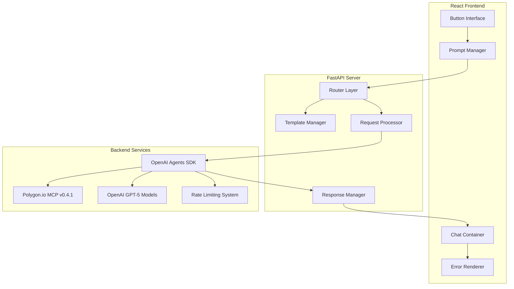

# Market Parser API Integration Guide

## Overview

This document provides comprehensive integration patterns and implementation guidance for the Market Parser Direct Prompt API. The API enables optimized financial analysis with streamlined prompts, direct button functionality, and enhanced performance monitoring.

### New Features (Phase 3)

- **Optimized AI Prompts**: 40-50% token reduction with optimized GPT-5 settings
- **Direct Analysis Buttons**: One-click SNAPSHOT, SUPPORT/RESISTANCE, and TECHNICAL analysis
- **Performance Monitoring**: Response time and token usage tracking
- **Enhanced Configuration**: Centralized settings in `config/app.config.json`
- **GPT-5 Model Optimization**: Proper model specification with rate limiting (200K TPM for nano)
- **Quick Response System**: All prompts enforce minimal tool calls for 20-40% faster responses
- **Polygon MCP v4.1.0**: Latest version with enhanced market data capabilities

## Architecture Overview



## Server Configuration

**Static Endpoints:**

- **Backend API**: <http://127.0.0.1:8000>
- **Frontend Development**: <http://127.0.0.1:3000>
- **Frontend Production**: <http://127.0.0.1:5500>

**One-Click Startup:**

```bash
npm run start:app
```

## Integration Flow Patterns

### 1. Button-Triggered Analysis Flow

**Frontend → Backend Data Flow:**

```typescript
// 1. User clicks analysis button
const handleButtonClick = async (templateId: string, ticker: string) => {
  // 2. Generate dynamic prompt
  const promptResponse = await fetch('/api/v1/prompts/generate', {
    method: 'POST',
    headers: { 'Content-Type': 'application/json' },
    body: JSON.stringify({
      template_id: templateId,
      variables: { ticker, company_name: getCompanyName(ticker) }
    })
  });
  
  const { generated_prompt } = await promptResponse.json();
  
  // 3. Process analysis with generated prompt
  const analysisResponse = await fetch('/api/v1/analysis/chat', {
    method: 'POST',
    headers: { 'Content-Type': 'application/json' },
    body: JSON.stringify({
      message: generated_prompt,
      source: 'button',
      analysis_type: templateId,
      ticker: ticker,
      session_id: sessionId
    })
  });
  
  const result = await analysisResponse.json();
  
  // 4. Display results and follow-up questions
  displayAnalysis(result.response);
  showFollowUpQuestions(result.follow_up_questions);
};
```

**Backend Processing Chain:**

```python
# FastAPI endpoint processing
@app.post("/api/v1/analysis/chat")
async def process_chat(request: ChatRequest):
    # 1. Input validation and ticker extraction
    if request.source == "button" and not request.ticker:
        raise HTTPException(400, "Ticker required for button analysis")
    
    # 2. Process through OpenAI Agents SDK
    result = await process_financial_query(
        request.message, 
        session, 
        polygon_server
    )
    
    # 3. Enhanced response formatting
    formatted_response = response_manager.process_response(
        result['response'],
        source_type=request.source,
        data_type=request.analysis_type,
        ticker=request.ticker
    )
    
    # 4. Generate follow-up questions
    follow_up = await generate_follow_up_questions(
        request.analysis_type,
        request.ticker
    )
    
    return ChatResponse(
        success=True,
        response=formatted_response['content'],
        metadata={
            "analysis_type": request.analysis_type,
            "ticker": request.ticker,
            "processing_time_ms": result['processing_time'],
            "tokens_used": result.get('tokens_used', 0)
        },
        follow_up_questions=follow_up
    )
```

### 2. User Message Processing Flow

**Natural Language Processing Chain:**

```python
async def process_user_message(message: str, session_id: str):
    # 1. Guardrail validation
    guardrail_result = await finance_guardrail.check(message)
    if not guardrail_result.is_finance_related:
        raise GuardrailException(guardrail_result.reasoning)
    
    # 2. Ticker extraction from context
    ticker_context = ticker_extractor.extract_ticker(
        message, 
        chat_history=get_session_history(session_id)
    )
    
    # 3. Analysis type detection
    analysis_type = prompt_template_manager.detect_analysis_type(message)
    
    # 4. Process through AI agent
    result = await ai_agent.process(message, context={
        'ticker': ticker_context.symbol,
        'analysis_type': analysis_type,
        'session_id': session_id
    })
    
    return result
```

## Data Structure Patterns

### Template Management

```python
# Backend: PromptTemplateManager Integration
class PromptTemplateAPI:
    def __init__(self, template_manager: PromptTemplateManager):
        self.manager = template_manager
    
    def get_templates(self) -> PromptTemplatesResponse:
        templates = []
        for prompt_type in PromptType:
            template = self.manager.templates[prompt_type]
            templates.append(PromptTemplate(
                id=prompt_type.value,
                name=self._get_display_name(prompt_type),
                description=template.context_guidance,
                emoji=self._get_emoji(prompt_type),
                category=self._get_category(prompt_type),
                requires_ticker=True,
                estimated_response_time=self._estimate_time(prompt_type)
            ))
        
        return PromptTemplatesResponse(
            success=True,
            templates=templates,
            metadata={
                'total_templates': len(templates),
                'last_updated': datetime.now().isoformat()
            }
        )
    
    def generate_prompt(self, request: PromptGenerationRequest) -> PromptGenerationResponse:
        prompt_type = PromptType(request.template_id)
        ticker_context = TickerContext(
            symbol=request.variables['ticker'],
            company_name=request.variables.get('company_name')
        )
        
        generated_prompt, context = self.manager.generate_prompt(
            prompt_type=prompt_type,
            ticker=ticker_context.symbol,
            custom_instructions=request.custom_instructions
        )
        
        return PromptGenerationResponse(
            success=True,
            generated_prompt=generated_prompt,
            template_info={
                'id': prompt_type.value,
                'name': self._get_display_name(prompt_type),
                'estimated_tokens': self._estimate_tokens(generated_prompt)
            },
            variables_used=request.variables
        )
```

### Response Processing

```python
# Enhanced Response Manager Integration
class APIResponseManager:
    def __init__(self, response_manager: ResponseManager):
        self.response_manager = response_manager
    
    def process_for_api(self, ai_response: str, request: ChatRequest) -> ChatResponse:
        # Process through existing ResponseManager
        processed = self.response_manager.process_response(
            ai_response,
            source_type=request.source,
            data_type=request.analysis_type,
            ticker=request.ticker
        )
        
        # Generate follow-up questions based on context
        follow_up = self._generate_follow_up_questions(
            request.analysis_type,
            request.ticker
        )
        
        return ChatResponse(
            success=processed['success'],
            response=processed['content'],
            metadata={
                'analysis_type': request.analysis_type,
                'ticker': request.ticker,
                'processing_time_ms': processed['processing_time_ms'],
                'tokens_used': self._extract_token_usage(processed)
            },
            follow_up_questions=follow_up
        )
    
    def _generate_follow_up_questions(self, analysis_type: str, ticker: str) -> List[str]:
        """Generate contextual follow-up questions based on analysis type"""
        base_questions = {
            'snapshot': [
                f"Would you like me to analyze {ticker}'s support and resistance levels?",
                f"How does {ticker} compare to sector peers?",
                f"What are the key upcoming events for {ticker}?"
            ],
            'support_resistance': [
                f"Should I analyze {ticker}'s technical indicators?",
                f"What's the fundamental outlook for {ticker}?",
                f"How do these levels compare to historical patterns?"
            ],
            'technical': [
                f"Would you like a fundamental analysis of {ticker}?",
                f"How do these indicators compare to sector averages?",
                f"What trading strategies work best with these signals?"
            ]
        }
        
        return base_questions.get(analysis_type, [])[:3]  # Limit to 3 questions
```

## Frontend Integration Patterns

### React Hook for API Integration

```typescript
// Custom hook for prompt management
export const usePromptAPI = () => {
  const [templates, setTemplates] = useState<PromptTemplate[]>([]);
  const [loading, setLoading] = useState(false);
  const [error, setError] = useState<string | null>(null);

  const fetchTemplates = useCallback(async () => {
    try {
      setLoading(true);
      const response = await fetch('/api/v1/prompts/templates');
      const data: PromptTemplatesResponse = await response.json();
      
      if (data.success) {
        setTemplates(data.templates);
      } else {
        throw new Error('Failed to fetch templates');
      }
    } catch (err) {
      setError(err instanceof Error ? err.message : 'Unknown error');
    } finally {
      setLoading(false);
    }
  }, []);

  const generatePrompt = useCallback(async (
    templateId: string,
    variables: Record<string, string>,
    customInstructions?: string
  ): Promise<string> => {
    const response = await fetch('/api/v1/prompts/generate', {
      method: 'POST',
      headers: { 'Content-Type': 'application/json' },
      body: JSON.stringify({
        template_id: templateId,
        variables,
        custom_instructions: customInstructions
      })
    });

    const data: PromptGenerationResponse = await response.json();
    
    if (!data.success) {
      throw new Error(data.error || 'Failed to generate prompt');
    }
    
    return data.generated_prompt;
  }, []);

  const processChat = useCallback(async (
    message: string,
    source: 'button' | 'user',
    options?: {
      analysisType?: string;
      ticker?: string;
      sessionId?: string;
    }
  ): Promise<ChatResponse> => {
    const response = await fetch('/api/v1/analysis/chat', {
      method: 'POST',
      headers: { 'Content-Type': 'application/json' },
      body: JSON.stringify({
        message,
        source,
        analysis_type: options?.analysisType,
        ticker: options?.ticker,
        session_id: options?.sessionId || generateSessionId()
      })
    });

    const data = await response.json();
    
    if (!response.ok) {
      throw new APIError(data.error, data.error_code, data.error_type);
    }
    
    return data;
  }, []);

  return {
    templates,
    loading,
    error,
    fetchTemplates,
    generatePrompt,
    processChat
  };
};

// Error handling class
class APIError extends Error {
  constructor(
    message: string,
    public code: string,
    public type: string
  ) {
    super(message);
    this.name = 'APIError';
  }
}
```

### Button Integration Component

```typescript
interface AnalysisButtonProps {
  templateId: string;
  ticker: string;
  onResult: (result: ChatResponse) => void;
  onError: (error: APIError) => void;
}

export const AnalysisButton: React.FC<AnalysisButtonProps> = ({
  templateId,
  ticker,
  onResult,
  onError
}) => {
  const { generatePrompt, processChat } = usePromptAPI();
  const [processing, setProcessing] = useState(false);

  const handleAnalysis = useCallback(async () => {
    try {
      setProcessing(true);

      // 1. Generate dynamic prompt
      const prompt = await generatePrompt(templateId, {
        ticker: ticker.toUpperCase(),
        company_name: await getCompanyName(ticker) // Helper function
      });

      // 2. Process analysis
      const result = await processChat(prompt, 'button', {
        analysisType: templateId,
        ticker: ticker.toUpperCase()
      });

      // 3. Handle success
      onResult(result);

    } catch (error) {
      if (error instanceof APIError) {
        onError(error);
      } else {
        onError(new APIError(
          error instanceof Error ? error.message : 'Unknown error',
          'UNKNOWN_ERROR',
          'client'
        ));
      }
    } finally {
      setProcessing(false);
    }
  }, [templateId, ticker, generatePrompt, processChat, onResult, onError]);

  return (
    <button
      onClick={handleAnalysis}
      disabled={processing || !ticker}
      className="analysis-button"
      data-template={templateId}
    >
      {processing ? 'Analyzing...' : `${templateId.replace('_', ' ')} Analysis`}
    </button>
  );
};
```

## Security Considerations

### Input Validation

```python
# Backend validation patterns
class TickerValidator:
    VALID_PATTERN = re.compile(r'^[A-Z]{1,5}$')
    BLACKLIST = {'TEST', 'NULL', 'ADMIN', 'DEBUG'}
    
    @classmethod
    def validate(cls, ticker: str) -> bool:
        if not ticker or len(ticker.strip()) == 0:
            return False
        
        ticker = ticker.upper().strip()
        
        if not cls.VALID_PATTERN.match(ticker):
            return False
            
        if ticker in cls.BLACKLIST:
            return False
            
        return True

# GPT-5 Model-Specific Rate Limiting
from slowapi import Limiter, _rate_limit_exceeded_handler
from slowapi.util import get_remote_address
from slowapi.errors import RateLimitExceeded

limiter = Limiter(key_func=get_remote_address)
app.state.limiter = limiter
app.add_exception_handler(RateLimitExceeded, _rate_limit_exceeded_handler)

# Model-specific rate limiting based on GPT-5 capabilities
def get_model_rate_limits(model: str) -> dict:
    """Get rate limits for specific GPT-5 models."""
    if model == "gpt-5-nano":
        return {"tpm": 200000, "rpm": 500}  # 200K TPM, 500 RPM
    else:
        return {"tpm": 200000, "rpm": 500}  # Default fallback

@app.post("/api/v1/analysis/chat")
@limiter.limit("500/minute")  # GPT-5 model-specific rate limit
async def process_chat(request: Request, chat_request: ChatRequest):
    # Validate request size against model-specific TPM limits
    model = settings.default_active_model  # GPT-5 nano
    limits = get_model_rate_limits(model)
    
    # Implementation here with proper model specification
    pass
```

### Frontend Security

```typescript
// Input sanitization
const sanitizeInput = (input: string): string => {
  // Remove potentially harmful characters
  return input
    .replace(/<script\b[^<]*(?:(?!<\/script>)<[^<]*)*<\/script>/gi, '')
    .replace(/javascript:/gi, '')
    .replace(/on\w+\s*=/gi, '')
    .trim();
};

// Ticker validation
const validateTicker = (ticker: string): boolean => {
  const TICKER_PATTERN = /^[A-Z]{1,5}$/;
  const BLACKLIST = new Set(['TEST', 'NULL', 'ADMIN', 'DEBUG']);
  
  const cleaned = ticker.toUpperCase().trim();
  return TICKER_PATTERN.test(cleaned) && !BLACKLIST.has(cleaned);
};

// API error handling
const handleAPIError = (error: APIError): string => {
  switch (error.code) {
    case 'GUARDRAIL_TRIGGERED':
      return 'Please ask questions related to finance and investments.';
    case 'INVALID_TICKER':
      return 'Please provide a valid stock ticker symbol.';
    case 'RATE_LIMIT_EXCEEDED':
      return 'Too many requests. Please wait a moment before trying again.';
    case 'EXTERNAL_API_ERROR':
      return 'Unable to fetch market data. Please try again later.';
    default:
      return 'An unexpected error occurred. Please try again.';
  }
};
```

## Performance Optimizations

### Caching Strategies

```python
# Template caching
from functools import lru_cache
from datetime import datetime, timedelta

class CachedPromptTemplateAPI:
    def __init__(self, template_manager: PromptTemplateManager):
        self.manager = template_manager
        self._cache_timestamp = datetime.now()
        self._cache_ttl = timedelta(hours=1)  # Cache for 1 hour
    
    @lru_cache(maxsize=10)
    def get_templates_cached(self) -> PromptTemplatesResponse:
        """Cache template data since it changes infrequently"""
        return self.get_templates()
    
    def get_templates(self) -> PromptTemplatesResponse:
        # Check if cache should be invalidated
        if datetime.now() - self._cache_timestamp > self._cache_ttl:
            self.get_templates_cached.cache_clear()
            self._cache_timestamp = datetime.now()
        
        return self.get_templates_cached()

# Response streaming for long analyses
from fastapi.responses import StreamingResponse
import json

@app.post("/api/v1/analysis/chat/stream")
async def stream_chat_analysis(request: ChatRequest):
    async def generate_response():
        # Start processing
        yield f"data: {json.dumps({'type': 'start', 'message': 'Processing analysis...'})}\n\n"
        
        try:
            # Process through AI agent with streaming
            async for chunk in ai_agent.stream_process(request.message):
                yield f"data: {json.dumps({'type': 'chunk', 'content': chunk})}\n\n"
            
            # Send completion signal
            yield f"data: {json.dumps({'type': 'complete'})}\n\n"
            
        except Exception as e:
            yield f"data: {json.dumps({'type': 'error', 'error': str(e)})}\n\n"
    
    return StreamingResponse(
        generate_response(),
        media_type="text/plain",
        headers={"Cache-Control": "no-cache"}
    )
```

### Frontend Optimization

```typescript
// Request debouncing for user input
import { debounce } from 'lodash-es';

const useDebounceAnalysis = (delay: number = 500) => {
  const { processChat } = usePromptAPI();
  
  const debouncedProcess = useMemo(
    () => debounce(async (message: string, options: any) => {
      return await processChat(message, 'user', options);
    }, delay),
    [processChat, delay]
  );
  
  return { debouncedProcess };
};

// Template preloading
const useTemplatePreloader = () => {
  const { fetchTemplates } = usePromptAPI();
  
  useEffect(() => {
    // Preload templates on app initialization
    fetchTemplates();
  }, [fetchTemplates]);
  
  // Prefetch on hover
  const prefetchAnalysis = useCallback((templateId: string) => {
    // Pre-warm any necessary data
    console.log(`Prefetching data for ${templateId}`);
  }, []);
  
  return { prefetchAnalysis };
};
```

## Error Handling Patterns

### Backend Error Management

```python
# Custom exception classes
class APIException(Exception):
    def __init__(self, message: str, code: str, status_code: int = 400):
        self.message = message
        self.code = code
        self.status_code = status_code
        super().__init__(message)

class GuardrailException(APIException):
    def __init__(self, reasoning: str):
        super().__init__(
            message=f"Query not finance-related: {reasoning}",
            code="GUARDRAIL_TRIGGERED",
            status_code=400
        )

class TickerValidationException(APIException):
    def __init__(self, ticker: str):
        super().__init__(
            message=f"Invalid ticker symbol: {ticker}",
            code="INVALID_TICKER",
            status_code=400
        )

# Global exception handler
@app.exception_handler(APIException)
async def api_exception_handler(request: Request, exc: APIException):
    return JSONResponse(
        status_code=exc.status_code,
        content={
            "success": False,
            "error": exc.message,
            "error_code": exc.code,
            "error_type": "validation" if exc.status_code == 400 else "server_error"
        }
    )
```

### Frontend Error Boundaries

```typescript
// Error boundary for API failures
class APIErrorBoundary extends React.Component<
  { children: React.ReactNode; fallback: React.ComponentType<{error: Error}> },
  { hasError: boolean; error: Error | null }
> {
  constructor(props: any) {
    super(props);
    this.state = { hasError: false, error: null };
  }

  static getDerivedStateFromError(error: Error) {
    return { hasError: true, error };
  }

  componentDidCatch(error: Error, errorInfo: React.ErrorInfo) {
    console.error('API Error Boundary caught an error:', error, errorInfo);
    
    // Report to error tracking service
    if (error instanceof APIError) {
      this.reportAPIError(error);
    }
  }

  private reportAPIError(error: APIError) {
    // Send to analytics/monitoring
    console.error('API Error:', {
      message: error.message,
      code: error.code,
      type: error.type,
      timestamp: new Date().toISOString()
    });
  }

  render() {
    if (this.state.hasError && this.state.error) {
      const FallbackComponent = this.props.fallback;
      return <FallbackComponent error={this.state.error} />;
    }

    return this.props.children;
  }
}

// Usage in app
const APIErrorFallback: React.FC<{error: Error}> = ({ error }) => (
  <div className="error-container">
    <h2>Analysis Unavailable</h2>
    <p>
      {error instanceof APIError 
        ? handleAPIError(error)
        : 'An unexpected error occurred. Please refresh and try again.'
      }
    </p>
    <button onClick={() => window.location.reload()}>
      Refresh Page
    </button>
  </div>
);
```

## Testing Strategies

### Backend API Testing

```python
# Test the API endpoints
import pytest
from fastapi.testclient import TestClient
from main import app

client = TestClient(app)

@pytest.fixture
def sample_chat_request():
    return {
        "message": "Analyze AAPL stock",
        "source": "user",
        "session_id": "test_session"
    }

def test_chat_endpoint_success(sample_chat_request):
    response = client.post("/api/v1/analysis/chat", json=sample_chat_request)
    assert response.status_code == 200
    
    data = response.json()
    assert data["success"] is True
    assert "response" in data
    assert "metadata" in data

def test_chat_endpoint_guardrail():
    request = {
        "message": "What's your favorite recipe?",
        "source": "user",
        "session_id": "test_session"
    }
    
    response = client.post("/api/v1/analysis/chat", json=request)
    assert response.status_code == 400
    
    data = response.json()
    assert data["success"] is False
    assert data["error_code"] == "GUARDRAIL_TRIGGERED"

def test_templates_endpoint():
    response = client.get("/api/v1/prompts/templates")
    assert response.status_code == 200
    
    data = response.json()
    assert data["success"] is True
    assert len(data["templates"]) == 3  # snapshot, support_resistance, technical
    
    for template in data["templates"]:
        assert "id" in template
        assert "name" in template
        assert "emoji" in template
```

### Frontend Integration Testing

```typescript
// Mock API responses for testing
const mockTemplatesResponse: PromptTemplatesResponse = {
  success: true,
  templates: [
    {
      id: 'snapshot',
      name: 'Stock Snapshot',
      description: 'Current market data analysis',
      emoji: '📊',
      category: 'market_data',
      requires_ticker: true,
      estimated_response_time: '2-5 seconds'
    }
  ],
  metadata: {
    total_templates: 1,
    last_updated: new Date().toISOString()
  }
};

// Test the React hook
import { renderHook, act } from '@testing-library/react';
import { usePromptAPI } from './usePromptAPI';

// Mock fetch globally
global.fetch = jest.fn();

describe('usePromptAPI', () => {
  beforeEach(() => {
    (fetch as jest.Mock).mockClear();
  });

  it('fetches templates successfully', async () => {
    (fetch as jest.Mock).mockResolvedValue({
      ok: true,
      json: async () => mockTemplatesResponse
    });

    const { result } = renderHook(() => usePromptAPI());

    await act(async () => {
      await result.current.fetchTemplates();
    });

    expect(result.current.templates).toHaveLength(1);
    expect(result.current.templates[0].id).toBe('snapshot');
    expect(result.current.error).toBeNull();
  });

  it('handles API errors gracefully', async () => {
    (fetch as jest.Mock).mockRejectedValue(new Error('Network error'));

    const { result } = renderHook(() => usePromptAPI());

    await act(async () => {
      await result.current.fetchTemplates();
    });

    expect(result.current.templates).toHaveLength(0);
    expect(result.current.error).toBe('Network error');
  });
});
```

## Migration Strategy

### Gradual Migration from Current System

1. **Phase 1: API Layer Addition**
   - Add new FastAPI endpoints alongside existing `/chat` endpoint
   - Implement template management APIs
   - Maintain backward compatibility

2. **Phase 2: Frontend Integration**
   - Build React components that use new APIs
   - Run new system in parallel with Gradio interface
   - Test and validate feature parity

3. **Phase 3: Gradual Replacement**
   - Switch button functionality to new API system
   - Migrate user message processing
   - Deprecate old endpoints

4. **Phase 4: Cleanup**
   - Remove unused code and endpoints
   - Optimize performance
   - Complete documentation

### Configuration Management

```python
# settings.py - Centralized configuration
from pydantic import BaseSettings

class APISettings(BaseSettings):
    # API Configuration
    api_version: str = "v1"
    api_prefix: str = "/api/v1"
    
    # Rate Limiting
    rate_limit_per_minute: int = 60
    
    # Caching
    template_cache_ttl_hours: int = 1
    response_cache_ttl_minutes: int = 5
    
    # Performance
    max_concurrent_requests: int = 10
    request_timeout_seconds: int = 30
    
    # Security
    enable_rate_limiting: bool = True
    enable_input_validation: bool = True
    log_api_requests: bool = True
    
    class Config:
        env_file = ".env"
        env_prefix = "API_"

settings = APISettings()
```

## Conclusion

This integration guide provides a comprehensive foundation for implementing clean, scalable API contracts between your React frontend and Python backend. The design prioritizes:

- **Separation of Concerns**: Clear boundaries between template management, prompt generation, and analysis processing
- **Performance**: Caching strategies, request optimization, and streaming capabilities
- **Security**: Input validation, rate limiting, and proper error handling
- **Maintainability**: Consistent patterns, comprehensive testing, and clear documentation
- **Scalability**: Modular design that can grow with your application needs

The API contracts are designed to work seamlessly with your existing OpenAI Agents SDK while providing the flexibility needed for future enhancements and optimizations.
