# Execution Flow Architecture & Sequence Diagrams

**Comprehensive Execution Flow Design for `/test_cli_full` and `/test_mcp_full` Commands**

---

## Executive Summary

This document defines the detailed execution flows, sequence diagrams, and orchestration patterns for both Playwright testing command methods. The architecture ensures consistent behavior while optimizing for method-specific characteristics.

---

## 1. Universal Execution Flow Components

### Master Orchestration Pattern


### Environment Validation Flow

```mermaid
sequenceDiagram
    participant User
    participant Command
    participant Bash
    participant Backend
    participant Frontend
    participant TestFiles
    
    User->>Command: /test_[method]_full
    Command->>Bash: curl -f http://localhost:8000/health
    Bash->>Backend: Health Check Request
    Backend-->>Bash: {"status": "ok"} or Error
    Bash-->>Command: Health Status
    
    alt Backend Healthy
        Command->>Bash: Frontend Port Detection
        loop Port Detection [3000, 3001, 3002, ...]
            Bash->>Frontend: curl -f http://localhost:PORT/
            Frontend-->>Bash: Response or Timeout
        end
        Bash-->>Command: Frontend Port Found
        
        Command->>Bash: Test File Validation
        Bash->>TestFiles: ls test-b*.spec.ts | wc -l
        TestFiles-->>Bash: File Count
        Bash-->>Command: 16 Files Confirmed
        
        Command->>Command: Proceed to Execution
    else Backend Unhealthy
        Command-->>User: ❌ Backend not ready - Start server first
    end
```



---

## 2. CLI Method Execution Flow

### CLI Sequential Test Execution

```mermaid
sequenceDiagram
    participant Command
    participant TodoWrite
    participant Bash
    participant Playwright
    participant Timer
    participant Write
    
    Command->>TodoWrite: Create 16-item todo list
    TodoWrite-->>Command: Todo list initialized
    
    loop For each B001-B016 test
        Command->>TodoWrite: Mark test in_progress
        Command->>Timer: Start timing
        Command->>Bash: npx playwright test --timeout=120000 --workers=1
        Bash->>Playwright: Execute test with config
        
        alt Test Success (< 120s)
            Playwright-->>Bash: Test PASS + execution time
            Bash-->>Command: Success result
            Command->>Timer: Record duration
            Command->>Command: Classify performance (😊😐😴)
            Command->>TodoWrite: Mark test completed
        else Test Timeout (≥ 120s)
            Playwright-->>Bash: Test TIMEOUT
            Bash-->>Command: Timeout result
            Command->>Timer: Record timeout (120s)
            Command->>Command: Classify as ❌
            Command->>TodoWrite: Mark test completed (timeout)
        else Test Failure
            Playwright-->>Bash: Test FAIL + error details
            Bash-->>Command: Failure result
            Command->>Timer: Record duration
            Command->>Command: Classify performance
            Command->>TodoWrite: Mark test completed (failed)
        end
    end
    
    Command->>Write: Generate standardized report
    Write-->>Command: Report file created
    Command-->>Command: Execution complete
```



### CLI Performance Optimization Flow

```mermaid
graph LR
    subgraph "CLI Optimizations"
        Config[CLI Configuration]
        Config --> Timeout["--timeout=120000"]
        Config --> Workers["--workers=1"]
        Config --> Reporter["--reporter=line"]
        
        Timeout --> FastExecution[Fast Execution]
        Workers --> SessionContinuity[Session Continuity]
        Reporter --> MinimalOverhead[Minimal Overhead]
        
        FastExecution --> Performance[Expected: 😊😐 majority]
        SessionContinuity --> SingleBrowser[Single Browser Instance]
        MinimalOverhead --> QuickReporting[Quick Test Reporting]
    end
```



---

## 3. MCP Method Execution Flow

### MCP Browser Session Management

```mermaid
sequenceDiagram
    participant Command
    participant TodoWrite
    participant MCP_Nav as mcp__playwright__browser_navigate
    participant MCP_Snap as mcp__playwright__browser_snapshot
    participant MCP_Type as mcp__playwright__browser_type
    participant MCP_Click as mcp__playwright__browser_click
    participant MCP_Wait as mcp__playwright__browser_wait_for
    participant MCP_Eval as mcp__playwright__browser_evaluate
    participant Timer
    participant Write
    
    Command->>TodoWrite: Create 16-item todo list
    TodoWrite-->>Command: Todo list initialized
    
    Command->>MCP_Nav: Initialize browser session
    MCP_Nav->>MCP_Nav: Navigate to http://localhost:3000
    MCP_Nav-->>Command: Session established
    
    Command->>MCP_Snap: Capture baseline state
    MCP_Snap-->>Command: Initial snapshot
    
    loop For each B001-B016 test
        Command->>TodoWrite: Mark test in_progress
        Command->>Timer: Start timing
        
        Command->>MCP_Type: Input test query
        MCP_Type-->>Command: Text entered
        
        Command->>MCP_Click: Click send/submit
        MCP_Click-->>Command: Click registered
        
        Command->>MCP_Wait: Poll for response (10s intervals)
        loop Polling with 10s intervals (max 12 attempts = 120s)
            MCP_Wait->>MCP_Wait: Wait 10 seconds
            MCP_Wait->>MCP_Wait: Check for expected response
            alt Response Found
                MCP_Wait-->>Command: Response detected
                break
            else Continue Polling
                MCP_Wait->>MCP_Wait: Continue to next interval
            end
        end
        
        alt Response within timeout
            Command->>Timer: Record actual duration
            Command->>MCP_Eval: Validate response content
            MCP_Eval-->>Command: Validation result
            Command->>Command: Classify performance (😊😐😴)
            Command->>TodoWrite: Mark test completed
        else Timeout (≥120s)
            Command->>Timer: Record timeout (120s)
            Command->>Command: Classify as ❌
            Command->>TodoWrite: Mark test completed (timeout)
        end
    end
    
    Command->>Write: Generate standardized report
    Write-->>Command: Report file created
    Command-->>Command: Session cleanup & completion
```

### MCP Session Continuity Validation


---

## 4. Server Lifecycle Management

### Backend Server Orchestration


### Frontend Server Auto-Detection

```mermaid
flowchart TD
    Start[Frontend Detection] --> Port3000{Port 3000?}
    Port3000 -->|Available| Found3000[Frontend: localhost:3000]
    Port3000 -->|Busy/Error| Port3001{Port 3001?}
    Port3001 -->|Available| Found3001[Frontend: localhost:3001]
    Port3001 -->|Busy/Error| Port3002{Port 3002?}
    Port3002 -->|Available| Found3002[Frontend: localhost:3002]
    Port3002 -->|Busy/Error| PortRange{Continue Range?}
    PortRange -->|Yes| NextPort[Port 3003+]
    PortRange -->|No| NotFound[❌ Frontend not found]
    NextPort --> MorePorts{More Ports?}
    MorePorts -->|Yes| NextPort
    MorePorts -->|No| NotFound
    
    Found3000 --> Success[✅ Frontend Ready]
    Found3001 --> Success
    Found3002 --> Success
```



---

## 5. TodoWrite Integration Orchestration

### Progress Tracking State Machine

```mermaid
stateDiagram-v2
    [*] --> Initialized: Create 16-item todo list
    
    state TestLoop {
        [*] --> Pending
        Pending --> InProgress: Mark test starting
        InProgress --> Completed: Test successful
        InProgress --> CompletedTimeout: Test timeout (≥120s)
        InProgress --> CompletedFailed: Test failed
        
        Completed --> [*]
        CompletedTimeout --> [*] 
        CompletedFailed --> [*]
    }
    
    Initialized --> TestLoop: Begin B001
    TestLoop --> TestLoop: Next test (B002-B016)
    TestLoop --> AllComplete: All 16 tests processed
    
    AllComplete --> ReportGeneration: Generate completion report
    ReportGeneration --> [*]
    
    note right of TestLoop
        Testing Integrity Protocols:
        - Never mark completed without execution
        - Never skip progress tracking
        - Never batch complete without individual tracking
    end note
```



### Testing Integrity Validation Flow


---

## 6. Performance Classification Orchestration

### Universal Performance Measurement

```mermaid
graph TB
    subgraph "Performance Classification System"
        Timer[Execution Timer]
        Timer --> Duration[Actual Duration]
        Duration --> Classifier{Classification Logic}
        
        Classifier -->|≤30s| Good["😊 Good"]
        Classifier -->|31-60s| OK["😐 OK"]
        Classifier -->|61-119s| Slow["😴 Slow"]
        Classifier -->|≥120s| Timeout["❌ Timeout"]
        
        Good --> Distribution[Performance Distribution]
        OK --> Distribution
        Slow --> Distribution
        Timeout --> Distribution
        
        Distribution --> ExpectedCLI[CLI: More 😊😐]
        Distribution --> ExpectedMCP[MCP: More 😐😴]
    end
```



### Method-Specific Performance Expectations


---

## 7. Error Recovery Orchestration

### Multi-Level Error Handling Flow


### Session Recovery Workflow


---

## 8. Report Generation Orchestration

### Standardized Report Assembly


### Performance Distribution Analysis

```mermaid
graph LR
    subgraph "Performance Analysis Pipeline"
        RawData[Raw Timing Data]
        RawData --> Aggregator[Data Aggregator]
        Aggregator --> Counter[Classification Counter]
        
        Counter --> GoodCount[😊 Count]
        Counter --> OKCount[😐 Count] 
        Counter --> SlowCount[😴 Count]
        Counter --> TimeoutCount[❌ Count]
        
        GoodCount --> Distribution[Performance Distribution]
        OKCount --> Distribution
        SlowCount --> Distribution
        TimeoutCount --> Distribution
        
        Distribution --> Analysis[Method-Aware Analysis]
        Analysis --> Insights[Performance Insights]
        Insights --> Recommendations[Optimization Recommendations]
    end
```



---

## 9. Coordination and Synchronization

### Cross-Method Coordination


### Resource Management Coordination


---

## 10. Quality Assurance Flow Integration

### Validation Gate Integration


---

This comprehensive execution flow architecture ensures consistent, reliable, and maintainable command execution while optimizing for method-specific characteristics and maintaining robust error handling throughout the entire testing lifecycle.