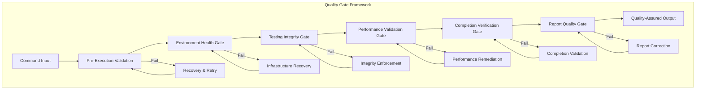

# Quality Gate Architecture Specifications

**Comprehensive Quality Assurance and Validation Framework for Playwright Slash Commands**

---

## Executive Summary

This document defines the complete quality gate architecture ensuring robust, reliable, and trustworthy execution of `/test_cli_full` and `/test_mcp_full` commands. The framework enforces testing integrity, prevents false reporting, and maintains the highest quality standards established in the Market Parser project.

---

## 1. Quality Gate Framework Overview

### Multi-Layer Quality Assurance Architecture



### Quality Gate Classification System

```typescript
interface QualityGateSystem {
  gates: QualityGate[];
  enforcement: EnforcementLevel;
  failureHandling: FailureHandlingStrategy;
  continuousValidation: boolean;
  qualityThresholds: QualityThresholds;
}

enum EnforcementLevel {
  STRICT = 'strict',         // All gates must pass
  STANDARD = 'standard',     // Critical gates must pass
  ADVISORY = 'advisory'      // Gates provide warnings only
}

enum FailureHandlingStrategy {
  IMMEDIATE_STOP = 'immediate_stop',
  RETRY_WITH_RECOVERY = 'retry_with_recovery',
  CONTINUE_WITH_WARNING = 'continue_with_warning',
  GRACEFUL_DEGRADATION = 'graceful_degradation'
}

interface QualityThresholds {
  minimumTestCompletion: number;    // 100% for integrity
  maximumErrorRate: number;         // 0% for false reporting
  minimumPerformanceScore: number;  // 70% for acceptable performance
  minimumIntegrityScore: number;    // 95% for testing integrity
  minimumReportQuality: number;     // 90% for report completeness
}
```

---

## 2. Pre-Execution Validation Gate

### Environment Validation Architecture

```typescript
interface PreExecutionValidationGate extends QualityGate {
  name: 'PreExecutionValidation';
  
  // Validation components
  systemHealthCheck(): Promise<SystemHealthResult>;
  dependencyValidation(): Promise<DependencyValidationResult>;
  configurationValidation(): Promise<ConfigurationValidationResult>;
  permissionValidation(): Promise<PermissionValidationResult>;
  
  // Validation orchestration
  executeValidation(): Promise<PreExecutionResult>;
}

interface SystemHealthResult {
  backend: {
    healthy: boolean;
    endpoint: string;         // http://localhost:8000/health
    responseTime: number;     // Response time in ms
    status: any;              // {"status": "ok"} or error
  };
  
  frontend: {
    healthy: boolean;
    detectedPort: number;     // Auto-detected port (3000, 3001, etc.)
    responseTime: number;
    accessible: boolean;
  };
  
  infrastructure: {
    overallHealth: boolean;
    criticalIssues: string[];
    warnings: string[];
    recommendations: string[];
  };
}

interface DependencyValidationResult {
  playwright: {
    installed: boolean;
    version: string;
    browserInstalled: boolean;  // Chromium availability
    configurationValid: boolean;
  };
  
  testFiles: {
    directoryExists: boolean;
    fileCount: number;          // Should be 16 for B001-B016
    allFilesPresent: boolean;
    fileValidation: TestFileValidation[];
  };
  
  nodeEnvironment: {
    nodeVersion: string;
    npmAvailable: boolean;
    uvAvailable: boolean;       // For CLI method
    pathConfiguration: boolean;
  };
}

interface TestFileValidation {
  fileName: string;             // test-b001-market-status.spec.ts
  exists: boolean;
  readable: boolean;
  syntaxValid: boolean;
  testId: string;              // B001, B002, etc.
}
```

### Configuration Validation Subsystem

```typescript
interface ConfigurationValidationSubsystem {
  // Method-specific configuration validation
  validateCLIConfiguration(): CLIConfigurationResult;
  validateMCPConfiguration(): MCPConfigurationResult;
  
  // Universal configuration validation
  validateUniversalSettings(): UniversalConfigurationResult;
  
  // Environment adaptation
  adaptConfigurationToEnvironment(): ConfigurationAdaptationResult;
}

interface CLIConfigurationResult {
  timeoutConfiguration: {
    universalTimeout: number;    // Must be 120000ms
    configurationValid: boolean;
  };
  
  workerConfiguration: {
    singleWorker: boolean;       // Must be 1 for session continuity
    configurationValid: boolean;
  };
  
  reporterConfiguration: {
    reporter: string;            // Should be 'line' for performance
    configurationValid: boolean;
  };
  
  overall: {
    configurationValid: boolean;
    requiredAdjustments: ConfigurationAdjustment[];
  };
}

interface MCPConfigurationResult {
  pollingConfiguration: {
    interval: number;            // Must be 10 seconds
    maxAttempts: number;         // Should be 12 (120s total)
    configurationValid: boolean;
  };
  
  sessionConfiguration: {
    singleSession: boolean;      // Must maintain single session
    sessionValidation: boolean;  // Session continuity validation enabled
    configurationValid: boolean;
  };
  
  browserConfiguration: {
    browserType: string;         // Chromium
    headlessMode: boolean;
    configurationValid: boolean;
  };
  
  overall: {
    configurationValid: boolean;
    requiredAdjustments: ConfigurationAdjustment[];
  };
}

interface ConfigurationAdjustment {
  component: string;
  property: string;
  currentValue: any;
  requiredValue: any;
  criticality: 'critical' | 'recommended' | 'optional';
  autoFixable: boolean;
}
```

---

## 3. Environment Health Gate

### Infrastructure Monitoring and Validation

```typescript
interface EnvironmentHealthGate extends QualityGate {
  name: 'EnvironmentHealth';
  
  // Health monitoring
  monitorInfrastructureHealth(): Promise<InfrastructureHealthResult>;
  validateServiceAvailability(): Promise<ServiceAvailabilityResult>;
  checkResourceAvailability(): Promise<ResourceAvailabilityResult>;
  
  // Health maintenance
  maintainHealthDuringExecution(): Promise<ContinuousHealthResult>;
}

interface InfrastructureHealthResult {
  services: {
    backend: ServiceHealthStatus;
    frontend: ServiceHealthStatus;
    mcp: ServiceHealthStatus;
  };
  
  connectivity: {
    backendConnectivity: boolean;
    frontendConnectivity: boolean;
    crossOriginConfiguration: boolean;  // CORS validation
  };
  
  performance: {
    backendResponseTime: number;
    frontendResponseTime: number;
    networkLatency: number;
    overallPerformance: PerformanceRating;
  };
  
  stability: {
    serviceUptime: number;           // Percentage
    errorRate: number;               // Error rate during monitoring
    stabilityRating: StabilityRating;
  };
}

interface ServiceHealthStatus {
  service: string;
  healthy: boolean;
  port: number;
  responseTime: number;
  lastChecked: Date;
  consecutiveFailures: number;
  healthDetails: {
    status?: any;                    // Service-specific status response
    version?: string;
    capabilities?: string[];
  };
  issues: HealthIssue[];
}

interface HealthIssue {
  severity: 'critical' | 'warning' | 'info';
  category: 'connectivity' | 'performance' | 'configuration' | 'resource';
  description: string;
  impact: string;                    // Impact on test execution
  resolution: string;                // Suggested resolution
  autoResolvable: boolean;
}

enum PerformanceRating {
  EXCELLENT = 'excellent',          // <100ms response times
  GOOD = 'good',                    // 100-500ms response times
  ACCEPTABLE = 'acceptable',        // 500ms-2s response times
  POOR = 'poor'                     // >2s response times
}

enum StabilityRating {
  ROCK_SOLID = 'rock_solid',        // 100% uptime, 0% errors
  STABLE = 'stable',                // >99% uptime, <1% errors
  UNSTABLE = 'unstable',            // 95-99% uptime, 1-5% errors
  UNRELIABLE = 'unreliable'         // <95% uptime, >5% errors
}
```

### Dynamic Health Recovery System

```typescript
interface DynamicHealthRecovery {
  // Health issue detection and classification
  detectHealthIssues(): Promise<HealthIssueDetectionResult>;
  classifyHealthIssues(issues: HealthIssue[]): HealthIssueClassification;
  
  // Automated recovery strategies
  executeHealthRecovery(classification: HealthIssueClassification): Promise<HealthRecoveryResult>;
  
  // Recovery verification
  verifyHealthRecovery(): Promise<HealthRecoveryVerification>;
}

interface HealthIssueDetectionResult {
  issuesDetected: HealthIssue[];
  severity: 'critical' | 'major' | 'minor' | 'none';
  impactAssessment: ImpactAssessment;
  recoveryRecommendations: RecoveryRecommendation[];
}

interface ImpactAssessment {
  testExecutionImpact: 'blocking' | 'degraded' | 'minimal' | 'none';
  performanceImpact: PerformanceImpactLevel;
  reliabilityImpact: ReliabilityImpactLevel;
  userExperienceImpact: 'severe' | 'moderate' | 'minor' | 'none';
}

enum PerformanceImpactLevel {
  SEVERE = 'severe',                // >50% performance degradation
  MODERATE = 'moderate',            // 20-50% performance degradation  
  MINOR = 'minor',                  // 5-20% performance degradation
  NEGLIGIBLE = 'negligible'         // <5% performance degradation
}

enum ReliabilityImpactLevel {
  CRITICAL = 'critical',            // Tests likely to fail
  SIGNIFICANT = 'significant',      // Tests may be unreliable
  MINOR = 'minor',                  // Occasional issues possible
  NONE = 'none'                     // No reliability impact
}

interface RecoveryRecommendation {
  action: HealthRecoveryAction;
  priority: number;                 // 1-5 priority level
  automatable: boolean;
  estimatedRecoveryTime: number;    // Seconds
  successProbability: number;       // 0-100%
  description: string;
}

enum HealthRecoveryAction {
  RESTART_SERVICE = 'restart_service',
  CLEAR_CACHE = 'clear_cache',
  RESET_CONNECTION = 'reset_connection',
  INCREASE_TIMEOUT = 'increase_timeout',
  SWITCH_PORT = 'switch_port',
  GRACEFUL_DEGRADATION = 'graceful_degradation'
}
```

---

## 4. Testing Integrity Gate

### Comprehensive Testing Integrity Enforcement

```typescript
interface TestingIntegrityGate extends QualityGate {
  name: 'TestingIntegrity';
  
  // Core integrity validation
  validateTestingIntegrity(): Promise<TestingIntegrityResult>;
  
  // Specific integrity checks
  validateTodoListIntegrity(): Promise<TodoListIntegrityResult>;
  validateExecutionIntegrity(): Promise<ExecutionIntegrityResult>;
  validateProgressIntegrity(): Promise<ProgressIntegrityResult>;
  
  // Integrity enforcement
  enforceIntegrityProtocols(): Promise<IntegrityEnforcementResult>;
  
  // False reporting prevention
  preventFalseCompletionReporting(): Promise<FalseReportingPreventionResult>;
}

interface TestingIntegrityResult {
  overallIntegrityScore: number;    // 0-100%
  integrityStatus: IntegrityStatus;
  violationsDetected: IntegrityViolation[];
  complianceChecks: ComplianceCheck[];
  enforcementActions: EnforcementAction[];
  recommendedActions: RecommendedAction[];
}

enum IntegrityStatus {
  FULLY_COMPLIANT = 'fully_compliant',      // 95-100% integrity score
  MOSTLY_COMPLIANT = 'mostly_compliant',    // 85-94% integrity score
  PARTIALLY_COMPLIANT = 'partially_compliant', // 70-84% integrity score
  NON_COMPLIANT = 'non_compliant'           // <70% integrity score
}

interface ComplianceCheck {
  checkName: string;
  category: ComplianceCategory;
  required: boolean;                // Is this check mandatory?
  passed: boolean;
  score: number;                    // 0-100% compliance score
  details: ComplianceDetails;
  evidence: ComplianceEvidence;
}

enum ComplianceCategory {
  TODO_LIST_INTEGRITY = 'todo_list_integrity',
  EXECUTION_EVIDENCE = 'execution_evidence',
  PROGRESS_TRACKING = 'progress_tracking',
  COMPLETION_VALIDATION = 'completion_validation',
  TIMING_ACCURACY = 'timing_accuracy',
  RESULT_AUTHENTICITY = 'result_authenticity'
}

interface ComplianceDetails {
  description: string;
  requirements: string[];           // What this check requires
  actualFindings: string[];         // What was actually found
  deviations: string[];             // Any deviations from requirements
  recommendations: string[];        // Recommendations for compliance
}

interface ComplianceEvidence {
  evidenceType: EvidenceType;
  evidenceData: any;                // Evidence supporting compliance
  evidenceQuality: EvidenceQuality;
  verificationMethod: string;       // How evidence was verified
  timestamp: Date;
}

enum EvidenceType {
  EXECUTION_LOG = 'execution_log',
  TIMING_DATA = 'timing_data',
  RESPONSE_DATA = 'response_data',
  STATE_TRANSITION = 'state_transition',
  SYSTEM_OUTPUT = 'system_output'
}

enum EvidenceQuality {
  HIGH = 'high',                    // Direct, verifiable evidence
  MEDIUM = 'medium',                // Indirect but reliable evidence
  LOW = 'low',                      // Circumstantial evidence
  INSUFFICIENT = 'insufficient'     // Evidence is inadequate
}
```

### False Reporting Prevention System

```typescript
interface FalseReportingPrevention {
  // Detection mechanisms
  detectFalseReporting(): Promise<FalseReportingDetectionResult>;
  
  // Prevention mechanisms
  implementPreventionMeasures(): Promise<PreventionImplementationResult>;
  
  // Verification requirements
  enforceVerificationRequirements(): Promise<VerificationEnforcementResult>;
  
  // Audit trail maintenance
  maintainAuditTrail(): Promise<AuditTrailResult>;
}

interface FalseReportingDetectionResult {
  suspiciousActivities: SuspiciousActivity[];
  riskLevel: FalseReportingRisk;
  detectionConfidence: number;      // 0-100% confidence in detection
  investigationRequired: boolean;
  preventionRecommendations: PreventionRecommendation[];
}

interface SuspiciousActivity {
  activityType: SuspiciousActivityType;
  description: string;
  severity: 'high' | 'medium' | 'low';
  evidence: SuspiciousActivityEvidence;
  timestamp: Date;
  requiresImmedateAction: boolean;
}

enum SuspiciousActivityType {
  COMPLETION_WITHOUT_EXECUTION = 'completion_without_execution',
  MISSING_TIMING_DATA = 'missing_timing_data',
  INCONSISTENT_PROGRESS = 'inconsistent_progress',
  FABRICATED_RESULTS = 'fabricated_results',
  PREMATURE_REPORTING = 'premature_reporting',
  BATCH_COMPLETION_WITHOUT_TRACKING = 'batch_completion_without_tracking'
}

interface SuspiciousActivityEvidence {
  todoListState: TodoItem[];
  executionLogs: string[];
  timingInconsistencies: TimingInconsistency[];
  stateTransitionAnomalies: StateTransitionAnomaly[];
  reportingAnomalies: ReportingAnomaly[];
}

interface TimingInconsistency {
  testId: string;
  reportedDuration: number;
  expectedDurationRange: [number, number];
  inconsistencyLevel: 'major' | 'minor';
  possibleExplanations: string[];
}

interface StateTransitionAnomaly {
  testId: string;
  expectedTransition: string;       // pending -> in_progress -> completed
  actualTransition: string;         // What actually happened
  transitionTime: Date;
  anomalyType: 'skipped_state' | 'invalid_transition' | 'timing_anomaly';
}

interface ReportingAnomaly {
  anomalyType: ReportingAnomalyType;
  description: string;
  impact: 'critical' | 'significant' | 'minor';
  detectedAt: Date;
  affectedData: string[];
}

enum ReportingAnomalyType {
  COMPLETION_CLAIM_MISMATCH = 'completion_claim_mismatch',
  MISSING_EXECUTION_EVIDENCE = 'missing_execution_evidence',
  TIMING_IMPOSSIBILITY = 'timing_impossibility',
  INCONSISTENT_STATUS = 'inconsistent_status'
}

enum FalseReportingRisk {
  CRITICAL = 'critical',            // High probability of false reporting
  HIGH = 'high',                    // Significant risk indicators
  MEDIUM = 'medium',                // Some concerning patterns
  LOW = 'low',                      // Minimal risk indicators
  MINIMAL = 'minimal'               // No significant risk detected
}
```

### Mandatory Verification Protocol

```typescript
interface MandatoryVerificationProtocol {
  // Pre-completion verification requirements
  verifyBeforeCompletion(testId: string): Promise<PreCompletionVerificationResult>;
  
  // Evidence collection and validation
  collectExecutionEvidence(testId: string): Promise<ExecutionEvidenceResult>;
  validateExecutionEvidence(evidence: ExecutionEvidence): Promise<EvidenceValidationResult>;
  
  // Completion authorization
  authorizeCompletion(testId: string, evidence: ExecutionEvidence): Promise<CompletionAuthorizationResult>;
}

interface PreCompletionVerificationResult {
  verificationPassed: boolean;
  requiredChecks: RequiredCheck[];
  missingEvidence: string[];
  blockingIssues: string[];
  authorizationGranted: boolean;
}

interface RequiredCheck {
  checkName: string;
  required: boolean;
  passed: boolean;
  evidence: any;
  failureReason?: string;
}

interface ExecutionEvidenceResult {
  evidenceCollected: boolean;
  evidenceQuality: EvidenceQuality;
  evidenceItems: EvidenceItem[];
  evidenceGaps: string[];
  collectionTime: Date;
}

interface EvidenceItem {
  type: EvidenceType;
  data: any;
  quality: EvidenceQuality;
  verifiable: boolean;
  timestamp: Date;
  source: string;
}

interface EvidenceValidationResult {
  validationPassed: boolean;
  validatedEvidence: ValidatedEvidence[];
  validationIssues: ValidationIssue[];
  overallEvidenceQuality: EvidenceQuality;
  recommendedActions: string[];
}

interface ValidatedEvidence {
  evidenceItem: EvidenceItem;
  validationStatus: 'verified' | 'questionable' | 'invalid';
  validationDetails: string;
  confidenceLevel: number;          // 0-100%
}

interface CompletionAuthorizationResult {
  authorized: boolean;
  authorizationLevel: AuthorizationLevel;
  conditions: AuthorizationCondition[];
  validUntil: Date;
  authorizationEvidence: string;
}

enum AuthorizationLevel {
  FULL_AUTHORIZATION = 'full_authorization',        // Complete authorization
  CONDITIONAL_AUTHORIZATION = 'conditional_authorization', // Authorization with conditions
  PROVISIONAL_AUTHORIZATION = 'provisional_authorization', // Temporary authorization
  AUTHORIZATION_DENIED = 'authorization_denied'    // Authorization refused
}

interface AuthorizationCondition {
  condition: string;
  requirement: string;
  deadline?: Date;
  criticality: 'mandatory' | 'recommended';
}
```

---

## 5. Performance Validation Gate

### Performance Quality Assurance Framework

```typescript
interface PerformanceValidationGate extends QualityGate {
  name: 'PerformanceValidation';
  
  // Performance measurement validation
  validatePerformanceMeasurement(): Promise<PerformanceMeasurementValidationResult>;
  
  // Performance classification validation
  validatePerformanceClassification(): Promise<PerformanceClassificationValidationResult>;
  
  // Method-specific performance validation
  validateMethodPerformance(method: TestMethod): Promise<MethodPerformanceValidationResult>;
  
  // Performance expectation validation
  validatePerformanceExpectations(): Promise<PerformanceExpectationValidationResult>;
}

interface PerformanceMeasurementValidationResult {
  measurementAccuracy: MeasurementAccuracy;
  timingValidation: TimingValidationResult[];
  measurementIntegrity: MeasurementIntegrityResult;
  performanceDistribution: ValidatedPerformanceDistribution;
  anomalies: PerformanceAnomaly[];
}

enum MeasurementAccuracy {
  PRECISE = 'precise',              // Actual measured timing, high accuracy
  ACCURATE = 'accurate',            // Measured timing, good accuracy
  APPROXIMATE = 'approximate',      // Estimated timing, reasonable accuracy
  INACCURATE = 'inaccurate'        // Poor accuracy or fabricated timing
}

interface TimingValidationResult {
  testId: string;
  reportedDuration: number;
  validationStatus: TimingValidationStatus;
  accuracyAssessment: AccuracyAssessment;
  validationEvidence: TimingValidationEvidence;
  issues: TimingIssue[];
}

enum TimingValidationStatus {
  VALIDATED = 'validated',          // Timing data validated and accurate
  QUESTIONABLE = 'questionable',    // Timing data has some concerns
  INVALID = 'invalid',              // Timing data is clearly wrong
  MISSING = 'missing'               // No timing data available
}

interface AccuracyAssessment {
  expectedRange: [number, number];  // Expected duration range for test
  actualDuration: number;
  withinExpectedRange: boolean;
  deviationLevel: 'none' | 'minor' | 'moderate' | 'major' | 'extreme';
  deviationExplanation?: string;
}

interface TimingValidationEvidence {
  measurementMethod: 'direct' | 'indirect' | 'estimated';
  measurementSource: string;        // Where timing data came from
  measurementQuality: EvidenceQuality;
  supportingEvidence: string[];
  validationTimestamp: Date;
}

interface TimingIssue {
  issueType: TimingIssueType;
  severity: 'critical' | 'major' | 'minor';
  description: string;
  impact: string;
  recommendation: string;
}

enum TimingIssueType {
  MEASUREMENT_MISSING = 'measurement_missing',
  TIMING_IMPOSSIBLE = 'timing_impossible',    // e.g., negative duration
  TIMING_IMPROBABLE = 'timing_improbable',    // e.g., 1ms for complex test
  CLASSIFICATION_ERROR = 'classification_error',
  METHOD_INCONSISTENCY = 'method_inconsistency'
}
```

### Performance Classification Validation

```typescript
interface PerformanceClassificationValidator {
  // Classification accuracy validation
  validateClassificationAccuracy(): Promise<ClassificationAccuracyResult>;
  
  // Threshold compliance validation
  validateThresholdCompliance(): Promise<ThresholdComplianceResult>;
  
  // Method-aware classification validation
  validateMethodAwareClassification(): Promise<MethodAwareClassificationResult>;
  
  // Distribution pattern validation
  validateDistributionPatterns(): Promise<DistributionPatternValidationResult>;
}

interface ClassificationAccuracyResult {
  overallAccuracy: number;          // 0-100% classification accuracy
  classificationResults: ClassificationValidationResult[];
  misclassifications: ClassificationError[];
  accuracyAssessment: ClassificationAccuracyAssessment;
}

interface ClassificationValidationResult {
  testId: string;
  actualDuration: number;
  reportedClassification: PerformanceClassification;
  correctClassification: PerformanceClassification;
  classificationCorrect: boolean;
  classificationError?: ClassificationErrorType;
}

interface ClassificationError {
  testId: string;
  actualDuration: number;
  incorrectClassification: PerformanceClassification;
  correctClassification: PerformanceClassification;
  errorType: ClassificationErrorType;
  impact: ClassificationErrorImpact;
}

enum ClassificationErrorType {
  THRESHOLD_ERROR = 'threshold_error',      // Wrong threshold applied
  CALCULATION_ERROR = 'calculation_error',  // Mathematical error
  LOGIC_ERROR = 'logic_error',             // Classification logic error
  DATA_ERROR = 'data_error'                // Input data error
}

enum ClassificationErrorImpact {
  CRITICAL = 'critical',            // Significantly affects analysis
  MODERATE = 'moderate',            // Somewhat affects analysis
  MINOR = 'minor'                   // Minimal impact on analysis
}

interface ClassificationAccuracyAssessment {
  accuracyLevel: 'excellent' | 'good' | 'acceptable' | 'poor';
  qualityScore: number;             // 0-100%
  improvementRecommendations: string[];
  complianceStatus: 'compliant' | 'non_compliant';
}
```

### Performance Expectation Validation

```typescript
interface PerformanceExpectationValidator {
  // Method-specific expectation validation
  validateCLIPerformanceExpectations(results: TestResult[]): Promise<CLIPerformanceExpectationResult>;
  validateMCPPerformanceExpectations(results: TestResult[]): Promise<MCPPerformanceExpectationResult>;
  
  // Universal threshold validation
  validateUniversalThresholds(results: TestResult[]): Promise<UniversalThresholdValidationResult>;
  
  // Performance baseline validation
  validatePerformanceBaselines(results: TestResult[]): Promise<BaselineValidationResult>;
}

interface CLIPerformanceExpectationResult {
  expectationsMet: boolean;
  expectedDistribution: PerformanceDistribution;  // More 😊😐 expected
  actualDistribution: PerformanceDistribution;
  distributionVariance: DistributionVariance;
  performanceInsights: CLIPerformanceInsights;
}

interface MCPPerformanceExpectationResult {
  expectationsMet: boolean;
  expectedDistribution: PerformanceDistribution;  // More 😐😴 expected
  actualDistribution: PerformanceDistribution;
  distributionVariance: DistributionVariance;
  performanceInsights: MCPPerformanceInsights;
}

interface DistributionVariance {
  goodVariance: number;             // Difference in 😊 count
  okVariance: number;               // Difference in 😐 count
  slowVariance: number;             // Difference in 😴 count
  timeoutVariance: number;          // Difference in ❌ count
  significantDeviation: boolean;    // Is variance significant?
  varianceExplanation: string[];    // Possible explanations
}

interface CLIPerformanceInsights {
  averagePerformance: 'excellent' | 'good' | 'acceptable' | 'poor';
  speedAdvantage: number;           // Performance advantage vs MCP (%)
  optimizationOpportunities: string[];
  performanceBottlenecks: string[];
  methodSpecificObservations: string[];
}

interface MCPPerformanceInsights {
  averagePerformance: 'excellent' | 'good' | 'acceptable' | 'poor';
  expectedOverhead: number;         // Expected overhead vs CLI (%)
  sessionEfficiency: number;        // Single session efficiency (%)
  pollingEffectiveness: number;     // 10s polling effectiveness (%)
  methodSpecificObservations: string[];
}

interface UniversalThresholdValidationResult {
  thresholdCompliance: ThresholdComplianceStatus;
  thresholdViolations: ThresholdViolation[];
  overallThresholdScore: number;    // 0-100% compliance score
  complianceRecommendations: string[];
}

enum ThresholdComplianceStatus {
  FULLY_COMPLIANT = 'fully_compliant',
  MOSTLY_COMPLIANT = 'mostly_compliant',
  PARTIALLY_COMPLIANT = 'partially_compliant',
  NON_COMPLIANT = 'non_compliant'
}

interface ThresholdViolation {
  threshold: PerformanceThreshold;
  violationType: ThresholdViolationType;
  severity: 'critical' | 'major' | 'minor';
  affectedTests: string[];
  impact: string;
  correctionRequired: boolean;
}

interface PerformanceThreshold {
  name: string;                     // Good, OK, Slow, Timeout
  lowerBound: number;               // Lower bound in seconds
  upperBound: number;               // Upper bound in seconds
  classification: PerformanceClassification;
}

enum ThresholdViolationType {
  THRESHOLD_EXCEEDED = 'threshold_exceeded',
  THRESHOLD_MISCONFIGURED = 'threshold_misconfigured',
  CLASSIFICATION_MISMATCH = 'classification_mismatch'
}
```

---

## 6. Completion Verification Gate

### Comprehensive Completion Validation

```typescript
interface CompletionVerificationGate extends QualityGate {
  name: 'CompletionVerification';
  
  // Completion status validation
  validateCompletionStatus(): Promise<CompletionStatusValidationResult>;
  
  // Todo list completion validation
  validateTodoListCompletion(): Promise<TodoListCompletionValidationResult>;
  
  // Test execution completion validation
  validateTestExecutionCompletion(): Promise<TestExecutionCompletionValidationResult>;
  
  // Completion integrity validation
  validateCompletionIntegrity(): Promise<CompletionIntegrityValidationResult>;
}

interface CompletionStatusValidationResult {
  overallCompletionValid: boolean;
  completionScore: number;          // 0-100% completion quality score
  completionCoverage: CompletionCoverage;
  completionIssues: CompletionIssue[];
  completionEvidence: CompletionEvidence[];
}

interface CompletionCoverage {
  totalTests: number;               // 16 for B001-B016
  testsAttempted: number;
  testsCompleted: number;
  testsPassedValidation: number;
  coveragePercentage: number;       // % of tests properly completed
  gapAnalysis: CompletionGap[];
}

interface CompletionGap {
  testId: string;
  expectedStatus: TodoStatus;
  actualStatus: TodoStatus;
  gapType: CompletionGapType;
  impact: 'critical' | 'major' | 'minor';
  resolutionRequired: boolean;
}

enum CompletionGapType {
  NOT_ATTEMPTED = 'not_attempted',
  INCOMPLETE_EXECUTION = 'incomplete_execution',
  FAILED_VALIDATION = 'failed_validation',
  MISSING_EVIDENCE = 'missing_evidence',
  STATUS_MISMATCH = 'status_mismatch'
}

interface CompletionIssue {
  issueType: CompletionIssueType;
  severity: 'blocking' | 'significant' | 'minor';
  affectedTests: string[];
  description: string;
  resolutionSteps: string[];
  autoResolvable: boolean;
}

enum CompletionIssueType {
  INCOMPLETE_TODO_LIST = 'incomplete_todo_list',
  MISSING_EXECUTION_EVIDENCE = 'missing_execution_evidence',
  STATUS_INCONSISTENCY = 'status_inconsistency',
  VALIDATION_FAILURE = 'validation_failure',
  TIMING_ANOMALY = 'timing_anomaly'
}

interface CompletionEvidence {
  testId: string;
  evidenceType: CompletionEvidenceType;
  evidenceData: any;
  evidenceQuality: EvidenceQuality;
  validationStatus: 'verified' | 'pending' | 'failed';
  timestamp: Date;
}

enum CompletionEvidenceType {
  TODO_STATUS_CHANGE = 'todo_status_change',
  EXECUTION_LOG = 'execution_log',
  PERFORMANCE_DATA = 'performance_data',
  RESPONSE_DATA = 'response_data',
  VALIDATION_RESULT = 'validation_result'
}
```

### Anti-False-Completion Enforcement

```typescript
interface AntiFalseCompletionEnforcement {
  // False completion detection
  detectFalseCompletion(): Promise<FalseCompletionDetectionResult>;
  
  // Completion verification enforcement
  enforceCompletionVerification(): Promise<CompletionVerificationEnforcementResult>;
  
  // Completion authorization management
  manageCompletionAuthorization(): Promise<CompletionAuthorizationManagementResult>;
  
  // Audit trail enforcement
  enforceCompletionAuditTrail(): Promise<CompletionAuditTrailResult>;
}

interface FalseCompletionDetectionResult {
  falseCompletionDetected: boolean;
  suspiciousCompletions: SuspiciousCompletion[];
  detectionConfidence: number;      // 0-100% confidence
  riskAssessment: FalseCompletionRisk;
  immediateActionRequired: boolean;
}

interface SuspiciousCompletion {
  testId: string;
  suspicionType: SuspicionType;
  suspicionLevel: 'high' | 'medium' | 'low';
  evidence: SuspiciousCompletionEvidence;
  investigationRecommended: boolean;
  blockCompletion: boolean;
}

enum SuspicionType {
  INSTANT_COMPLETION = 'instant_completion',        // Completed too quickly
  NO_EXECUTION_EVIDENCE = 'no_execution_evidence', // No evidence of execution
  TIMING_IMPOSSIBILITY = 'timing_impossibility',   // Impossible timing
  BATCH_COMPLETION = 'batch_completion',           // Multiple tests completed simultaneously
  MISSING_PROGRESS_TRACKING = 'missing_progress_tracking' // No progress tracking evidence
}

interface SuspiciousCompletionEvidence {
  timelineAnalysis: CompletionTimelineAnalysis;
  executionEvidenceAnalysis: ExecutionEvidenceAnalysis;
  progressTrackingAnalysis: ProgressTrackingAnalysis;
  consistencyAnalysis: ConsistencyAnalysis;
}

interface CompletionTimelineAnalysis {
  completionTime: Date;
  expectedMinimumDuration: number;  // Minimum realistic duration
  actualDuration: number;
  durationRatio: number;            // Actual vs expected ratio
  timelineRealistic: boolean;
}

interface ExecutionEvidenceAnalysis {
  executionEvidencePresent: boolean;
  evidenceQuality: EvidenceQuality;
  evidenceConsistency: boolean;
  evidenceCompleteness: number;     // 0-100% completeness
  evidenceAuthenticity: EvidenceAuthenticity;
}

enum EvidenceAuthenticity {
  AUTHENTIC = 'authentic',          // Evidence appears genuine
  QUESTIONABLE = 'questionable',    // Evidence has concerning aspects
  FABRICATED = 'fabricated',        // Evidence appears fabricated
  MISSING = 'missing'               // No evidence available
}

interface ProgressTrackingAnalysis {
  progressTrackingComplete: boolean;
  stateTransitionsValid: boolean;
  transitionTimingRealistic: boolean;
  progressConsistency: number;      // 0-100% consistency score
}

interface ConsistencyAnalysis {
  overallConsistency: number;       // 0-100% consistency score
  inconsistencies: Inconsistency[];
  consistencyLevel: 'high' | 'medium' | 'low' | 'very_low';
}

interface Inconsistency {
  inconsistencyType: InconsistencyType;
  severity: 'critical' | 'major' | 'minor';
  description: string;
  affectedData: string[];
  resolutionRequired: boolean;
}

enum InconsistencyType {
  TODO_STATUS_MISMATCH = 'todo_status_mismatch',
  TIMING_INCONSISTENCY = 'timing_inconsistency',
  EVIDENCE_CONTRADICTION = 'evidence_contradiction',
  PROGRESS_ANOMALY = 'progress_anomaly'
}

enum FalseCompletionRisk {
  CRITICAL = 'critical',            // High probability of false completion
  HIGH = 'high',                    // Significant false completion indicators
  MEDIUM = 'medium',                // Some concerning completion patterns
  LOW = 'low',                      // Minimal false completion risk
  MINIMAL = 'minimal'               // No significant false completion risk
}
```

---

## 7. Report Quality Gate

### Report Quality Assurance Framework

```typescript
interface ReportQualityGate extends QualityGate {
  name: 'ReportQuality';
  
  // Report content validation
  validateReportContent(): Promise<ReportContentValidationResult>;
  
  // Report structure validation
  validateReportStructure(): Promise<ReportStructureValidationResult>;
  
  // Report accuracy validation
  validateReportAccuracy(): Promise<ReportAccuracyValidationResult>;
  
  // Report completeness validation
  validateReportCompleteness(): Promise<ReportCompletenessValidationResult>;
}

interface ReportContentValidationResult {
  contentQualityScore: number;      // 0-100% content quality
  contentValidation: ContentValidationResult[];
  contentIssues: ContentIssue[];
  contentCompleteness: ContentCompleteness;
  accuracyAssessment: ReportAccuracyAssessment;
}

interface ContentValidationResult {
  section: ReportSection;
  validationPassed: boolean;
  qualityScore: number;             // 0-100% section quality
  contentPresent: boolean;
  contentAccurate: boolean;
  contentComplete: boolean;
  issues: string[];
}

enum ReportSection {
  EXECUTIVE_SUMMARY = 'executive_summary',
  PERFORMANCE_OVERVIEW = 'performance_overview',
  DETAILED_RESULTS = 'detailed_results',
  INFRASTRUCTURE_ASSESSMENT = 'infrastructure_assessment',
  QUALITY_METRICS = 'quality_metrics',
  RECOMMENDATIONS = 'recommendations'
}

interface ContentIssue {
  section: ReportSection;
  issueType: ContentIssueType;
  severity: 'critical' | 'major' | 'minor';
  description: string;
  impact: string;
  correctionRequired: boolean;
  autoCorrectible: boolean;
}

enum ContentIssueType {
  MISSING_CONTENT = 'missing_content',
  INACCURATE_DATA = 'inaccurate_data',
  INCOMPLETE_ANALYSIS = 'incomplete_analysis',
  FORMATTING_ERROR = 'formatting_error',
  INCONSISTENT_DATA = 'inconsistent_data',
  MISSING_CONTEXT = 'missing_context'
}

interface ContentCompleteness {
  overallCompleteness: number;      // 0-100% completeness
  sectionCompleteness: { [section in ReportSection]: number };
  missingElements: string[];
  optionalElementsIncluded: string[];
  completenessAssessment: CompletenessAssessment;
}

enum CompletenessAssessment {
  COMPREHENSIVE = 'comprehensive',   // All required and optional elements
  COMPLETE = 'complete',            // All required elements present
  MOSTLY_COMPLETE = 'mostly_complete', // Most required elements present
  INCOMPLETE = 'incomplete'         // Missing significant required elements
}

interface ReportAccuracyAssessment {
  overallAccuracy: number;          // 0-100% accuracy score
  dataAccuracy: DataAccuracyAssessment;
  analysisAccuracy: AnalysisAccuracyAssessment;
  calculationAccuracy: CalculationAccuracyAssessment;
  accuracyLevel: AccuracyLevel;
}

enum AccuracyLevel {
  HIGHLY_ACCURATE = 'highly_accurate',   // 95-100% accuracy
  ACCURATE = 'accurate',                 // 85-94% accuracy
  MOSTLY_ACCURATE = 'mostly_accurate',   // 75-84% accuracy
  INACCURATE = 'inaccurate'             // <75% accuracy
}

interface DataAccuracyAssessment {
  testDataAccuracy: number;         // Accuracy of test result data
  timingDataAccuracy: number;       // Accuracy of timing measurements
  performanceDataAccuracy: number;  // Accuracy of performance metrics
  infrastructureDataAccuracy: number; // Accuracy of infrastructure info
}

interface AnalysisAccuracyAssessment {
  performanceAnalysisAccuracy: number;   // Quality of performance analysis
  trendAnalysisAccuracy: number;         // Quality of trend analysis
  insightAccuracy: number;               // Quality of insights
  recommendationAccuracy: number;        // Quality of recommendations
}

interface CalculationAccuracyAssessment {
  percentageCalculations: number;    // Accuracy of % calculations
  averageCalculations: number;       // Accuracy of average calculations
  distributionCalculations: number;  // Accuracy of distribution calculations
  scoreCalculations: number;         // Accuracy of score calculations
}
```

### Report Standardization Validation

```typescript
interface ReportStandardizationValidator {
  // Format standardization validation
  validateFormatStandardization(): Promise<FormatStandardizationResult>;
  
  // Template compliance validation
  validateTemplateCompliance(): Promise<TemplateComplianceResult>;
  
  // Naming convention validation
  validateNamingConventions(): Promise<NamingConventionValidationResult>;
  
  // Cross-method consistency validation
  validateCrossMethodConsistency(): Promise<CrossMethodConsistencyResult>;
}

interface FormatStandardizationResult {
  formatCompliance: boolean;
  standardizationScore: number;     // 0-100% standardization score
  formatIssues: FormatIssue[];
  standardizationLevel: StandardizationLevel;
  correctionRecommendations: string[];
}

interface FormatIssue {
  issueType: FormatIssueType;
  section: ReportSection;
  severity: 'critical' | 'major' | 'minor';
  description: string;
  expectedFormat: string;
  actualFormat: string;
  autoCorrectible: boolean;
}

enum FormatIssueType {
  SECTION_MISSING = 'section_missing',
  SECTION_ORDER = 'section_order',
  HEADING_FORMAT = 'heading_format',
  TABLE_FORMAT = 'table_format',
  LIST_FORMAT = 'list_format',
  TIMESTAMP_FORMAT = 'timestamp_format'
}

enum StandardizationLevel {
  FULLY_STANDARDIZED = 'fully_standardized',
  MOSTLY_STANDARDIZED = 'mostly_standardized',
  PARTIALLY_STANDARDIZED = 'partially_standardized',
  NON_STANDARDIZED = 'non_standardized'
}

interface TemplateComplianceResult {
  templateCompliance: boolean;
  complianceScore: number;          // 0-100% template compliance
  templateDeviations: TemplateDeviation[];
  requiredSections: SectionComplianceResult[];
  optionalSections: SectionComplianceResult[];
}

interface TemplateDeviation {
  deviationType: TemplateDeviationType;
  section: ReportSection;
  severity: 'critical' | 'major' | 'minor';
  description: string;
  templateRequirement: string;
  actualImplementation: string;
  correctionRequired: boolean;
}

enum TemplateDeviationType {
  MISSING_REQUIRED_SECTION = 'missing_required_section',
  INCORRECT_SECTION_FORMAT = 'incorrect_section_format',
  MISSING_REQUIRED_CONTENT = 'missing_required_content',
  INCORRECT_CONTENT_ORDER = 'incorrect_content_order',
  TEMPLATE_STRUCTURE_VIOLATION = 'template_structure_violation'
}

interface SectionComplianceResult {
  section: ReportSection;
  required: boolean;
  present: boolean;
  compliant: boolean;
  complianceScore: number;          // 0-100% section compliance
  deviations: TemplateDeviation[];
}
```

---

This comprehensive Quality Gate Architecture ensures the highest standards of reliability, integrity, and accuracy for the Playwright testing slash commands system, providing robust validation at every stage of execution and preventing the quality issues that compromise testing effectiveness.