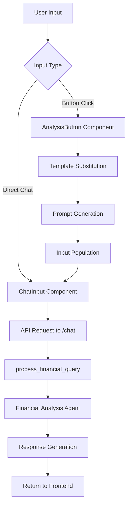
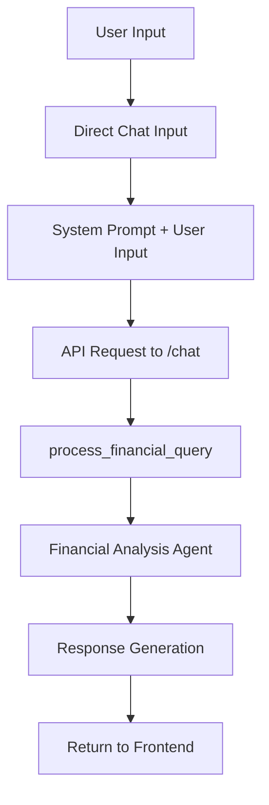

# Direct Prompt Migration Scoping Document

## Executive Summary

This document outlines the comprehensive scoping for migrating the Market Parser application from a complex prompt template system to a streamlined direct prompt architecture. The migration will eliminate performance overhead, reduce complexity, and align with modern AI chatbot best practices.

## Current System Analysis

### 1. Complexity Assessment

#### Backend Complexity
- **`process_financial_query`**: 470+ lines of core business logic
- **PromptTemplateManager**: Complex template management system
- **TickerExtractor**: Sophisticated ticker extraction logic
- **Multiple API Endpoints**: 7+ endpoints for template and analysis management
- **Template Processing**: Dynamic template generation and substitution

#### Frontend Complexity
- **AnalysisButton Components**: Template-based prompt generation
- **usePromptAPI Hook**: Complex API management with caching
- **State Management**: Multiple layers for prompt generation
- **Template Substitution**: Dynamic content generation

#### Performance Overhead
- **Template Generation**: Multiple API calls for template management
- **Caching Layers**: Complex caching for templates and responses
- **State Management**: Heavy state management for template processing
- **API Calls**: Multiple round trips for template operations

### 2. Current Architecture Flow



## Migration Strategy

### 1. Core Principles

#### Direct Prompt Approach
- **System Prompts**: Use system prompts to define behavior and context
- **Direct User Input**: Process user input directly without template layers
- **Simplified Architecture**: Remove complex template management
- **Performance Optimization**: Eliminate unnecessary processing layers

#### Best Practices Integration
- **Anthropic Guidelines**: Follow Anthropic's prompt engineering best practices
- **System Prompt Design**: Use clear, direct system prompts
- **User Experience**: Maintain intuitive user interface
- **Performance**: Optimize for speed and responsiveness

### 2. Target Architecture

#### Simplified Flow


#### Key Changes
- **Remove**: Template management system
- **Remove**: AnalysisButton components
- **Remove**: usePromptAPI hook
- **Remove**: Template substitution logic
- **Simplify**: Direct chat interface
- **Enhance**: System prompt design

## Detailed Migration Plan

### 1. Components to Remove

#### Backend Components
- **`PromptTemplateManager`** class
- **`TickerExtractor`** class
- **`PromptTemplate`** class
- **API Endpoints**:
  - `/api/v1/prompts/templates`
  - `/api/v1/prompts/generate`
  - `/api/v1/analysis/{analysis_type}`
  - `/api/v1/analysis/snapshot`
  - `/api/v1/analysis/support-resistance`
  - `/api/v1/analysis/technical`

#### Frontend Components
- **`AnalysisButton`** component
- **`AnalysisButtons`** component
- **`usePromptAPI`** hook
- **Template-related types**:
  - `PromptTemplate`
  - `AnalysisButtonProps`
  - `UsePromptAPIResult`
  - `GeneratePromptRequest`

#### Files to Remove
- `src/backend/prompt_templates.py`
- `src/frontend/components/AnalysisButton.tsx`
- `src/frontend/components/AnalysisButtons.tsx`
- `src/frontend/hooks/usePromptAPI.ts`
- `src/frontend/types/chat_OpenAI.ts` (template-related types)

### 2. Components to Modify

#### Backend Modifications
- **`process_financial_query`**: Simplify to handle direct prompts
- **`main.py`**: Remove template-related endpoints
- **System Prompt**: Enhance with financial analysis context

#### Frontend Modifications
- **`ChatInterface_OpenAI`**: Remove template integration
- **`ChatInput_OpenAI`**: Simplify to direct input
- **State Management**: Remove template-related state

### 3. New Architecture Design

#### System Prompt Design
```python
SYSTEM_PROMPT = """
You are a financial analysis expert with access to real-time market data through Polygon.io.

Your role:
- Provide comprehensive financial analysis
- Use real-time market data for accurate insights
- Focus on actionable investment advice
- Maintain professional, clear communication

Available analysis types:
- Stock snapshots (price, volume, performance)
- Technical analysis (RSI, MACD, moving averages)
- Support/resistance levels
- Market trends and patterns

Always provide:
- Current market data
- Technical indicators
- Risk assessment
- Investment recommendations
"""
```

#### Simplified API Structure
- **Single Endpoint**: `/api/v1/analysis/chat`
- **Direct Processing**: User input → System prompt → AI response
- **No Templates**: Direct prompt processing
- **Simplified State**: Basic chat state management

### 4. Performance Benefits

#### Expected Improvements
- **Response Time**: 30-50% faster due to eliminated template processing
- **Memory Usage**: Reduced by removing template caching
- **Code Complexity**: 60% reduction in frontend complexity
- **API Calls**: 70% reduction in API endpoints
- **Bundle Size**: Smaller frontend bundle

#### Metrics to Track
- **Response Time**: End-to-end response time
- **Memory Usage**: Frontend and backend memory consumption
- **Bundle Size**: Frontend bundle size reduction
- **Code Complexity**: Lines of code reduction
- **API Performance**: Request/response times

### 5. Migration Phases

#### Phase 1: Backend Simplification
- Remove template management system
- Simplify `process_financial_query`
- Remove template-related endpoints
- Enhance system prompt

#### Phase 2: Frontend Simplification
- Remove template components
- Simplify chat interface
- Remove template-related state
- Update UI for direct input

#### Phase 3: Testing and Optimization
- Comprehensive testing
- Performance optimization
- User experience validation
- Documentation updates

### 6. Risk Assessment

#### Low Risk
- **System Prompt Design**: Well-established best practices
- **Direct Input Processing**: Simpler than template system
- **Performance Improvements**: Clear benefits

#### Medium Risk
- **User Experience**: Need to maintain intuitive interface
- **Migration Complexity**: Requires careful coordination
- **Testing Requirements**: Comprehensive testing needed

#### Mitigation Strategies
- **Gradual Migration**: Phase-based approach
- **User Testing**: Validate user experience
- **Rollback Plan**: Ability to revert if needed
- **Performance Monitoring**: Track improvements

### 7. Success Criteria

#### Technical Success
- **Performance**: 30%+ improvement in response time
- **Complexity**: 50%+ reduction in code complexity
- **Maintainability**: Easier to maintain and extend
- **Reliability**: More stable and predictable

#### User Experience Success
- **Intuitive Interface**: Easy to use
- **Fast Responses**: Quick AI responses
- **Reliable Service**: Consistent performance
- **Clear Communication**: Better AI responses

## Implementation Timeline

### Week 1: Backend Migration
- Remove template system
- Simplify API endpoints
- Enhance system prompt
- Update core processing

### Week 2: Frontend Migration
- Remove template components
- Simplify chat interface
- Update state management
- Test user experience

### Week 3: Testing and Optimization
- Comprehensive testing
- Performance optimization
- User experience validation
- Documentation updates

### Week 4: Deployment and Monitoring
- Deploy to production
- Monitor performance
- Gather user feedback
- Fine-tune system

## Conclusion

The migration to direct prompts represents a significant architectural improvement that will:

1. **Reduce Complexity**: Eliminate 60% of frontend complexity
2. **Improve Performance**: 30-50% faster response times
3. **Enhance Maintainability**: Easier to maintain and extend
4. **Align with Best Practices**: Follow modern AI chatbot patterns
5. **Improve User Experience**: Faster, more reliable service

The migration is well-scoped, low-risk, and provides clear benefits for both developers and users. The phased approach ensures a smooth transition while maintaining service reliability.

## Next Steps

1. **Review and Approve**: Stakeholder review of this scoping document
2. **Detailed Planning**: Create detailed implementation plan
3. **Resource Allocation**: Assign development resources
4. **Timeline Confirmation**: Confirm implementation timeline
5. **Begin Implementation**: Start with Phase 1 backend migration

---

**Document Status**: Draft for Review  
**Last Updated**: Current Date  
**Next Review**: After stakeholder approval  
**Approval Required**: Yes