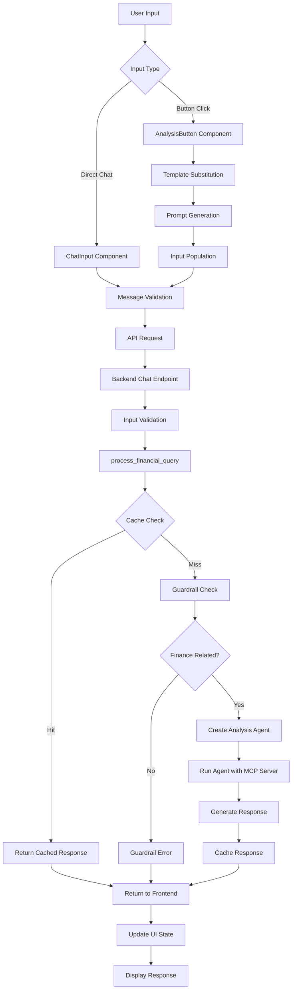

# Prompt Template System Analysis

## Overview

The Market Parser application implements a sophisticated prompt template system that enables users to generate financial analysis queries through both direct chat input and predefined button prompts. This system provides a unified conversational architecture that processes financial queries using OpenAI's GPT models and Polygon.io data.

## Architecture Components

### 1. Core Backend Components

#### PromptTemplateManager (`src/backend/prompt_templates.py`)
- **Purpose**: Central manager for all prompt template operations
- **Key Methods**:
  - `generate_prompt()`: Creates conversational prompts from templates
  - `detect_analysis_type()`: Automatically detects analysis type from user input
  - `get_available_templates()`: Returns available template information
  - `_build_templates()`: Initializes template definitions

#### TickerExtractor (`src/backend/prompt_templates.py`)
- **Purpose**: Extracts and manages ticker symbols from conversation context
- **Key Features**:
  - Explicit ticker extraction (e.g., $AAPL, AAPL stock)
  - Company name recognition (Apple → AAPL)
  - Conversation context awareness
  - Confidence scoring for ticker matches

#### PromptTemplate Class
- **Purpose**: Individual template definition and prompt generation
- **Key Properties**:
  - `conversational_template`: Base template string
  - `formatting_instructions`: Response formatting guidelines
  - `example_response`: Sample response structure
  - `context_guidance`: Additional context instructions

### 2. API Endpoints

#### Prompt Management Endpoints
- **`GET /api/v1/prompts/templates`**: Lists available prompt templates
- **`POST /api/v1/prompts/generate`**: Generates prompts from templates

#### Analysis Endpoints
- **`POST /api/v1/analysis/chat`**: Processes chat-based analysis requests
- **`POST /api/v1/analysis/{analysis_type}`**: Unified endpoint for button-triggered analysis
- **`POST /api/v1/analysis/snapshot`**: Legacy snapshot analysis endpoint
- **`POST /api/v1/analysis/support-resistance`**: Legacy support/resistance analysis endpoint
- **`POST /api/v1/analysis/technical`**: Legacy technical analysis endpoint

### 3. Frontend Components

#### ChatInterface_OpenAI (`src/frontend/components/ChatInterface_OpenAI.tsx`)
- **Purpose**: Main chat interface with integrated prompt template support
- **Key Features**:
  - Message state management using useReducer
  - Integration with analysis buttons
  - Real-time ticker input handling
  - Performance monitoring and logging

#### AnalysisButton (`src/frontend/components/AnalysisButton.tsx`)
- **Purpose**: Individual analysis button components
- **Key Features**:
  - Static template-based prompt generation
  - Ticker validation and substitution
  - Visual feedback (loading, success, error states)
  - Accessibility support

#### usePromptAPI Hook (`src/frontend/hooks/usePromptAPI.ts`)
- **Purpose**: API integration for prompt template management
- **Key Features**:
  - Template fetching with caching
  - Prompt generation from templates
  - Error handling and loading states
  - Request cancellation support

## Template Types

### 1. Snapshot Analysis
- **Template ID**: `snapshot`
- **Purpose**: Comprehensive stock overview
- **Key Elements**: Current price, volume, OHLC data, recent performance
- **Icon**: 📊

### 2. Support/Resistance Analysis
- **Template ID**: `support_resistance`
- **Purpose**: Key support and resistance level identification
- **Key Elements**: 3 support levels, 3 resistance levels, trading significance
- **Icon**: 📈

### 3. Technical Analysis
- **Template ID**: `technical`
- **Purpose**: Technical indicator analysis
- **Key Elements**: RSI, MACD, moving averages, momentum, trend direction
- **Icon**: 🔍

## Complete Execution Flow Analysis

### Scenario 1: User Input in AI Chat

#### Step 1: User Input
1. User types message in `ChatInput_OpenAI` component
2. Input is validated (minimum 2 characters, non-empty)
3. Message is added to chat state via `dispatch({ type: 'UPDATE_INPUT' })`

#### Step 2: Message Processing
1. User clicks send or presses Enter
2. `handleSendMessage` is triggered in `ChatInterface_OpenAI`
3. User message is created with timestamp and ID
4. State is updated to loading: `dispatch({ type: 'SEND_MESSAGE_START' })`

#### Step 3: API Request
1. `sendChatMessage` is called from `api_OpenAI.ts`
2. Request is sent to `POST /chat` endpoint
3. Request includes message content and optional model selection

#### Step 4: Backend Processing
1. `chat_endpoint` in `main.py` receives request
2. Input validation and sanitization
3. `process_financial_query` is called with:
   - User query
   - Shared SQLite session
   - MCP server instance
   - Request ID
   - Model selection

#### Step 5: Financial Query Processing
1. **Cache Check**: Query is checked against response cache
2. **Guardrail Validation**: `finance_guardrail` checks if query is finance-related
3. **Agent Creation**: Financial Analysis Agent is created with:
   - MCP server for Polygon.io data
   - Input guardrails
   - Model settings
   - Tools (save_analysis_report)
4. **Agent Execution**: `Runner.run` processes the query
5. **Response Generation**: Agent generates structured financial analysis
6. **Caching**: Response is cached for future use

#### Step 6: Response Handling
1. Response is returned to frontend
2. AI message is created with response content
3. State is updated: `dispatch({ type: 'SEND_MESSAGE_SUCCESS' })`
4. UI updates with new message

### Scenario 2: Button Prompt Selection

#### Step 1: Button Click
1. User clicks analysis button (e.g., "Stock Snapshot")
2. `handleButtonClick` is triggered in `AnalysisButton`
3. Ticker validation occurs (if required)
4. Static template substitution: `template.template.replace('{ticker}', tickerValue)`

#### Step 2: Prompt Generation
1. Generated prompt is passed to `onPromptGenerated` callback
2. `handlePromptGenerated` is called in `ChatInterface_OpenAI`
3. Input field is populated: `dispatch({ type: 'UPDATE_INPUT', payload: prompt })`
4. Visual feedback is shown (success indicator)

#### Step 3: User Sends Generated Prompt
1. User reviews generated prompt in input field
2. User clicks send or presses Enter
3. **Flow continues as Scenario 1, Steps 2-6**

## Key Technical Details

### Caching System
- **Type**: TTL Cache with 15-minute expiration
- **Size**: Maximum 1000 cached responses
- **Key Generation**: `f"{query.lower().strip()}:{ticker.upper().strip()}"`
- **Statistics**: Hit/miss tracking, eviction monitoring

### Session Management
- **Type**: SQLite session for conversation persistence
- **Cleanup**: Periodic cleanup of old session data
- **Memory Management**: Limits to last 100 conversation turns

### Error Handling
- **Guardrail Errors**: Non-finance queries are blocked with explanation
- **API Errors**: Comprehensive error handling with user feedback
- **Network Errors**: Retry logic and graceful degradation
- **Validation Errors**: Input validation with clear error messages

### Performance Optimizations
- **Response Caching**: Reduces API calls for repeated queries
- **Lazy Loading**: Frontend components are lazy-loaded
- **State Management**: useReducer for efficient state updates
- **Request Cancellation**: AbortController for cleanup

## Data Flow Diagram

## Configuration

### Backend Configuration (`config/app.config.json`)
- **Server Settings**: Host, port, CORS origins
- **AI Models**: Available models, pricing, context limits
- **MCP Settings**: Timeout, version, API key management
- **Security**: Rate limiting, CORS configuration

### Frontend Configuration
- **API Endpoints**: Centralized endpoint definitions
- **Template Definitions**: Static template configurations
- **Performance Settings**: Caching, debouncing, optimization

## Security Considerations

### Input Validation
- **Message Length**: Minimum 2 characters, maximum 10,000
- **Ticker Format**: Alphanumeric, 1-5 characters
- **Content Sanitization**: XSS prevention, injection protection

### API Security
- **CORS Configuration**: Restricted origins
- **Rate Limiting**: Configurable requests per minute
- **Error Handling**: No sensitive information in error messages

### Data Protection
- **API Key Management**: Environment-based configuration
- **Session Security**: SQLite session isolation
- **Cache Security**: No sensitive data in cache keys

## Monitoring and Logging

### Backend Logging
- **Request Tracking**: Unique request IDs
- **Performance Metrics**: Response times, processing duration
- **Error Logging**: Comprehensive error tracking
- **Cache Statistics**: Hit/miss rates, eviction counts

### Frontend Logging
- **User Interactions**: Button clicks, message sends
- **Performance Monitoring**: Component render times
- **Error Tracking**: API errors, validation failures
- **Analytics**: Usage patterns, feature adoption

## Future Enhancement Opportunities

### Template System Improvements
1. **Dynamic Template Loading**: Load templates from external sources
2. **Custom Template Creation**: User-defined templates
3. **Template Versioning**: Version control for templates
4. **A/B Testing**: Template effectiveness testing

### Performance Optimizations
1. **Streaming Responses**: Real-time response streaming
2. **Batch Processing**: Multiple query processing
3. **Advanced Caching**: Redis-based distributed caching
4. **CDN Integration**: Static asset optimization

### User Experience Enhancements
1. **Template Suggestions**: AI-powered template recommendations
2. **Smart Ticker Detection**: Enhanced ticker extraction
3. **Conversation Memory**: Long-term conversation context
4. **Multi-language Support**: Internationalization

## Conclusion

The prompt template system provides a robust, scalable foundation for financial analysis queries. Its unified conversational architecture, combined with sophisticated caching and error handling, delivers a seamless user experience while maintaining high performance and security standards. The system's modular design allows for easy extension and enhancement as requirements evolve.