# Prompt Template System Flow Diagram

## Complete System Architecture

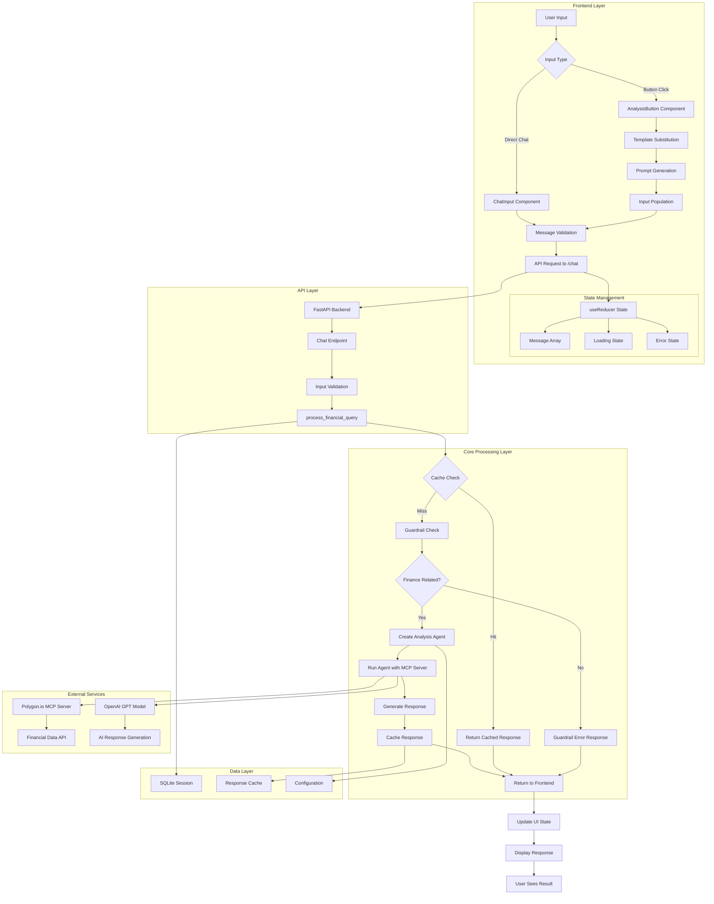

## Detailed Component Interactions

### 1. User Input Flow

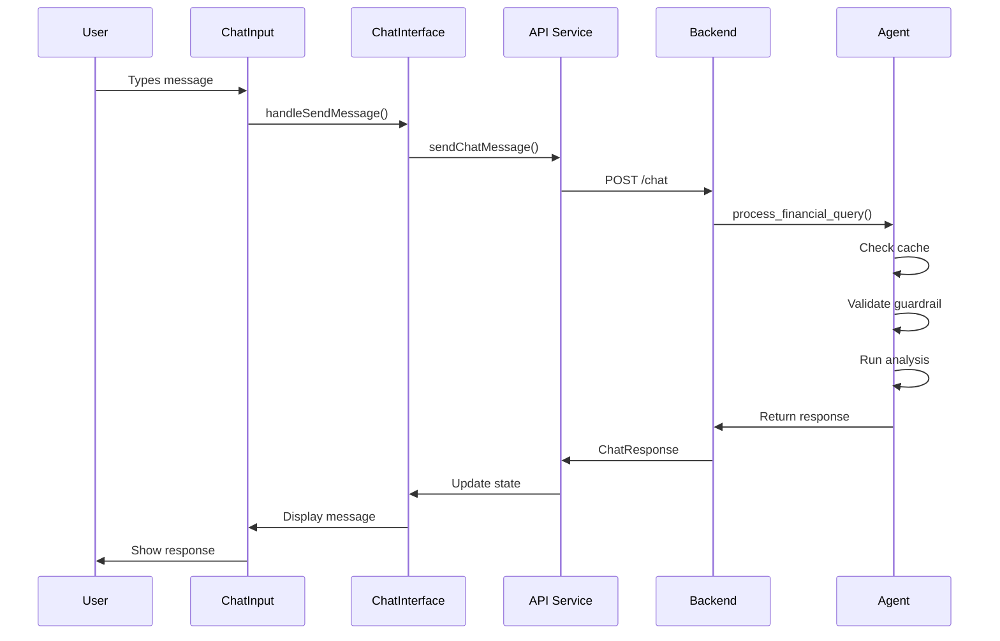

### 2. Button Prompt Flow

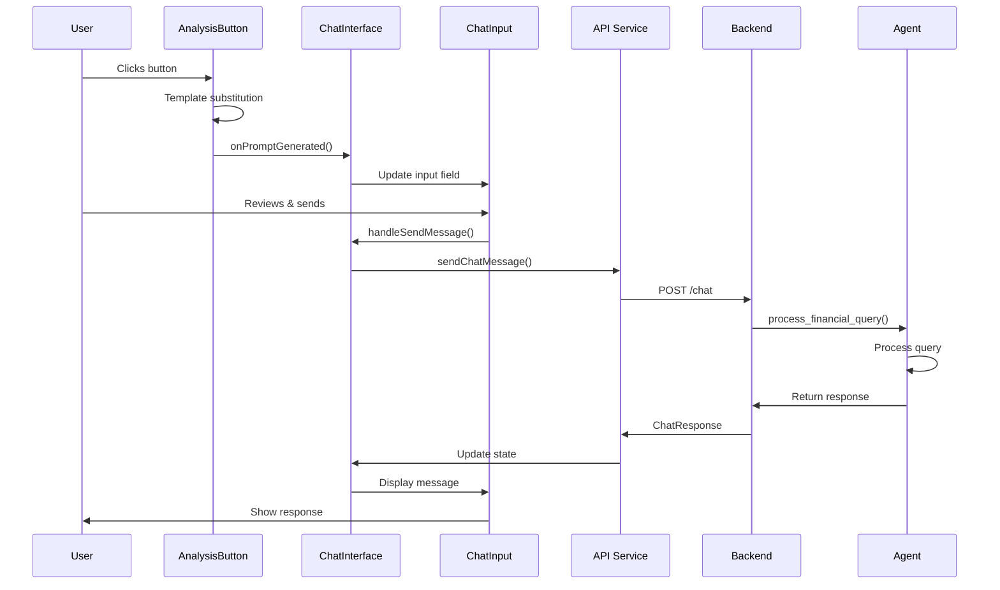

## System Components Detail

### Frontend Components

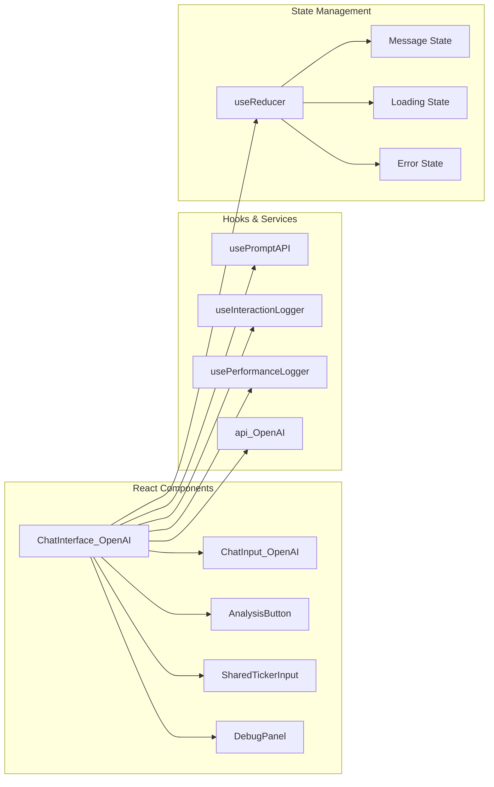

### Backend Architecture

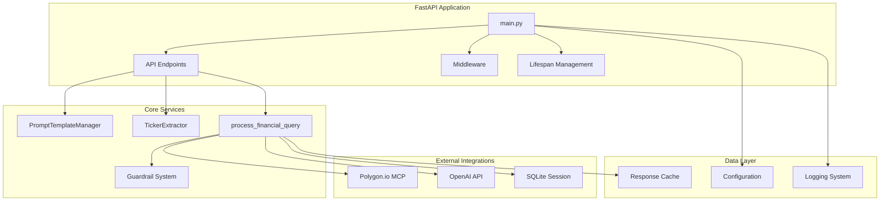

## Data Flow Patterns

### 1. Template Processing

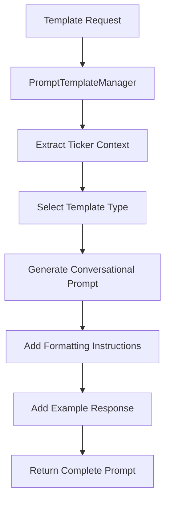

### 2. Caching Strategy

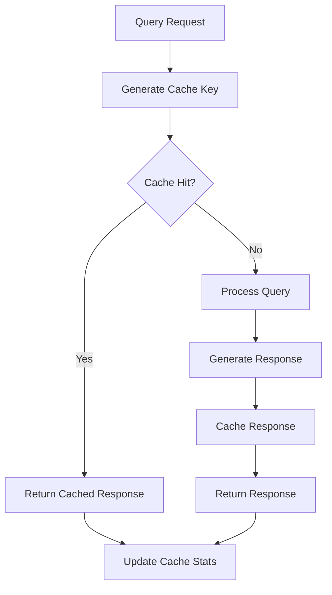

### 3. Error Handling

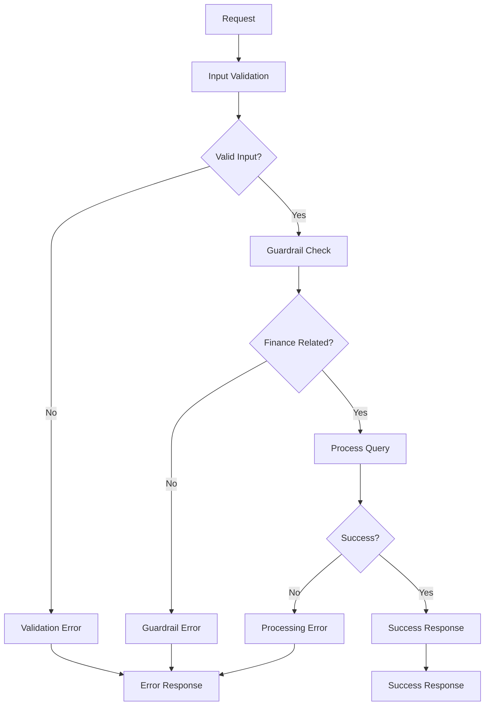

## Performance Optimization Points

### 1. Frontend Optimizations

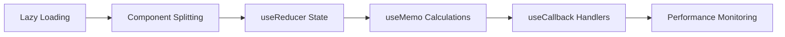

### 2. Backend Optimizations

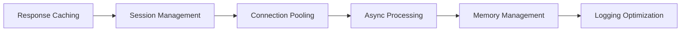

## Security Flow

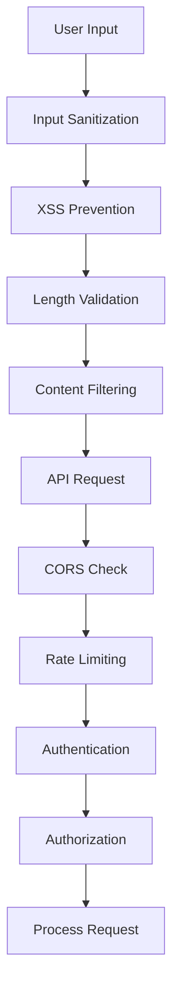

This comprehensive flow diagram shows the complete architecture and data flow of the prompt template system, from user input through all processing layers to the final response display.